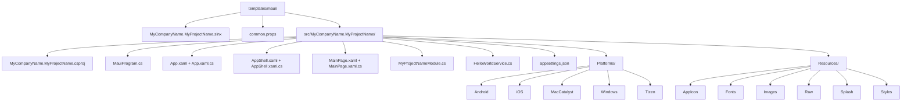
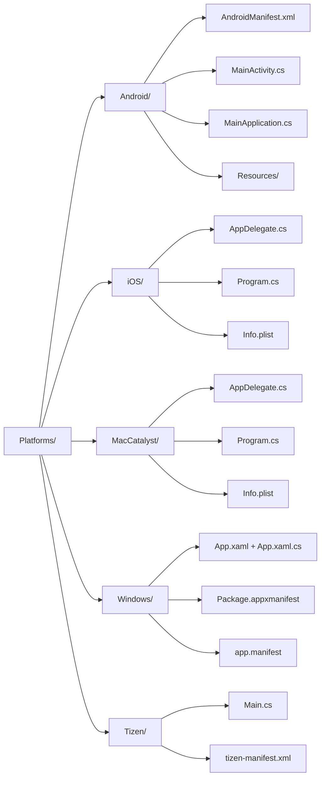
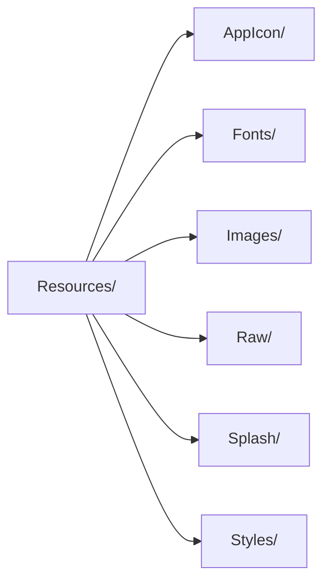

The MAUI template ships a single-project, multi-targeted .NET MAUI application wired through ABP Framework's modularity system. The source lives at `templates/maui/src/MyCompanyName.MyProjectName/` and produces Android, iOS, MacCatalyst, Tizen (optional), and Windows binaries from one `.csproj`. The CLI invocation is `abp new MyCompany.MyProject -t maui`.

The template is intended for clients that consume an ABP HTTP API — pair it with `MyCompanyName.MyProjectName.HttpApi.HostWithIds` from the [layered app template](/templates/app-template-aspnetcore) or with a no-layers `Host` project.

## Solution layout



Every leaf is a real folder under `templates/maui/`. The solution file is `templates/maui/MyCompanyName.MyProjectName.slnx`.

## `MyCompanyName.MyProjectName.csproj`

Path: `templates/maui/src/MyCompanyName.MyProjectName/MyCompanyName.MyProjectName.csproj`

The project file is the most opinionated file in the template:

```xml templates/maui/src/MyCompanyName.MyProjectName/MyCompanyName.MyProjectName.csproj
<Project Sdk="Microsoft.NET.Sdk">
    <Import Project="..\..\common.props" />

    <PropertyGroup>
        <TargetFrameworks>net10.0;net10.0-android;net10.0-ios;net10.0-maccatalyst</TargetFrameworks>
        <TargetFrameworks Condition="$([MSBuild]::IsOSPlatform('windows'))">$(TargetFrameworks);net10.0-windows10.0.19041.0</TargetFrameworks>
        <!-- <TargetFrameworks>$(TargetFrameworks);net10.0-tizen</TargetFrameworks> -->
        <Nullable>enable</Nullable>
        <OutputType>Exe</OutputType>
        <RootNamespace>MyCompanyName.MyProjectName</RootNamespace>
        <UseMaui>true</UseMaui>
        <SingleProject>true</SingleProject>
        <ImplicitUsings>enable</ImplicitUsings>

        <ApplicationTitle>MyCompanyName.MyProjectName</ApplicationTitle>
        <ApplicationId>com.mycompanyname.myprojectname</ApplicationId>
        <ApplicationIdGuid>27317750-B571-4690-B433-B358B2480E01</ApplicationIdGuid>
        <ApplicationDisplayVersion>1.0</ApplicationDisplayVersion>
        <ApplicationVersion>1</ApplicationVersion>

        <SupportedOSPlatformVersion Condition="$([MSBuild]::GetTargetPlatformIdentifier('$(TargetFramework)')) == 'ios'">15.0</SupportedOSPlatformVersion>
        <SupportedOSPlatformVersion Condition="$([MSBuild]::GetTargetPlatformIdentifier('$(TargetFramework)')) == 'maccatalyst'">15.0</SupportedOSPlatformVersion>
        <SupportedOSPlatformVersion Condition="$([MSBuild]::GetTargetPlatformIdentifier('$(TargetFramework)')) == 'android'">24.0</SupportedOSPlatformVersion>
        <SupportedOSPlatformVersion Condition="$([MSBuild]::GetTargetPlatformIdentifier('$(TargetFramework)')) == 'windows'">10.0.17763.0</SupportedOSPlatformVersion>
        <TargetPlatformMinVersion Condition="$([MSBuild]::GetTargetPlatformIdentifier('$(TargetFramework)')) == 'windows'">10.0.17763.0</TargetPlatformMinVersion>
    </PropertyGroup>

    <ItemGroup>
        <ProjectReference Include="..\..\..\..\framework\src\Volo.Abp.Autofac\Volo.Abp.Autofac.csproj" />
        <PackageReference Include="Microsoft.Extensions.FileProviders.Embedded" Version="10.0.7" />
    </ItemGroup>
</Project>
```

Three things to notice:

1. **`<UseMaui>true</UseMaui>` and `<SingleProject>true</SingleProject>`** turn this into a MAUI single-project — Resources, Platforms, and the cross-platform code live in one csproj.
2. **`<TargetFrameworks>` is multi-targeted**. The Tizen line is commented out by default and the Windows target is only added on Windows hosts.
3. **`Volo.Abp.Autofac` is the only ABP reference**. ABP modularity flows from there; everything else (the API client, theme libraries) is added by the user.

`Microsoft.Extensions.FileProviders.Embedded` is required because `MauiProgram.cs` loads `appsettings.json` from an embedded resource (mobile apps cannot ship loose JSON files reliably).

## `MauiProgram.cs`

Path: `templates/maui/src/MyCompanyName.MyProjectName/MauiProgram.cs`

This file is the bootstrap entry point — every platform-specific launcher delegates to `MauiProgram.CreateMauiApp()`:

```csharp templates/maui/src/MyCompanyName.MyProjectName/MauiProgram.cs
public static class MauiProgram
{
    public static MauiApp CreateMauiApp()
    {
        var builder = MauiApp.CreateBuilder();
        builder
            .UseMauiApp<App>()
            .ConfigureFonts(fonts =>
            {
                fonts.AddFont("OpenSans-Regular.ttf", "OpenSansRegular");
                fonts.AddFont("OpenSans-Semibold.ttf", "OpenSansSemibold");
            })
            .ConfigureContainer(new AbpAutofacServiceProviderFactory(new Autofac.ContainerBuilder()));

        ConfigureConfiguration(builder);

        builder.Services.AddApplication<MyProjectNameModule>(options =>
        {
            options.Services.ReplaceConfiguration(builder.Configuration);
        });

        var app = builder.Build();

        app.Services.GetRequiredService<IAbpApplicationWithExternalServiceProvider>().Initialize(app.Services);

        return app;
    }

    private static void ConfigureConfiguration(MauiAppBuilder builder)
    {
        var assembly = typeof(App).GetTypeInfo().Assembly;
        builder.Configuration.AddJsonFile(new EmbeddedFileProvider(assembly), "appsettings.json", optional: false, false);
    }
}
```

Key differences from the [console template](/templates/console-template):

- `AbpAutofacServiceProviderFactory` is passed **directly** to `ConfigureContainer`, not via `AddAutofacServiceProviderFactory()` — this is the synchronous API needed because MAUI's `MauiAppBuilder` doesn't support async configuration.
- `AddApplication<TModule>` (not `AddApplicationAsync<TModule>`) is used for the same reason.
- `IAbpApplicationWithExternalServiceProvider.Initialize` runs **after** the host is built. ABP needs to know the final `IServiceProvider` resolved from MAUI's container.
- `appsettings.json` is loaded from an `EmbeddedFileProvider` instead of disk — required because Android/iOS bundle resources differently than desktop processes.

## `App.xaml.cs`

Path: `templates/maui/src/MyCompanyName.MyProjectName/App.xaml.cs`

```csharp templates/maui/src/MyCompanyName.MyProjectName/App.xaml.cs
public partial class App : Application
{
    public App()
    {
        InitializeComponent();
        MainPage = new AppShell();
    }
}
```

The `App` class sets `MainPage = new AppShell()` rather than constructing the shell via DI because MAUI's `Application` constructor runs before the DI container is ready. The shell itself doesn't need any injected services — the heavy lifting happens in `MainPage`.

## `AppShell.xaml.cs`

Path: `templates/maui/src/MyCompanyName.MyProjectName/AppShell.xaml.cs`

```csharp templates/maui/src/MyCompanyName.MyProjectName/AppShell.xaml.cs
public partial class AppShell : Shell
{
    public AppShell()
    {
        InitializeComponent();
    }
}
```

A `Shell` provides the flyout/tab navigation chrome. The XAML side (`AppShell.xaml`) hosts the routes.

## `MainPage.xaml.cs`

Path: `templates/maui/src/MyCompanyName.MyProjectName/MainPage.xaml.cs`

```csharp templates/maui/src/MyCompanyName.MyProjectName/MainPage.xaml.cs
public partial class MainPage : ContentPage, ISingletonDependency
{
    private readonly HelloWorldService _helloWorldService;
    int count = 0;

    public MainPage(HelloWorldService helloWorldService)
    {
        _helloWorldService = helloWorldService;
        InitializeComponent();
        SetHelloLabText();
    }

    private void SetHelloLabText()
    {
        HelloLab.Text = _helloWorldService.SayHello();
    }

    private void OnCounterClicked(object sender, EventArgs e)
    {
        count++;
        CounterBtn.Text = count == 1 ? $"Clicked {count} time" : $"Clicked {count} times";
        SemanticScreenReader.Announce(CounterBtn.Text);
    }
}
```

The page implements `ISingletonDependency` so ABP registers it as a singleton — MAUI's `Shell` resolves it once and reuses the instance across navigations.

## `HelloWorldService.cs`

Path: `templates/maui/src/MyCompanyName.MyProjectName/HelloWorldService.cs`

```csharp templates/maui/src/MyCompanyName.MyProjectName/HelloWorldService.cs
public class HelloWorldService : ITransientDependency
{
    public string SayHello()
    {
        return "Hello, World!";
    }
}
```

Demonstrates the simplest ABP injection — `ITransientDependency` flags the class for automatic registration. MAUI's container resolves it whenever `MainPage` is constructed.

## `MyProjectNameModule.cs`

Path: `templates/maui/src/MyCompanyName.MyProjectName/MyProjectNameModule.cs`

```csharp templates/maui/src/MyCompanyName.MyProjectName/MyProjectNameModule.cs
[DependsOn(typeof(AbpAutofacModule))]
public class MyProjectNameModule : AbpModule
{
}
```

Minimal — `AbpAutofacModule` is the only dependency. The class is empty because MAUI's bootstrap doesn't need `ConfigureServices` overrides for the sample workload.

When you start wiring `Volo.Abp.Http.Client` to talk to your API, you'll add `[DependsOn(typeof(MyProjectNameHttpApiClientModule))]` here.

## `appsettings.json`

Path: `templates/maui/src/MyCompanyName.MyProjectName/appsettings.json`

Embedded JSON file. Anything you'd put in a desktop `appsettings.json` works here, including remote API URLs.

```json templates/maui/src/MyCompanyName.MyProjectName/appsettings.json
{
  "RemoteServices": {
    "Default": {
      "BaseUrl": "https://localhost:44305/"
    }
  }
}
```

## `Platforms/` folders



Each platform folder under `templates/maui/src/MyCompanyName.MyProjectName/Platforms/` is what MAUI's `SingleProject=true` setting expects:

- **Android** (`templates/maui/src/MyCompanyName.MyProjectName/Platforms/Android/`): `MainActivity.cs` declares the entry activity, `MainApplication.cs` calls `MauiProgram.CreateMauiApp()`, `AndroidManifest.xml` declares permissions, and `Resources/` holds Android-specific assets.
- **iOS** (`Platforms/iOS/`): `AppDelegate.cs` calls `MauiProgram.CreateMauiApp()`, `Program.cs` is the UIKit entry, `Info.plist` declares iOS metadata.
- **MacCatalyst** (`Platforms/MacCatalyst/`): mirrors iOS — `AppDelegate.cs`, `Program.cs`, `Info.plist`.
- **Windows** (`Platforms/Windows/`): `App.xaml` + `App.xaml.cs` host the WinUI shell, `Package.appxmanifest` declares the MSIX package.
- **Tizen** (`Platforms/Tizen/`): `Main.cs` is the entry point, `tizen-manifest.xml` declares Tizen metadata. Disabled by default in the `.csproj`.

The single-project model means **none** of these need their own `.csproj` — `<UseMaui>true` plus `<SingleProject>true` instructs the SDK to compile each subfolder for the matching `TargetFramework`.

## `Resources/` folders



- `templates/maui/src/MyCompanyName.MyProjectName/Resources/AppIcon/` — `appicon.svg`, `appiconfg.svg` (MAUI generates platform icons from SVG at build time).
- `templates/maui/src/MyCompanyName.MyProjectName/Resources/Fonts/` — `OpenSans-Regular.ttf`, `OpenSans-Semibold.ttf` (registered in `MauiProgram.ConfigureFonts`).
- `templates/maui/src/MyCompanyName.MyProjectName/Resources/Images/` — shared image assets.
- `templates/maui/src/MyCompanyName.MyProjectName/Resources/Raw/` — files that MAUI ships as-is (helpful for embedded JSON, ML models, etc.).
- `templates/maui/src/MyCompanyName.MyProjectName/Resources/Splash/` — splash screen SVG.
- `templates/maui/src/MyCompanyName.MyProjectName/Resources/Styles/` — `Colors.xaml` and `Styles.xaml` containing the resource dictionary merged into `App.xaml`.

## Lifecycle in one picture

```mermaid
sequenceDiagram
    participant Plat as Platforms/&lt;OS&gt;
    participant MP as MauiProgram
    participant Build as MauiAppBuilder
    participant Abp as AddApplication
    participant App as App.xaml.cs
    participant Shell as AppShell
    participant Page as MainPage

    Plat->>MP: CreateMauiApp()
    MP->>Build: MauiApp.CreateBuilder
    Build->>Build: UseMauiApp<App>
    Build->>Build: ConfigureFonts
    Build->>Build: ConfigureContainer(AbpAutofacServiceProviderFactory)
    Build->>Abp: AddApplication<MyProjectNameModule>
    MP->>Build: Build() -> MauiApp
    MP->>Abp: Initialize(MauiApp.Services)
    MP-->>Plat: MauiApp
    Plat->>App: instantiate App
    App->>Shell: new AppShell()
    Shell->>Page: navigate to MainPage
    Page->>Page: ctor resolves HelloWorldService
```

The diagram makes one important point: `Initialize` runs **after** `Build()` but **before** any UI is shown. That's the only safe place to assume the DI container is final.

## Wiring an ABP HTTP API

To consume `MyCompanyName.MyProjectName.HttpApi.HostWithIds` from the MAUI client, add the typed HTTP client module from the app template:

```csharp templates/maui/src/MyCompanyName.MyProjectName/MyProjectNameModule.cs
[DependsOn(
    typeof(AbpAutofacModule),
    typeof(MyProjectNameHttpApiClientModule)
)]
public class MyProjectNameModule : AbpModule
{
    public override void ConfigureServices(ServiceConfigurationContext context)
    {
        Configure<AbpRemoteServiceOptions>(options =>
        {
            options.RemoteServices.Default = new RemoteServiceConfiguration("https://your-api/");
        });
    }
}
```

The HTTP API client module pulls in dynamic proxying so application services become callable from MAUI as if they were local. The `appsettings.json` base URL is also picked up if you leave the `Configure<AbpRemoteServiceOptions>` block empty.

## Where to look next

- For the HTTP API host this client typically talks to, see [App (.NET)](/templates/app-template-aspnetcore).
- For the desktop counterpart targeting Windows only, see [WPF](/templates/wpf-template).
- For a headless background worker on the same machine, see [Console](/templates/console-template).
