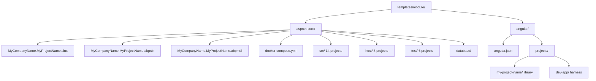

The module template is how ABP Framework consumers package **reusable functionality** — feature areas like Identity, CMS Kit, or Saas. The output is not an application but a set of NuGet packages plus an Angular library that other ABP solutions can install. The structure mirrors `modules/identity/` and `modules/cms-kit/` from the framework repo, so studying this template is the fastest way to learn how every official ABP module is built.

The CLI invocation is `abp new MyCompany.MyProject -t module`. The sources live under `templates/module/aspnet-core/` (fourteen `src/` projects plus eight `host/` projects plus six `test/` projects) and `templates/module/angular/` (an Angular library plus a `dev-app` harness).

## Workspace layout



Every leaf maps to a real folder. The `abpmdl` and `abpsln` files are JSON manifests read by ABP Suite to wire entity-generation tooling — they are not consumed by `dotnet build`.

## `src/` projects

The `templates/module/aspnet-core/src/` folder contains fourteen projects that mirror the layered application template, **plus an `Installer` project unique to modules**.

| Path | Role |
| --- | --- |
| `MyCompanyName.MyProjectName.Domain.Shared` | Constants, enums, localization shared with every consumer |
| `MyCompanyName.MyProjectName.Domain` | Entities, repositories, domain services |
| `MyCompanyName.MyProjectName.Application.Contracts` | DTOs and `IApplicationService` interfaces |
| `MyCompanyName.MyProjectName.Application` | Application service implementations |
| `MyCompanyName.MyProjectName.HttpApi` | Controllers wrapping the application services |
| `MyCompanyName.MyProjectName.HttpApi.Client` | Strongly-typed C# client via dynamic proxying |
| `MyCompanyName.MyProjectName.EntityFrameworkCore` | EF Core DbContext + entity configurations |
| `MyCompanyName.MyProjectName.MongoDB` | MongoDB context |
| `MyCompanyName.MyProjectName.Web` | MVC/Razor UI assets |
| `MyCompanyName.MyProjectName.Blazor` | Shared Blazor components |
| `MyCompanyName.MyProjectName.Blazor.Server` | Blazor Server-specific bits |
| `MyCompanyName.MyProjectName.Blazor.WebAssembly` | Blazor WASM-specific bits |
| `MyCompanyName.MyProjectName.Blazor.WebAssembly.Bundling` | Resource mappings for WASM bundling |
| `MyCompanyName.MyProjectName.Installer` | Embedded `.abppkg` resources for ABP Suite |

### Module class shape

Module classes are smaller than in the layered app template because they only depend on **framework** modules, not on identity / tenant management / etc. For example the application module:

```csharp templates/module/aspnet-core/src/MyCompanyName.MyProjectName.Application/MyProjectNameApplicationModule.cs
[DependsOn(
    typeof(MyProjectNameDomainModule),
    typeof(MyProjectNameApplicationContractsModule),
    typeof(AbpDddApplicationModule),
    typeof(AbpMapperlyModule)
)]
public class MyProjectNameApplicationModule : AbpModule
{
    public override void ConfigureServices(ServiceConfigurationContext context)
    {
        context.Services.AddMapperlyObjectMapper<MyProjectNameApplicationModule>();
    }
}
```

Compare with the app template's `MyProjectNameApplicationModule` which additionally depends on `AbpAccountApplicationModule`, `AbpIdentityApplicationModule`, etc. **Modules pull in only what they need**, leaving identity / multi-tenancy concerns to the consuming application.

### The `Installer` project

Path: `templates/module/aspnet-core/src/MyCompanyName.MyProjectName.Installer/MyProjectNameInstallerModule.cs`

```csharp templates/module/aspnet-core/src/MyCompanyName.MyProjectName.Installer/MyProjectNameInstallerModule.cs
[DependsOn(
    typeof(AbpVirtualFileSystemModule)
)]
public class MyProjectNameInstallerModule : AbpModule
{
    public override void ConfigureServices(ServiceConfigurationContext context)
    {
        Configure<AbpVirtualFileSystemOptions>(options =>
        {
            options.FileSets.AddEmbedded<MyProjectNameInstallerModule>();
        });
    }
}
```

The `Installer` project exists **only to embed `.abppkg` files** in the module's NuGet output. Those files describe the module's dependencies so `abp install` (or ABP Suite) can resolve them when a consumer adds the module. The `.abppkg` next to `MyCompanyName.MyProjectName.Application.csproj` is built by the `AbpProjectType` MSBuild target.

### Fody weaving

Every `src/` project ships `FodyWeavers.xml` and `FodyWeavers.xsd`. ABP modules use Fody for IL weaving when packing embedded resources. The XML enables specific weavers configured in the framework's `Directory.Build.props`.

## `host/` projects

`templates/module/aspnet-core/host/` contains eight host projects used **only during development** to exercise the module:

- `MyCompanyName.MyProjectName.AuthServer` — OpenIddict authority for the dev environment.
- `MyCompanyName.MyProjectName.HttpApi.Host` — standalone API host.
- `MyCompanyName.MyProjectName.Web.Host` — tiered MVC host.
- `MyCompanyName.MyProjectName.Web.Unified` — non-tiered MVC host that bundles AuthServer pages.
- `MyCompanyName.MyProjectName.Blazor.Host` — Blazor WASM standalone host.
- `MyCompanyName.MyProjectName.Blazor.Host.Client` — Blazor WASM client.
- `MyCompanyName.MyProjectName.Blazor.Server.Host` — Blazor Server host.
- `MyCompanyName.MyProjectName.Host.Shared` — shared host bootstrap helpers.

When you ship the module to NuGet, **none of these projects are packaged** — they exist for the module author's own end-to-end testing. The `host/` projects each contain `Program.cs`, `appsettings.json`, a `Dockerfile`, and a Razor `Pages/` tree.

`templates/module/aspnet-core/host/MyCompanyName.MyProjectName.AuthServer/` ships its own `EntityFrameworkCore/` and `Migrations/` so the dev host can spin up an OpenIddict store from scratch. It also includes `abp.resourcemapping.js` and `package.json` for static asset bundling.

## `test/` projects

`templates/module/aspnet-core/test/` contains six test projects:

| Project | Tests |
| --- | --- |
| `MyCompanyName.MyProjectName.TestBase` | Shared `TestBase` with seed contributors |
| `MyCompanyName.MyProjectName.Domain.Tests` | Domain logic |
| `MyCompanyName.MyProjectName.Application.Tests` | Application services |
| `MyCompanyName.MyProjectName.EntityFrameworkCore.Tests` | Repository tests against SQLite in-memory |
| `MyCompanyName.MyProjectName.MongoDB.Tests` | Repository tests against MongoDB2Go |
| `MyCompanyName.MyProjectName.HttpApi.Client.ConsoleTestApp` | Console smoke test of the typed HTTP client |

The seventh from the app template — `Web.Tests` — is intentionally **not** present; modules don't ship a UI host that would be worth integration-testing.

## Docker harness

The module template ships three docker-compose files for the dev experience:

- `templates/module/aspnet-core/docker-compose.yml` — base services (SQL Server / MongoDB / Redis).
- `templates/module/aspnet-core/docker-compose.override.yml` — local overrides.
- `templates/module/aspnet-core/docker-compose.migrations.yml` — runs the migration host.

The `templates/module/aspnet-core/database/` folder ships SQL bootstrap scripts that the override file mounts at container start.

## Angular library

`templates/module/angular/` is **fundamentally different** from the app Angular templates: instead of a runnable SPA it produces an **Angular library** that other ABP Angular apps can install via npm.

### `angular.json`

Path: `templates/module/angular/angular.json`

The workspace declares two projects:

- `my-project-name` — the library, built with `@angular/build:ng-packagr`.
- `dev-app` — a host application that imports the library and exercises it during development.

### Library project

Path: `templates/module/angular/projects/my-project-name/`

Layout:

- `ng-package.json` — ng-packagr configuration for the library output.
- `package.json` — npm metadata published to consumers.
- `tsconfig.lib.json` / `tsconfig.lib.prod.json` — library compilation.
- `tsconfig.spec.json` — Karma test compilation.
- `config/` — extra `ng-package.json` configurations for secondary entry points.
- `src/public-api.ts` — re-exports the library's public surface.
- `src/lib/` — implementation.

The `public-api.ts` file ties everything together:

```ts templates/module/angular/projects/my-project-name/src/public-api.ts
/*
 * Public API Surface of my-project-name
 */
export * from './lib/components/my-project-name.component';
export * from './lib/services/my-project-name.service';
export * from './lib/my-project-name.routes';
```

Consumers add the library to their `app.routes.ts` via `loadChildren: () => import('my-project-name').then(m => m.MY_PROJECT_NAME_ROUTES)`. Exactly the pattern the app template uses for `@abp/ng.identity` etc.

### Dev harness

Path: `templates/module/angular/projects/dev-app/`

A miniature ABP Angular workspace identical to the app Angular template — `main.ts`, `app/app.config.ts`, `app/app.routes.ts`, `environments/`, `assets/`. Its only purpose is to wire the in-repo library so the module author can `ng serve dev-app` and exercise the components.

This split mirrors how the official `@abp/ng.identity` library is developed inside `npm/ng-packs/packages/identity/` next to a dev harness.

## Configuration manifests

### `MyCompanyName.MyProjectName.abpmdl`

Path: `templates/module/aspnet-core/MyCompanyName.MyProjectName.abpmdl`

A JSON file ABP Suite reads to know which entities the module exposes and which template was used to generate it. Hand-editing is discouraged — Suite owns the file.

### `MyCompanyName.MyProjectName.abpsln`

Path: `templates/module/aspnet-core/MyCompanyName.MyProjectName.abpsln`

Companion JSON describing the solution from ABP Suite's perspective. Lists which projects were generated and where they live, so Suite can run code generators against them.

## Comparison with app templates

<Tabs>
  <Tab title="vs Layered App">
    The module template's `src/` projects look like a subset of the layered app's `src/`. The differences:
    - **No `AuthServer`, `HttpApi.Host`, `HttpApi.HostWithIds`, `Web.Host`, `Web` (full UI), or `DbMigrator` in `src/`** — these live under `host/` because they are dev-only.
    - **Adds `Installer` and the `Blazor.WebAssembly.Bundling`** projects unique to packageable modules.
    - **`[DependsOn]` lists target framework modules only**, not feature modules like Identity.
    - **`docker-compose.*.yml` and `database/`** harness are first-class.
    - **`abpmdl` and `abpsln`** manifests for Suite integration.
  </Tab>
  <Tab title="vs No-Layers App">
    The no-layers template collapses everything into one project. The module template does the opposite — it splits more aggressively than the app template because each project is published as a **separate NuGet package**. Consumers can reference just `MyCompanyName.MyProjectName.HttpApi.Client` without pulling in the EF Core implementation.
  </Tab>
  <Tab title="vs Console">
    Console is a single-process host. Module is a library. They are at opposite ends of the spectrum: console doesn't ship to NuGet, module **only** ships to NuGet.
  </Tab>
</Tabs>

## How official ABP modules use this layout

The `modules/identity/` and `modules/cms-kit/` folders in the framework repo are real instances of this template, frozen at the version when each module was first created. If you grep their `src/` folders you'll find the same nine layered projects plus an `Installer` — exact same convention.

## Publishing checklist

<AccordionGroup>
  <Accordion title="Pack each src/ project as a NuGet package">
    Every project under `templates/module/aspnet-core/src/` has `<IsPackable>true</IsPackable>` in its `.csproj`. Run `dotnet pack` against the solution to produce a `.nupkg` per project plus the embedded `.abppkg` from the `Installer`.
  </Accordion>
  <Accordion title="Pack the Angular library">
    `cd templates/module/angular && ng build my-project-name --configuration production` produces a tarball under `dist/`. Publish with `npm publish dist/my-project-name`.
  </Accordion>
  <Accordion title="Ship migrations separately">
    The host projects ship the dev-only `Migrations/` folders. Production consumers run `dotnet ef migrations add` against their own DbContext that picks up your entities via `OnModelCreating`.
  </Accordion>
  <Accordion title="Document module dependencies in your README">
    `templates/module/aspnet-core/README.md` is intentionally short — fill it in with required ABP modules, supported databases, and the namespace your DTOs live under (`rootNamespace` from the Angular template).
  </Accordion>
</AccordionGroup>

## Where to look next

- For the app template whose project layout this mirrors, see [App (.NET)](/templates/app-template-aspnetcore).
- For the Angular template whose layout the `dev-app` mirrors, see [App (Angular)](/templates/app-template-angular).
- For the packaging script that wraps the module template into `module-<version>.zip`, see the [Overview](/templates/overview).
