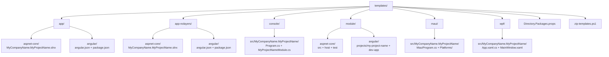

The ABP Framework ships every reference solution as a templated source tree under `templates/` in the main `abpframework/abp` repository. When a developer runs `abp new MyCompany.MyProject -t app` the CLI clones one of these trees, performs token replacement on `MyCompanyName.MyProjectName`, and emits a ready-to-build solution. This page walks through every template that lives next to `templates/zip-templates.ps1` and explains how the eight family pages in this section map back to those folders.

The repository keeps templates as **real, buildable projects** — not Liquid or T4 scaffolds. You can open `templates/app/aspnet-core/MyCompanyName.MyProjectName.slnx` directly in Rider or Visual Studio without ever invoking the CLI. That property makes the trees self-documenting: every `.csproj`, every `appsettings.json`, every Angular `angular.json` you see in the source is exactly what the CLI hands a new project.

## Template inventory

The seven top-level folders under `templates/` produce eight CLI templates because both `app` and `app-nolayers` ship a separate Angular companion alongside their ASP.NET Core stack:

<CardGroup cols={2}>
  <Card title="app (layered)" icon="layer-group" href="/templates/app-template-aspnetcore">
    Domain-Driven Design layered solution under `templates/app/aspnet-core/` with MVC, Blazor, Blazor WebApp, tiered Blazor, AuthServer and host variants.
  </Card>
  <Card title="app (Angular SPA)" icon="angular" href="/templates/app-template-angular">
    Standalone-components Angular workspace under `templates/app/angular/` that consumes the same HTTP API as the layered backend.
  </Card>
  <Card title="app-nolayers" icon="square-1" href="/templates/app-nolayers">
    Single-project ASP.NET Core variants under `templates/app-nolayers/aspnet-core/` plus an Angular SPA under `templates/app-nolayers/angular/`.
  </Card>
  <Card title="console" icon="terminal" href="/templates/console-template">
    `Microsoft.Extensions.Hosting` console under `templates/console/src/MyCompanyName.MyProjectName/` wired through `IHostedService`.
  </Card>
  <Card title="module" icon="puzzle-piece" href="/templates/module-template">
    Reusable application module under `templates/module/aspnet-core/` plus an Angular library under `templates/module/angular/projects/my-project-name/`.
  </Card>
  <Card title="MAUI" icon="mobile" href="/templates/maui-template">
    Cross-platform .NET MAUI shell under `templates/maui/src/MyCompanyName.MyProjectName/` with `Platforms/Android`, `iOS`, `MacCatalyst`, `Tizen`, `Windows`.
  </Card>
  <Card title="WPF" icon="window" href="/templates/wpf-template">
    Windows desktop host under `templates/wpf/src/MyCompanyName.MyProjectName/` using `AbpApplicationFactory` from `App.xaml.cs`.
  </Card>
  <Card title="Packaging" icon="box-archive" href="#packaging-with-zip-templatesps1">
    `templates/zip-templates.ps1` walks each folder, removes any stale zip, and produces `app-<version>.zip`, `module-<version>.zip`, etc.
  </Card>
</CardGroup>

## Template hierarchy

The diagram below shows how the eight CLI templates fan out from `templates/`. Each box maps one-to-one to a directory checked into the repo; the leaves marked with `csproj` and `package.json` are what `dotnet build` or `npm install` actually open.



Every leaf in that diagram corresponds to a dedicated page later in this section — the layered ASP.NET Core leaf is the largest, with twenty-three projects under `templates/app/aspnet-core/src/`, while the console and WPF leaves are single-project trees.

## Shared scaffolding files

Three files live next to the template folders and apply to every template at the same time. Knowing what each one does prevents surprises when you regenerate a solution after the CLI updates them.

### `templates/Directory.Packages.props`

This file is intentionally minimal:

```xml templates/Directory.Packages.props
<Project>
  <PropertyGroup>
    <ManagePackageVersionsCentrally>false</ManagePackageVersionsCentrally>
  </PropertyGroup>
</Project>
```

It exists only to **opt every templated solution out of central package management**. The ABP repo itself uses central versioning, but generated solutions pin versions inside each `.csproj` so a downstream consumer can upgrade one project at a time. Without this opt-out file the MSBuild SDK would inherit the repo-level `Directory.Packages.props` and refuse to honor inline `Version="..."` attributes.

### `templates/NuGet.Config`

Each `aspnet-core` template ships its own `NuGet.Config` (for example `templates/app/aspnet-core/NuGet.Config`) with an empty `<packageSources />` element. The CLI replaces those package sources at generation time when the user requests a preview build, but for source-controlled checkouts the file is intentionally empty so it falls through to the user's machine-wide configuration.

### `templates/zip-templates.ps1`

This script packages every template directory for distribution. The full body is short enough to quote:

```powershell templates/zip-templates.ps1
$version = $args[0]
$folders = Get-ChildItem -Directory

foreach ($folder in $folders) {
    $zipFile = "./" + $folder.Name + "-" + $version + ".zip"

    if (Test-Path $zipFile) {
        Remove-Item $zipFile
    }

    Compress-Archive -Path "$($folder.FullName)\*" -DestinationPath $zipFile
}

Write-Host "All templates have been zipped."
```

Running `pwsh templates/zip-templates.ps1 9.0.0` from the `templates/` directory produces `app-9.0.0.zip`, `app-nolayers-9.0.0.zip`, `console-9.0.0.zip`, `maui-9.0.0.zip`, `module-9.0.0.zip`, and `wpf-9.0.0.zip` in the same directory. The CLI's templating engine downloads those archives from the ABP CDN when a user generates a solution without the `--preview` flag.

<Note>
The script enumerates `Get-ChildItem -Directory`, so adding a new template is as simple as dropping a folder into `templates/`. No registration step is needed, but the CLI side still has to learn the template name in `Volo.Abp.Cli/Volo/Abp/Cli/ProjectBuilding/Templates/`.
</Note>

## How templates are selected by the CLI

When you run `abp new`, the CLI matches your `-t` argument against template ids defined in `Volo.Abp.Cli/Volo/Abp/Cli/ProjectBuilding/Templates/`. For example `AppProTemplate` resolves to the layered `templates/app/` folder, while `AppNoLayersTemplate` resolves to `templates/app-nolayers/`. The mapping is summarized below:

| CLI `-t` value | Source folder | Front-end flavor | Detail page |
| --- | --- | --- | --- |
| `app` | `templates/app/aspnet-core/` | MVC, Blazor, Blazor WebApp | [App (.NET)](/templates/app-template-aspnetcore) |
| `app --ui angular` | `templates/app/angular/` | Standalone Angular 21 | [App (Angular)](/templates/app-template-angular) |
| `app-nolayers` | `templates/app-nolayers/aspnet-core/` | MVC, Blazor Server, Blazor WASM | [App No-Layers](/templates/app-nolayers) |
| `app-nolayers --ui angular` | `templates/app-nolayers/angular/` | Angular SPA | [App No-Layers](/templates/app-nolayers) |
| `console` | `templates/console/src/` | None | [Console](/templates/console-template) |
| `module` | `templates/module/aspnet-core/` | Angular library + dev-app | [Module](/templates/module-template) |
| `maui` | `templates/maui/src/` | XAML | [MAUI](/templates/maui-template) |
| `wpf` | `templates/wpf/src/` | XAML | [WPF](/templates/wpf-template) |

## Token replacement

Although these folders are real solutions, the CLI substitutes a handful of tokens at generation time. Inspecting any file under `templates/` shows the pattern: the company name appears as `MyCompanyName` and the project name as `MyProjectName`, and the two are joined with a dot (`MyCompanyName.MyProjectName`). The CLI scans both file contents and file/folder names for these literals.

For instance `templates/console/src/MyCompanyName.MyProjectName/MyCompanyName.MyProjectName.csproj` becomes `Acme.BookStore/Acme.BookStore.csproj` when you run `abp new Acme.BookStore -t console`. The same logic walks the Angular workspace at `templates/app/angular/angular.json`, replacing the `"MyProjectName"` project key with `"BookStore"`.

<Warning>
Never check in a file under `templates/` that uses your real company name — the CLI will leak it into every downstream solution. The CI guard at `azure-pipelines.yml` greps each template folder for forbidden literals during PR validation.
</Warning>

## `common.props` per template family

Each non-Angular template root ships a `common.props` that sets `<AbpProjectType>` and centralizes a couple of compiler flags. The layered app uses:

```xml templates/app/aspnet-core/common.props
<Project>
  <PropertyGroup>
    <LangVersion>latest</LangVersion>
    <Version>1.0.0</Version>
    <NoWarn>$(NoWarn);CS1591</NoWarn>
    <AbpProjectType>app</AbpProjectType>
  </PropertyGroup>
  <!-- ... -->
</Project>
```

The `console/common.props`, `maui/common.props`, and `wpf/common.props` follow the same shape but with different `AbpProjectType` values. That property is read by the ABP MSBuild tasks shipped from `Volo.Abp.Cli.Sdk` to decide which packaging rules apply.

## When to use which template

<AccordionGroup>
  <Accordion title="Pick app (layered) when you need DDD enforcement">
    The layered solution under `templates/app/aspnet-core/src/` forces a strict separation between `MyCompanyName.MyProjectName.Domain`, `.Application`, and `.HttpApi`. Choose it for products that will live for years and that need clean module boundaries.
  </Accordion>
  <Accordion title="Pick app-nolayers when you want fast iteration">
    The single-project variants under `templates/app-nolayers/aspnet-core/MyCompanyName.MyProjectName.Mvc/` and `MyCompanyName.MyProjectName.Host/` collapse everything into one assembly. Ideal for internal tools, prototypes, or SaaS startups optimizing for time-to-first-commit.
  </Accordion>
  <Accordion title="Pick console for background workers or one-shot tools">
    `templates/console/src/MyCompanyName.MyProjectName/MyProjectNameHostedService.cs` shows the canonical `IHostedService` pattern. Use this template for cron jobs, ETL workers, and CLI utilities that need ABP modularity but no HTTP surface.
  </Accordion>
  <Accordion title="Pick module when you ship code to other ABP solutions">
    `templates/module/aspnet-core/src/` mirrors the layout of `modules/identity/` and `modules/cms-kit/`. Use it when your code will be consumed as NuGet packages or via the ABP module marketplace.
  </Accordion>
  <Accordion title="Pick MAUI or WPF for client-side ABP">
    MAUI under `templates/maui/src/` targets Android, iOS, MacCatalyst, Tizen, and Windows; WPF under `templates/wpf/src/` targets `net10.0-windows`. Both bootstrap an `AbpApplication` so client code can use the same modularity primitives as the server.
  </Accordion>
</AccordionGroup>

## Layered vs no-layers at a glance

The two flagship templates appear similar but have very different project counts. The layered template ships **23 projects** under `templates/app/aspnet-core/src/`, while the no-layers template ships at most **7 projects** under `templates/app-nolayers/aspnet-core/` — and you only pick one of those seven, not all of them.

<Tabs>
  <Tab title="app (layered) projects">
    Source: `templates/app/aspnet-core/src/`

    - `MyCompanyName.MyProjectName.Application`
    - `MyCompanyName.MyProjectName.Application.Contracts`
    - `MyCompanyName.MyProjectName.AuthServer`
    - `MyCompanyName.MyProjectName.Blazor`
    - `MyCompanyName.MyProjectName.Blazor.Client`
    - `MyCompanyName.MyProjectName.Blazor.Server`
    - `MyCompanyName.MyProjectName.Blazor.Server.Tiered`
    - `MyCompanyName.MyProjectName.Blazor.WebApp`
    - `MyCompanyName.MyProjectName.Blazor.WebApp.Client`
    - `MyCompanyName.MyProjectName.Blazor.WebApp.Tiered`
    - `MyCompanyName.MyProjectName.Blazor.WebApp.Tiered.Client`
    - `MyCompanyName.MyProjectName.DbMigrator`
    - `MyCompanyName.MyProjectName.Domain`
    - `MyCompanyName.MyProjectName.Domain.Shared`
    - `MyCompanyName.MyProjectName.EntityFrameworkCore`
    - `MyCompanyName.MyProjectName.HttpApi`
    - `MyCompanyName.MyProjectName.HttpApi.Client`
    - `MyCompanyName.MyProjectName.HttpApi.Host`
    - `MyCompanyName.MyProjectName.HttpApi.HostWithIds`
    - `MyCompanyName.MyProjectName.MongoDB`
    - `MyCompanyName.MyProjectName.Web`
    - `MyCompanyName.MyProjectName.Web.Host`
  </Tab>
  <Tab title="app-nolayers projects">
    Source: `templates/app-nolayers/aspnet-core/`

    - `MyCompanyName.MyProjectName.Mvc` — MVC + EF Core
    - `MyCompanyName.MyProjectName.Mvc.Mongo` — MVC + MongoDB
    - `MyCompanyName.MyProjectName.Host` — Razor host
    - `MyCompanyName.MyProjectName.Host.Mongo` — Razor host + MongoDB
    - `MyCompanyName.MyProjectName.Blazor.Server` — Blazor Server + EF Core
    - `MyCompanyName.MyProjectName.Blazor.Server.Mongo` — Blazor Server + MongoDB
    - `MyCompanyName.MyProjectName.Blazor.WebAssembly` — Blazor WASM

    The CLI keeps only the variant matching your `--ui` and `--database` flags.
  </Tab>
</Tabs>

## Solution file format

Every templated `.NET` solution ships as an `.slnx` (Visual Studio's XML solution format), for example `templates/app/aspnet-core/MyCompanyName.MyProjectName.slnx` and `templates/module/aspnet-core/MyCompanyName.MyProjectName.slnx`. The CLI converts these back to `.sln` for users on older tooling, but the canonical form in the repo is `.slnx`. JetBrains DotSettings files (`MyCompanyName.MyProjectName.sln.DotSettings`) ship alongside to pre-configure code style.

## Test projects

Only the **layered app** and the **module** templates ship test projects:

- `templates/app/aspnet-core/test/` contains `MyCompanyName.MyProjectName.Application.Tests`, `.Domain.Tests`, `.EntityFrameworkCore.Tests`, `.HttpApi.Client.ConsoleTestApp`, `.MongoDB.Tests`, `.TestBase`, and `.Web.Tests`.
- `templates/module/aspnet-core/test/` contains the same set minus `.Web.Tests`.

The console, MAUI, and WPF templates skip test projects on purpose — they assume the consumer adds tests in their own structure once the solution is generated.

## Next steps

Each downstream page in this section opens with the corresponding `slnx` file and walks every project end-to-end. Start with [App (.NET)](/templates/app-template-aspnetcore) if you want the full DDD tour, or jump straight to [Console](/templates/console-template) for the smallest possible ABP host.
