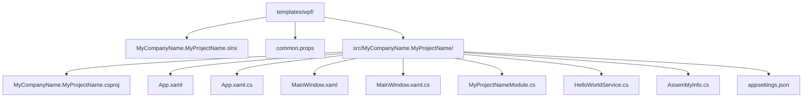
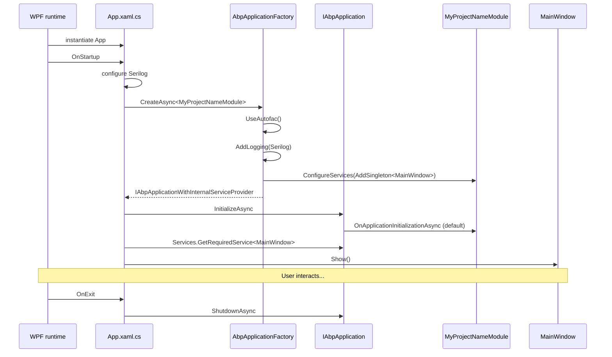

The WPF template ships a single-project Windows desktop application bootstrapped through ABP Framework's `AbpApplicationFactory`. The source lives at `templates/wpf/src/MyCompanyName.MyProjectName/` and targets `net10.0-windows`. The CLI invocation is `abp new MyCompany.MyProject -t wpf`.

Unlike the MAUI template — which uses `MauiAppBuilder` because MAUI dictates the bootstrap — the WPF template embeds ABP into the conventional WPF lifecycle (`Application.OnStartup`/`OnExit`). This makes it a useful reference for **embedding ABP into an existing WPF or WinForms application** that you cannot rewrite from scratch.

## Solution layout



Eight files plus the solution and `common.props`. Smaller than every other template except [Console](/templates/console-template).

## `common.props`

Path: `templates/wpf/common.props`

```xml templates/wpf/common.props
<Project>
  <PropertyGroup>
    <LangVersion>latest</LangVersion>
    <Version>0.1.0</Version>
    <NoWarn>$(NoWarn);CS1591;CS0436</NoWarn>
  </PropertyGroup>
</Project>
```

Notice the absence of `<AbpProjectType>wpf</AbpProjectType>` — at the time this template was authored, the WPF type was not yet on the ABP MSBuild tasks. The `CS0436` suppression silences "type forwarded" warnings that appear when referencing the framework directly via `ProjectReference`.

## `MyCompanyName.MyProjectName.csproj`

Path: `templates/wpf/src/MyCompanyName.MyProjectName/MyCompanyName.MyProjectName.csproj`

```xml templates/wpf/src/MyCompanyName.MyProjectName/MyCompanyName.MyProjectName.csproj
<Project Sdk="Microsoft.NET.Sdk">

    <Import Project="..\..\common.props" />

    <PropertyGroup>
        <OutputType>WinExe</OutputType>
        <TargetFramework>net10.0-windows</TargetFramework>
        <Nullable>enable</Nullable>
        <UseWPF>true</UseWPF>
    </PropertyGroup>

    <ItemGroup>
        <ProjectReference Include="..\..\..\..\framework\src\Volo.Abp.Autofac\Volo.Abp.Autofac.csproj" />
    </ItemGroup>

    <ItemGroup>
        <PackageReference Include="Microsoft.Extensions.Hosting" Version="10.0.7" />
        <PackageReference Include="Serilog.Extensions.Hosting" Version="9.0.0" />
        <PackageReference Include="Serilog.Extensions.Logging" Version="9.0.2" />
        <PackageReference Include="Serilog.Sinks.Async" Version="2.1.0" />
        <PackageReference Include="Serilog.Sinks.File" Version="7.0.0" />
    </ItemGroup>

    <ItemGroup>
        <None Remove="appsettings.json" />
        <Content Include="appsettings.json">
            <CopyToOutputDirectory>Always</CopyToOutputDirectory>
        </Content>
    </ItemGroup>

</Project>
```

The four critical lines:

- `<OutputType>WinExe</OutputType>` — Windows GUI executable (no console window).
- `<TargetFramework>net10.0-windows</TargetFramework>` — required for WPF (no multi-targeting).
- `<UseWPF>true</UseWPF>` — turns on XAML compilation.
- `Volo.Abp.Autofac` — the single ABP project reference. The CLI rewrites it to a `PackageReference` at generation time.

Like the console template, Serilog is pre-wired (no `Serilog.Sinks.Console` because there is no console). `appsettings.json` is copied to output as `Always`.

<Note>
This is **not** an `AbpAspNetCore`-based host. There is no `WebApplication.CreateBuilder`. The template uses ABP's lower-level `AbpApplicationFactory.CreateAsync<TModule>()` API directly so it can integrate with WPF's `Application.OnStartup` lifecycle.
</Note>

## `App.xaml`

Path: `templates/wpf/src/MyCompanyName.MyProjectName/App.xaml`

```xml templates/wpf/src/MyCompanyName.MyProjectName/App.xaml
<Application x:Class="MyCompanyName.MyProjectName.App"
             xmlns="http://schemas.microsoft.com/winfx/2006/xaml/presentation"
             xmlns:x="http://schemas.microsoft.com/winfx/2006/xaml"
             xmlns:local="clr-namespace:MyCompanyName.MyProjectName">
    <Application.Resources>

    </Application.Resources>
</Application>
```

Notice the missing `StartupUri="MainWindow.xaml"`. The default WPF behavior would auto-instantiate `MainWindow` via parameterless ctor — but `MainWindow` here takes constructor dependencies, so we **disable** `StartupUri` and resolve the window through ABP's container in `App.xaml.cs`.

## `App.xaml.cs`

Path: `templates/wpf/src/MyCompanyName.MyProjectName/App.xaml.cs`

This is the most interesting file in the template:

```csharp templates/wpf/src/MyCompanyName.MyProjectName/App.xaml.cs
public partial class App : Application
{
    private IAbpApplicationWithInternalServiceProvider? _abpApplication;

    protected override async void OnStartup(StartupEventArgs e)
    {
        Log.Logger = new LoggerConfiguration()
#if DEBUG
            .MinimumLevel.Debug()
#else
            .MinimumLevel.Information()
#endif
            .MinimumLevel.Override("Microsoft", LogEventLevel.Information)
            .Enrich.FromLogContext()
            .WriteTo.Async(c => c.File("Logs/logs.txt"))
            .CreateLogger();

        try
        {
            Log.Information("Starting WPF host.");

            _abpApplication = await AbpApplicationFactory.CreateAsync<MyProjectNameModule>(options =>
            {
                options.UseAutofac();
                options.Services.AddLogging(loggingBuilder => loggingBuilder.AddSerilog(dispose: true));
            });

            await _abpApplication.InitializeAsync();

            _abpApplication.Services.GetRequiredService<MainWindow>()?.Show();
        }
        catch (Exception ex)
        {
            Log.Fatal(ex, "Host terminated unexpectedly!");
        }
    }

    protected override async void OnExit(ExitEventArgs e)
    {
        if (_abpApplication != null)
        {
            await _abpApplication.ShutdownAsync();
        }
        Log.CloseAndFlush();
    }
}
```

Three things make this different from the console template's `Program.cs`:

1. **`AbpApplicationFactory.CreateAsync<TModule>` instead of `AddApplicationAsync`**. The factory creates an `IAbpApplicationWithInternalServiceProvider` — ABP owns the container outright. There is no `IHost`, no `IHostedService`, no generic host.
2. **`options.UseAutofac()`** is the synchronous configuration call equivalent to `AddAutofacServiceProviderFactory` in the console template. The factory handles the container swap internally.
3. **`_abpApplication.Services.GetRequiredService<MainWindow>()?.Show()`** — the main window is resolved from ABP's container. Its constructor dependencies are injected by Autofac.

The `OnExit` override calls `_abpApplication.ShutdownAsync()` so module shutdown hooks fire.

<Warning>
`async void` is unavoidable here because `OnStartup`/`OnExit` are framework hooks with `void` signatures. Wrap the body in `try/catch` so unhandled exceptions don't kill the process silently — that's exactly what the template does with the `Log.Fatal` call.
</Warning>

## `MyProjectNameModule.cs`

Path: `templates/wpf/src/MyCompanyName.MyProjectName/MyProjectNameModule.cs`

```csharp templates/wpf/src/MyCompanyName.MyProjectName/MyProjectNameModule.cs
[DependsOn(typeof(AbpAutofacModule))]
public class MyProjectNameModule : AbpModule
{
    public override void ConfigureServices(ServiceConfigurationContext context)
    {
        context.Services.AddSingleton<MainWindow>();
    }
}
```

Two notable choices:

- `AbpAutofacModule` is the only framework dependency.
- `MainWindow` is registered as a **singleton** via `context.Services.AddSingleton<MainWindow>()`. WPF expects a single primary window; the singleton lifetime matches that expectation. If you create secondary windows, register them as transient instead.

## `MainWindow.xaml.cs`

Path: `templates/wpf/src/MyCompanyName.MyProjectName/MainWindow.xaml.cs`

```csharp templates/wpf/src/MyCompanyName.MyProjectName/MainWindow.xaml.cs
public partial class MainWindow : Window
{
    private readonly HelloWorldService _helloWorldService;

    public MainWindow(HelloWorldService helloWorldService)
    {
        _helloWorldService = helloWorldService;
        InitializeComponent();
    }

    protected override void OnContentRendered(EventArgs e)
    {
        HelloLabel.Content = _helloWorldService.SayHello();
    }
}
```

The constructor takes `HelloWorldService` via DI. The injected service writes to the label once the content is rendered.

## `MainWindow.xaml`

Path: `templates/wpf/src/MyCompanyName.MyProjectName/MainWindow.xaml`

```xml templates/wpf/src/MyCompanyName.MyProjectName/MainWindow.xaml
<Window x:Class="MyCompanyName.MyProjectName.MainWindow"
        xmlns="http://schemas.microsoft.com/winfx/2006/xaml/presentation"
        xmlns:x="http://schemas.microsoft.com/winfx/2006/xaml"
        xmlns:d="http://schemas.microsoft.com/expression/blend/2008"
        xmlns:mc="http://schemas.openxmlformats.org/markup-compatibility/2006"
        xmlns:local="clr-namespace:MyCompanyName.MyProjectName"
        mc:Ignorable="d"
        Title="MainWindow" Height="450" Width="800">
    <Grid>
        <Label Name="HelloLabel" FontSize="90" Margin="58,129,-58,-129"/>
    </Grid>
</Window>
```

A single `Label` named `HelloLabel`. Intentionally minimal so the template demonstrates only the DI pipeline, not WPF layout patterns.

## `HelloWorldService.cs`

Path: `templates/wpf/src/MyCompanyName.MyProjectName/HelloWorldService.cs`

```csharp templates/wpf/src/MyCompanyName.MyProjectName/HelloWorldService.cs
public class HelloWorldService : ITransientDependency
{
    public ILogger<HelloWorldService> Logger { get; set; }

    public HelloWorldService()
    {
        Logger = NullLogger<HelloWorldService>.Instance;
    }

    public string SayHello()
    {
        Logger.LogInformation("Call SayHello");
        return "Hello world!";
    }
}
```

Identical pattern to the console template's `HelloWorldService.cs`: `ITransientDependency` for auto-registration, property injection for the logger via the `NullLogger` default.

## `AssemblyInfo.cs`

Path: `templates/wpf/src/MyCompanyName.MyProjectName/AssemblyInfo.cs`

```csharp templates/wpf/src/MyCompanyName.MyProjectName/AssemblyInfo.cs
[assembly: ThemeInfo(
    ResourceDictionaryLocation.None,
    ResourceDictionaryLocation.SourceAssembly
)]
```

Standard WPF theme dictionary configuration — kept unchanged from the WPF SDK default.

## `appsettings.json`

Path: `templates/wpf/src/MyCompanyName.MyProjectName/appsettings.json`

The file is shipped empty:

```json templates/wpf/src/MyCompanyName.MyProjectName/appsettings.json
{

}
```

`AbpApplicationFactory.CreateAsync` configures `Microsoft.Extensions.Configuration` by default; you can drop any keys here and they'll be readable via `IConfiguration` in module hooks.

## Lifecycle in one picture



The diagram clarifies what makes the WPF bootstrap different from MAUI: there is **no** intermediate `IHost`. ABP owns the container; WPF owns the message pump; the two communicate through `App.xaml.cs`.

## Why no `Volo.Abp.Wpf`?

ABP does not ship a `Volo.Abp.Wpf` package. The template demonstrates that you don't need one — `Volo.Abp.Autofac` plus `AbpApplicationFactory` provide everything required to host ABP inside WPF. Compare with MAUI which uses `AbpAutofacServiceProviderFactory` directly because `MauiAppBuilder` exposes `ConfigureContainer` — different bootstrap surface, same underlying primitives.

## Adding an ABP HTTP API client

To call a remote ABP API from the WPF client, depend on the `HttpApi.Client` module of your backend solution (for example `templates/app/aspnet-core/src/MyCompanyName.MyProjectName.HttpApi.Client/`). The dependency goes on the module:

```csharp templates/wpf/src/MyCompanyName.MyProjectName/MyProjectNameModule.cs
[DependsOn(
    typeof(AbpAutofacModule),
    typeof(MyProjectNameHttpApiClientModule)
)]
public class MyProjectNameModule : AbpModule
{
    public override void ConfigureServices(ServiceConfigurationContext context)
    {
        context.Services.AddSingleton<MainWindow>();

        Configure<AbpRemoteServiceOptions>(options =>
        {
            options.RemoteServices.Default = new RemoteServiceConfiguration("https://localhost:44305/");
        });
    }
}
```

`MyProjectNameHttpApiClientModule` brings dynamic proxying so the application services can be called as if they were local — the same mechanism the test project `MyCompanyName.MyProjectName.HttpApi.Client.ConsoleTestApp` exercises.

## Common pitfalls

<AccordionGroup>
  <Accordion title="Forgetting to remove StartupUri">
    The default WPF template sets `StartupUri="MainWindow.xaml"` in `App.xaml`. If you leave that in place, WPF will instantiate `MainWindow` via the parameterless ctor **before** ABP creates the container — the DI-resolved `HelloWorldService` field will be null.
  </Accordion>
  <Accordion title="async void exceptions">
    `OnStartup` and `OnExit` are `async void`. Any unhandled exception inside them is fatal. Always wrap with `try/catch` and log to Serilog, exactly as the template does.
  </Accordion>
  <Accordion title="Confusing singleton scope">
    `MainWindow` is registered as a singleton. If you call `_abpApplication.Services.GetRequiredService<MainWindow>()?.Show()` twice you get the same already-closed window. For secondary windows, prefer `services.AddTransient` and resolve through a factory.
  </Accordion>
  <Accordion title="Property injection without Autofac">
    The template's `HelloWorldService` relies on property injection for `ILogger<HelloWorldService>`. That only works because `options.UseAutofac()` is called. Switching to the default Microsoft container would null out the logger property.
  </Accordion>
</AccordionGroup>

## Where to look next

- For the cross-platform desktop alternative, see [MAUI](/templates/maui-template).
- For the headless console host that shares the Autofac + Serilog bootstrap, see [Console](/templates/console-template).
- For the API the WPF client typically talks to, see [App (.NET)](/templates/app-template-aspnetcore).
