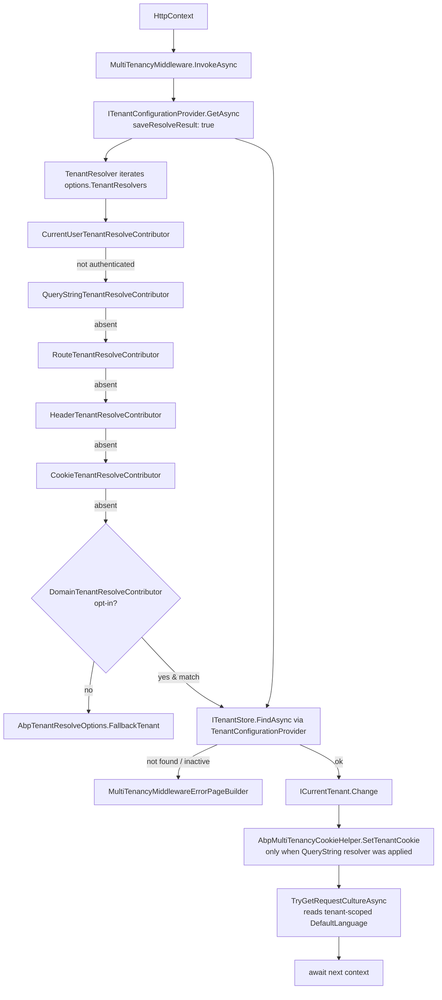

`framework/src/Volo.Abp.AspNetCore.MultiTenancy/` adds HTTP-aware tenant
resolution to ABP Framework. The package contributes four HTTP contributors to
`AbpTenantResolveOptions`, a `MultiTenancyMiddleware` that drives
`ITenantConfigurationProvider`, an `HttpContextTenantResolveResultAccessor` that
replaces the null-object default, and a tunable `AbpAspNetCoreMultiTenancyOptions`
type that holds the tenant key and the error-page builder. The module class
`framework/src/Volo.Abp.AspNetCore.MultiTenancy/Volo/Abp/AspNetCore/MultiTenancy/AbpAspNetCoreMultiTenancyModule.cs`
is the single entry point.

## `AbpAspNetCoreMultiTenancyModule` — what gets contributed

The module depends on `AbpMultiTenancyModule` (so the core resolver pipeline is
already in place) and `AbpAspNetCoreModule` (so an HTTP host is assumed). Its
`ConfigureServices` body adds four contributors to the chain:

```csharp
public override void ConfigureServices(ServiceConfigurationContext context)
{
    Configure<AbpTenantResolveOptions>(options =>
    {
        options.TenantResolvers.Add(new QueryStringTenantResolveContributor());
        options.TenantResolvers.Add(new RouteTenantResolveContributor());
        options.TenantResolvers.Add(new HeaderTenantResolveContributor());
        options.TenantResolvers.Add(new CookieTenantResolveContributor());
    });
}
```

Because `Add(...)` *appends*, these run after `CurrentUserTenantResolveContributor`
which was inserted at index 0 by `AbpMultiTenancyModule`. The HTTP contributors
are evaluated in the order shown, so a query-string value beats a route value,
which beats a header, which beats a cookie. The `DomainTenantResolveContributor`
is not in the list by default — it must be inserted explicitly with
`AddDomainTenantResolver(...)`.

## `MultiTenancyMiddleware`

The middleware is the bridge between the resolver chain and ASP.NET Core. Its
implementation lives at
`framework/src/Volo.Abp.AspNetCore.MultiTenancy/Volo/Abp/AspNetCore/MultiTenancy/MultiTenancyMiddleware.cs`,
and it inherits from `AbpMiddlewareBase` so that the ABP infrastructure can host
it as a transient service:

```csharp
public async override Task InvokeAsync(HttpContext context, RequestDelegate next)
{
    TenantConfiguration? tenant = null;
    try
    {
        tenant = await _tenantConfigurationProvider.GetAsync(saveResolveResult: true);
    }
    catch (Exception e)
    {
        Logger.LogException(e);
        if (await _options.MultiTenancyMiddlewareErrorPageBuilder(context, e)) return;
    }

    if (tenant?.Id != _currentTenant.Id)
    {
        using (_currentTenant.Change(tenant?.Id, tenant?.Name))
        {
            if (_tenantResolveResultAccessor.Result != null &&
                _tenantResolveResultAccessor.Result.AppliedResolvers.Contains(QueryStringTenantResolveContributor.ContributorName))
            {
                AbpMultiTenancyCookieHelper.SetTenantCookie(context, _currentTenant.Id, _options.TenantKey);
            }

            var requestCulture = await TryGetRequestCultureAsync(context);
            if (requestCulture != null) { /* set CultureInfo.CurrentCulture / CurrentUICulture, write culture cookie */ }
            await next(context);
        }
    }
    else
    {
        await next(context);
    }
}
```

A few observations:

- The provider is called with `saveResolveResult: true`, so the resulting
  `TenantResolveResult` is stored in `ITenantResolveResultAccessor.Result` and
  becomes visible to error pages, controllers, and views.
- If the provider throws (tenant missing, inactive, etc.), the middleware
  delegates to `AbpAspNetCoreMultiTenancyOptions.MultiTenancyMiddlewareErrorPageBuilder`.
  A `true` return short-circuits the pipeline; a `false` return rethrows.
- The `using (_currentTenant.Change(...))` block scopes the tenant for the rest
  of the pipeline (and disposes the scope when the response is being written).
- When the query-string contributor was the resolver, the middleware writes a
  tenant cookie via `AbpMultiTenancyCookieHelper.SetTenantCookie(...)`. This is
  the "first request adds `?__tenant=xyz` then subsequent requests don't have
  to" behavior.
- `TryGetRequestCultureAsync` checks `IRequestCultureFeature` and, if no
  provider has set a culture yet, reads `LocalizationSettingNames.DefaultLanguage`
  through `ISettingProvider` — which by now is tenant-scoped because
  `TenantSettingValueProvider` is in the chain.

## Registering the middleware

The extension method
`framework/src/Volo.Abp.AspNetCore.MultiTenancy/Microsoft/AspNetCore/Builder/AbpAspNetCoreMultiTenancyApplicationBuilderExtensions.cs`
adds the middleware:

```csharp
public static IApplicationBuilder UseMultiTenancy(this IApplicationBuilder app)
{
    var multiTenancyOptions = app.ApplicationServices.GetRequiredService<IOptions<AbpTenantResolveOptions>>();
    var hasCurrentUserTenantResolveContributor = multiTenancyOptions.Value.TenantResolvers
        .Any(r => r is CurrentUserTenantResolveContributor);
    if (hasCurrentUserTenantResolveContributor)
    {
        var authenticationMiddlewareSet = app.Properties.TryGetValue("__AuthenticationMiddlewareSet", out var value) && value is true;
        if (!authenticationMiddlewareSet)
        {
            var logger = app.ApplicationServices.GetService<ILogger<MultiTenancyMiddleware>>();
            logger?.LogWarning(
                "MultiTenancyMiddleware is being registered before the authentication middleware. " +
                "This may lead to incorrect tenant resolution if the resolution depends on the authenticated user. " +
                "Ensure app.UseAuthentication() is called before app.UseMultiTenancy().");
        }
    }
    return app.UseMiddleware<MultiTenancyMiddleware>();
}
```

The pre-flight check inspects `IApplicationBuilder.Properties["__AuthenticationMiddlewareSet"]`,
which is the well-known key that `UseAuthentication()` writes. If the user
contributor is registered but authentication has not been wired yet, the
extension logs a warning rather than throwing — but the warning is loud enough
that you should reorder the pipeline.

```csharp
app.UseAuthentication();
app.UseAbpRequestLocalization();
app.UseMultiTenancy();   // must be after UseAuthentication
app.UseAuthorization();
```

## `AbpAspNetCoreMultiTenancyOptions`

The options object in
`framework/src/Volo.Abp.AspNetCore.MultiTenancy/Volo/Abp/AspNetCore/MultiTenancy/AbpAspNetCoreMultiTenancyOptions.cs`
exposes two settings:

```csharp
public class AbpAspNetCoreMultiTenancyOptions
{
    public string TenantKey { get; set; }
    public Func<HttpContext, Exception, Task<bool>> MultiTenancyMiddlewareErrorPageBuilder { get; set; }

    public AbpAspNetCoreMultiTenancyOptions()
    {
        TenantKey = TenantResolverConsts.DefaultTenantKey; // "__tenant"
        MultiTenancyMiddlewareErrorPageBuilder = async (context, exception) => { /* default body */ };
    }
}
```

`TenantKey` is consumed by every HTTP contributor (`?__tenant=...`,
`__tenant=...` cookie, `__tenant` header, `__tenant` route value). Change it
once and all four contributors update. The constant `__tenant` is defined in
`framework/src/Volo.Abp.MultiTenancy.Abstractions/Volo/Abp/MultiTenancy/TenantResolverConsts.cs`.

The default `MultiTenancyMiddlewareErrorPageBuilder` does four things:

1. Inspects `ITenantResolveResultAccessor.Result` — if the only applied
   resolver was `CurrentUser`, the user identity claim has gone stale, so the
   builder calls `CookieAuthenticationHandler.SignOutAsync(null)` to delete the
   broken auth cookie.
2. If `Cookie` was an applied resolver, or the request still carries the tenant
   cookie, the builder deletes that cookie via
   `AbpMultiTenancyCookieHelper.SetTenantCookie(context, null, options.TenantKey)`.
3. Adds an `Abp-Tenant-Resolve-Error` response header with the exception
   message HTML-encoded.
4. For AJAX requests, writes a `RemoteServiceErrorResponse` JSON body with a
   `404 NotFound` status. For GET HTML requests with cookie auth, issues a
   redirect to the same URL so the freshly-deleted cookie takes effect. For
   everything else, renders the embedded `MultiTenancyMiddlewareErrorPage`
   Razor view from
   `framework/src/Volo.Abp.AspNetCore.MultiTenancy/Volo/Abp/AspNetCore/MultiTenancy/Views/MultiTenancyMiddlewareErrorPage.Designer.cs`.

Override the builder when you need to customize the page or to redirect
unauthorized tenants to a marketing site:

```csharp
Configure<AbpAspNetCoreMultiTenancyOptions>(options =>
{
    options.MultiTenancyMiddlewareErrorPageBuilder = async (ctx, ex) =>
    {
        ctx.Response.Redirect("/tenant-not-found");
        return true;
    };
});
```

## `HttpTenantResolveContributorBase`

All HTTP-aware contributors derive from
`framework/src/Volo.Abp.AspNetCore.MultiTenancy/Volo/Abp/AspNetCore/MultiTenancy/HttpTenantResolveContributorBase.cs`,
which does three things: pull `HttpContext` out of the resolve context, wrap
the work in a `try/catch` that logs warnings via `ILogger<HttpTenantResolveContributorBase>`,
and assign `context.TenantIdOrName` only when a non-empty value is found:

```csharp
public override async Task ResolveAsync(ITenantResolveContext context)
{
    var httpContext = context.GetHttpContext();
    if (httpContext == null) return;
    try { await ResolveFromHttpContextAsync(context, httpContext); }
    catch (Exception e) { /* log warning */ }
}

protected virtual async Task ResolveFromHttpContextAsync(ITenantResolveContext context, HttpContext httpContext)
{
    var tenantIdOrName = await GetTenantIdOrNameFromHttpContextOrNullAsync(context, httpContext);
    if (!tenantIdOrName.IsNullOrEmpty()) context.TenantIdOrName = tenantIdOrName;
}

protected abstract Task<string?> GetTenantIdOrNameFromHttpContextOrNullAsync(ITenantResolveContext context, HttpContext httpContext);
```

The static extension `GetHttpContext()` is a thin wrapper around
`IHttpContextAccessor` that uses `context.ServiceProvider`. Note that the base
class does *not* set `context.Handled` — only `DomainTenantResolveContributor`
does, because its match is non-ambiguous (the host name matched the configured
template, so even a "not found" result must short-circuit the chain).

## Built-in HTTP contributors

### `QueryStringTenantResolveContributor`

`framework/src/Volo.Abp.AspNetCore.MultiTenancy/Volo/Abp/AspNetCore/MultiTenancy/QueryStringTenantResolveContributor.cs`
inspects `HttpContext.Request.Query[options.TenantKey]`. The contributor name
constant is `"QueryString"`. Because this contributor runs before the cookie
contributor, `?__tenant=...` in the URL always overrides a previously cached
cookie — and the middleware then updates the cookie to match.

### `RouteTenantResolveContributor`

`framework/src/Volo.Abp.AspNetCore.MultiTenancy/Volo/Abp/AspNetCore/MultiTenancy/RouteTenantResolveContributor.cs`
calls `httpContext.GetRouteValue(options.TenantKey)`. Use it when your routes
look like `/{__tenant}/products/{id}`. The contributor name constant is
`"Route"`. Be aware that ASP.NET Core only populates route values after the
routing middleware has run — `UseMultiTenancy()` must therefore be added after
`UseRouting()` if you want this contributor to fire.

### `HeaderTenantResolveContributor`

`framework/src/Volo.Abp.AspNetCore.MultiTenancy/Volo/Abp/AspNetCore/MultiTenancy/HeaderTenantResolveContributor.cs`
reads `httpContext.Request.Headers[options.TenantKey]`. If more than one header
value is present it picks the first and logs a warning via
`ILogger<HeaderTenantResolveContributor>`. The contributor name constant is
`"Header"`. This is the path that REST/HttpApi clients use most often:
`__tenant: <guid>`.

### `CookieTenantResolveContributor`

`framework/src/Volo.Abp.AspNetCore.MultiTenancy/Volo/Abp/AspNetCore/MultiTenancy/CookieTenantResolveContributor.cs`
reads `httpContext.Request.Cookies[options.TenantKey]`. The contributor name
constant is `"Cookie"`. The cookie is written by
`MultiTenancyMiddleware` (for `?__tenant=...` requests) and by the
`TenantSwitchModal` Razor page (covered in the MVC UI page).

### `FormTenantResolveContributor` (obsolete)

`framework/src/Volo.Abp.AspNetCore.MultiTenancy/Volo/Abp/AspNetCore/MultiTenancy/FormTenantResolveContributor.cs`
reads `httpContext.Request.Form[options.TenantKey]` for POSTed form bodies.
The class is decorated `[Obsolete("This may make some features of ASP NET Core
unavailable, Will be removed in future versions.")]` because reading the form
inside middleware buffers the body in a way that interferes with downstream
model binding. Do not use it in new code.

### `DomainTenantResolveContributor`

`framework/src/Volo.Abp.AspNetCore.MultiTenancy/Volo/Abp/AspNetCore/MultiTenancy/DomainTenantResolveContributor.cs`
matches `httpContext.Request.Host.Value` against a template such as
`"{0}.myapp.com"` using
`Volo.Abp.Text.Formatting.FormattedStringValueExtracter`:

```csharp
public DomainTenantResolveContributor(string domainFormat)
{
    _domainFormat = domainFormat.RemovePreFix(ProtocolPrefixes);
}

protected override Task<string?> GetTenantIdOrNameFromHttpContextOrNullAsync(ITenantResolveContext context, HttpContext httpContext)
{
    if (!httpContext.Request.Host.HasValue) return Task.FromResult<string?>(null);
    var hostName = httpContext.Request.Host.Value.RemovePreFix(ProtocolPrefixes);
    var extractResult = FormattedStringValueExtracter.Extract(hostName, _domainFormat, ignoreCase: true);
    context.Handled = true;
    return Task.FromResult(extractResult.IsMatch ? extractResult.Matches[0].Value : null);
}
```

Two behaviors to note: it strips `http://` and `https://` prefixes from both the
template and the host (using the static `ProtocolPrefixes` array), and it sets
`context.Handled = true` whether or not the regex matched. The "always handled"
contract means that once you opt into domain-based tenancy, an unmatched host
becomes the host side rather than falling through to cookies and headers — a
safer default for production.

Register the contributor through the extension method in
`framework/src/Volo.Abp.AspNetCore.MultiTenancy/Volo/Abp/MultiTenancy/AbpMultiTenancyOptionsExtensions.cs`:

```csharp
public static void AddDomainTenantResolver(this AbpTenantResolveOptions options, string domainFormat)
{
    options.TenantResolvers.InsertAfter(
        r => r is CurrentUserTenantResolveContributor,
        new DomainTenantResolveContributor(domainFormat));
}
```

The insertion point — *after* the current-user contributor — preserves the
"authenticated user wins" invariant.

## Resolution flow at a glance



## `ITenantResolveResultAccessor` for HTTP

The default `NullTenantResolveResultAccessor` in `Volo.Abp.MultiTenancy` returns
`null`. This assembly replaces it via
`framework/src/Volo.Abp.AspNetCore.MultiTenancy/Volo/Abp/AspNetCore/MultiTenancy/HttpContextTenantResolveResultAccessor.cs`:

```csharp
[Dependency(ReplaceServices = true)]
public class HttpContextTenantResolveResultAccessor : ITenantResolveResultAccessor, ITransientDependency
{
    public const string HttpContextItemName = "__AbpTenantResolveResult";

    public TenantResolveResult? Result
    {
        get => _httpContextAccessor.HttpContext?.Items[HttpContextItemName] as TenantResolveResult;
        set
        {
            if (_httpContextAccessor.HttpContext == null) return;
            _httpContextAccessor.HttpContext.Items[HttpContextItemName] = value;
        }
    }
    // ...
}
```

The result is stored in `HttpContext.Items["__AbpTenantResolveResult"]`. Views,
filters, and downstream middlewares can read it to find out which resolver
actually fired (`Result.AppliedResolvers.Last()`) or to display the resolved
tenant name in a tenant-switch widget.

## `AbpMultiTenancyCookieHelper`

The static helper at
`framework/src/Volo.Abp.AspNetCore.MultiTenancy/Volo/Abp/AspNetCore/MultiTenancy/AbpMultiTenancyCookieHelper.cs`
writes (or deletes) the tenant cookie with the framework's standard
`CookieOptions`:

```csharp
public static void SetTenantCookie(HttpContext context, Guid? tenantId, string tenantKey)
{
    if (tenantId != null)
    {
        context.Response.Cookies.Append(tenantKey, tenantId.ToString()!, new CookieOptions
        {
            Path = "/",
            HttpOnly = false,
            IsEssential = true,
            Expires = DateTimeOffset.Now.AddYears(10)
        });
    }
    else
    {
        context.Response.Cookies.Delete(tenantKey);
    }
}
```

`HttpOnly = false` is intentional: client-side scripts (the
`tenant-switch.js` bundle from the MVC UI package) need to read the cookie to
keep dropdowns in sync. `IsEssential = true` exempts the cookie from the
GDPR-consent check so that tenancy keeps working before the user has accepted
non-essential cookies.

## `TenantResolveContextExtensions`

The small helper at
`framework/src/Volo.Abp.AspNetCore.MultiTenancy/Volo/Abp/AspNetCore/MultiTenancy/TenantResolveContextExtensions.cs`
fetches `AbpAspNetCoreMultiTenancyOptions` from the resolve-context service
provider:

```csharp
public static AbpAspNetCoreMultiTenancyOptions GetAbpAspNetCoreMultiTenancyOptions(this ITenantResolveContext context)
{
    return context.ServiceProvider.GetRequiredService<IOptions<AbpAspNetCoreMultiTenancyOptions>>().Value;
}
```

Every HTTP contributor calls this to learn the configured `TenantKey`, which is
why changing the key in one place flips the behavior of every contributor.

## Error page assets

The Razor view rendered by the default error builder is embedded:

- `framework/src/Volo.Abp.AspNetCore.MultiTenancy/Volo/Abp/AspNetCore/MultiTenancy/Views/MultiTenancyMiddlewareErrorPage.Designer.cs`
  is the auto-generated page implementation (the `.cshtml` is compiled into it).
- `framework/src/Volo.Abp.AspNetCore.MultiTenancy/Volo/Abp/AspNetCore/MultiTenancy/Views/MultiTenancyMiddlewareErrorPageModel.cs`
  is the view model with `Message` and `Details` strings.

The page is rendered via the framework's `Volo.Abp.AspNetCore.RazorViews`
infrastructure — no MVC stack is required for it to display, which is exactly
what you want for an early-pipeline error.

## Pipeline checklist

<Steps>
  <Step title="Reference Volo.Abp.AspNetCore.MultiTenancy">
    The package transitively pulls in `Volo.Abp.MultiTenancy`, `Volo.Abp.AspNetCore`, and the abstractions package.
  </Step>
  <Step title="Enable multi-tenancy">
    Set `AbpMultiTenancyOptions.IsEnabled = true` from your host module's `ConfigureServices`.
  </Step>
  <Step title="Order middlewares correctly">
    Call `app.UseRouting()`, `app.UseAuthentication()`, `app.UseAbpRequestLocalization()`, `app.UseMultiTenancy()`, `app.UseAuthorization()` in that order.
  </Step>
  <Step title="Pick a tenant identifier strategy">
    Decide between cookie/query/header/route/domain. Add `AddDomainTenantResolver(...)` if you use subdomains.
  </Step>
  <Step title="Plug in a real tenant store">
    Reference the tenant-management module to replace `DefaultTenantStore` with a database-backed implementation.
  </Step>
</Steps>

<Card title="Next: MVC UI integration" icon="arrow-right" href="/tenancy/mvc-ui-multi-tenancy">
  See how `Volo.Abp.AspNetCore.Mvc.UI.MultiTenancy` adds the tenant-switch modal,
  the `AbpTenantController`, and the JS bundle.
</Card>
