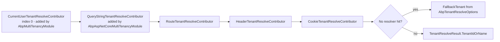

`framework/src/Volo.Abp.MultiTenancy/` is the *runtime* layer for ABP Framework
multi-tenancy. It implements the contracts from the abstractions package and
adds three things that the rest of the framework relies on: a concrete
`ICurrentTenant` backed by `AsyncLocal`, the iterating `TenantResolver` plus the
non-HTTP `CurrentUserTenantResolveContributor`, and a configuration-driven
`DefaultTenantStore`. The module class
`framework/src/Volo.Abp.MultiTenancy/Volo/Abp/MultiTenancy/AbpMultiTenancyModule.cs`
glues everything together.

## `AbpMultiTenancyModule` — service wiring

The module depends on `AbpDataModule`, `AbpSecurityModule`, `AbpSettingsModule`,
`AbpEventBusAbstractionsModule`, and `AbpMultiTenancyAbstractionsModule`. Its
`ConfigureServices` body is intentionally small:

```csharp
public override void ConfigureServices(ServiceConfigurationContext context)
{
    context.Services.AddSingleton<ICurrentTenantAccessor>(AsyncLocalCurrentTenantAccessor.Instance);

    var configuration = context.Services.GetConfiguration();
    Configure<AbpDefaultTenantStoreOptions>(configuration);

    Configure<AbpSettingOptions>(options =>
    {
        options.ValueProviders.InsertAfter(t => t == typeof(GlobalSettingValueProvider), typeof(TenantSettingValueProvider));
    });

    Configure<AbpTenantResolveOptions>(options =>
    {
        options.TenantResolvers.Insert(0, new CurrentUserTenantResolveContributor());
    });
}
```

Four observations:

1. `ICurrentTenantAccessor` is registered as a **singleton** that points at the
   static `AsyncLocalCurrentTenantAccessor.Instance` field in
   `framework/src/Volo.Abp.MultiTenancy/Volo/Abp/MultiTenancy/AsyncLocalCurrentTenantAccessor.cs`.
   A singleton accessor is safe because its storage is an `AsyncLocal<T>`, which
   means each logical call stack sees its own value.
2. `AbpDefaultTenantStoreOptions` is bound straight from `IConfiguration`, so
   `appsettings.json` snippets like `"Tenants": [ { "Id": ..., "Name": ..., "NormalizedName": ... } ]`
   automatically populate the in-memory store.
3. `TenantSettingValueProvider` is *inserted after* the global provider in the
   `AbpSettingOptions.ValueProviders` chain. The setting system consults
   providers in order, so a tenant-scoped value overrides the global one without
   replacing the chain.
4. `CurrentUserTenantResolveContributor` is *inserted at index 0* in
   `AbpTenantResolveOptions.TenantResolvers`. That makes it the highest-
   priority contributor — a logged-in user's `TenantId` claim wins over any
   query string or cookie value.

## `CurrentTenant` and the `AsyncLocal` accessor

`framework/src/Volo.Abp.MultiTenancy/Volo/Abp/MultiTenancy/CurrentTenant.cs`
implements `ICurrentTenant` as a transient adapter on top of
`ICurrentTenantAccessor`:

```csharp
public class CurrentTenant : ICurrentTenant, ITransientDependency
{
    public virtual bool IsAvailable => Id.HasValue;
    public virtual Guid? Id => _currentTenantAccessor.Current?.TenantId;
    public string? Name => _currentTenantAccessor.Current?.Name;

    public IDisposable Change(Guid? id, string? name = null) => SetCurrent(id, name);

    private IDisposable SetCurrent(Guid? tenantId, string? name = null)
    {
        var parentScope = _currentTenantAccessor.Current;
        _currentTenantAccessor.Current = new BasicTenantInfo(tenantId, name);
        return new DisposeAction<ValueTuple<ICurrentTenantAccessor, BasicTenantInfo?>>(static (state) =>
        {
            var (currentTenantAccessor, parentScope) = state;
            currentTenantAccessor.Current = parentScope;
        }, (_currentTenantAccessor, parentScope));
    }
}
```

Two design points are worth highlighting. First, the `DisposeAction` captures the
*parent* `BasicTenantInfo?` and restores it on dispose. That makes
`CurrentTenant.Change(...)` blocks safely nestable: an outer `using` for tenant
`A` can wrap an inner `using` for tenant `B`, and the inner dispose returns to
`A` rather than to `null`. Second, the static-lambda + `ValueTuple` pattern is
allocation-light, so heavily nested tenant switches do not generate garbage.

The companion accessor
`framework/src/Volo.Abp.MultiTenancy/Volo/Abp/MultiTenancy/AsyncLocalCurrentTenantAccessor.cs`
is a tiny class:

```csharp
public class AsyncLocalCurrentTenantAccessor : ICurrentTenantAccessor
{
    public static AsyncLocalCurrentTenantAccessor Instance { get; } = new();

    public BasicTenantInfo? Current
    {
        get => _currentScope.Value;
        set => _currentScope.Value = value;
    }

    private readonly AsyncLocal<BasicTenantInfo?> _currentScope;
    private AsyncLocalCurrentTenantAccessor() { _currentScope = new AsyncLocal<BasicTenantInfo?>(); }
}
```

Because `AsyncLocal<T>` participates in the execution-context flow, the value
follows the call across `await` boundaries, into `Task.Run` continuations, and
into hosted background services. This is how downstream repositories see the
same tenant that the middleware established for the HTTP request.

## `TenantResolver` — the iterating pipeline

`framework/src/Volo.Abp.MultiTenancy/Volo/Abp/MultiTenancy/TenantResolver.cs`
implements `ITenantResolver`. It is a transient service that creates a child
service scope, iterates `AbpTenantResolveOptions.TenantResolvers`, and stops on
the first contributor that calls `context.Handled = true` or sets
`context.TenantIdOrName` to a non-null value:

```csharp
public virtual async Task<TenantResolveResult> ResolveTenantIdOrNameAsync()
{
    var result = new TenantResolveResult();
    using (var serviceScope = ServiceProvider.CreateScope())
    {
        var context = new TenantResolveContext(serviceScope.ServiceProvider);

        foreach (var tenantResolver in Options.TenantResolvers)
        {
            await tenantResolver.ResolveAsync(context);
            result.AppliedResolvers.Add(tenantResolver.Name);
            if (context.HasResolvedTenantOrHost())
            {
                result.TenantIdOrName = context.TenantIdOrName;
                break;
            }
        }
    }

    if (result.TenantIdOrName.IsNullOrEmpty() && !string.IsNullOrWhiteSpace(Options.FallbackTenant))
    {
        result.TenantIdOrName = Options.FallbackTenant;
        result.AppliedResolvers.Add(TenantResolverNames.FallbackTenant);
    }
    return result;
}
```

The child scope is important: contributors that resolve `IHttpContextAccessor`
or `ICurrentUser` get a clean scope and their disposables are released when the
resolver returns. The fallback at the end uses
`AbpTenantResolveOptions.FallbackTenant` and tags the result with
`TenantResolverNames.FallbackTenant`, so logs and the ASP.NET Core middleware
can tell the difference between a resolver-driven decision and a fallback.

The resolver's debug log emits four messages per call (start, per-contributor
attempt, hit, finish), all prefixed with `[TenantResolver]`. Enable
`Microsoft.Extensions.Logging`'s `Debug` level on `Volo.Abp.MultiTenancy` to see
the full trace.

## `TenantResolveContributorBase`

Implementing a contributor is straightforward thanks to
`framework/src/Volo.Abp.MultiTenancy/Volo/Abp/MultiTenancy/TenantResolveContributorBase.cs`:

```csharp
public abstract class TenantResolveContributorBase : ITenantResolveContributor
{
    public abstract string Name { get; }
    public abstract Task ResolveAsync(ITenantResolveContext context);
}
```

The contract is empty beyond `Name` and `ResolveAsync`, but two helper classes
in this assembly give pre-baked behavior:

- `framework/src/Volo.Abp.MultiTenancy/Volo/Abp/MultiTenancy/ActionTenantResolveContributor.cs`
  takes an `Action<ITenantResolveContext>` in its constructor. Use it from
  `Configure<AbpTenantResolveOptions>` when the resolution is so trivial that a
  dedicated class would be overkill, for example reading a header from
  `context.ServiceProvider.GetRequiredService<IHttpContextAccessor>()`.
- `framework/src/Volo.Abp.MultiTenancy/Volo/Abp/MultiTenancy/CurrentUserTenantResolveContributor.cs`
  is the user-aware contributor described next.

## `CurrentUserTenantResolveContributor`

This contributor is the reason the framework inserts the resolver at index 0:

```csharp
public class CurrentUserTenantResolveContributor : TenantResolveContributorBase
{
    public const string ContributorName = "CurrentUser";
    public override string Name => ContributorName;

    public override Task ResolveAsync(ITenantResolveContext context)
    {
        var currentUser = context.ServiceProvider.GetRequiredService<ICurrentUser>();
        if (currentUser.IsAuthenticated)
        {
            context.Handled = true;
            context.TenantIdOrName = currentUser.TenantId?.ToString();
        }
        return Task.CompletedTask;
    }
}
```

If the caller is authenticated, the contributor *short-circuits* the chain by
setting `Handled = true` even when `TenantId` is null. That is exactly what you
want: a logged-in host user must not be reinterpreted as a tenant user because
a `__tenant` cookie happens to be lying around, and a logged-in tenant user
must always be that tenant regardless of query strings. The class is defined in
`framework/src/Volo.Abp.MultiTenancy/Volo/Abp/MultiTenancy/CurrentUserTenantResolveContributor.cs`.

`AbpAspNetCoreMultiTenancyApplicationBuilderExtensions.UseMultiTenancy(...)` (in
`framework/src/Volo.Abp.AspNetCore.MultiTenancy/Microsoft/AspNetCore/Builder/AbpAspNetCoreMultiTenancyApplicationBuilderExtensions.cs`)
logs a warning if the resolver is present but
`UseAuthentication()` has not been called before `UseMultiTenancy()` — because in
that order the resolver runs against an unauthenticated `ICurrentUser` and
silently does nothing.

## Resolver chain assembled by the core module

After `AbpMultiTenancyModule.ConfigureServices` runs, the
`AbpTenantResolveOptions.TenantResolvers` list contains just
`CurrentUserTenantResolveContributor`. When you also reference
`Volo.Abp.AspNetCore.MultiTenancy`, that module appends
`QueryStringTenantResolveContributor`, `RouteTenantResolveContributor`,
`HeaderTenantResolveContributor`, and `CookieTenantResolveContributor` in that
order. The composite chain is therefore:



Hosts can mutate this list freely from their module's `ConfigureServices`:

```csharp
Configure<AbpTenantResolveOptions>(options =>
{
    options.TenantResolvers.AddDomainTenantResolver("{0}.myapp.com");
    options.FallbackTenant = "dev-tenant";
});
```

`AddDomainTenantResolver(...)` is defined in
`framework/src/Volo.Abp.AspNetCore.MultiTenancy/Volo/Abp/MultiTenancy/AbpMultiTenancyOptionsExtensions.cs`
and uses `List<T>.InsertAfter` to place a `DomainTenantResolveContributor` right
after `CurrentUserTenantResolveContributor`, preserving the user-first invariant.

## `TenantConfigurationProvider`

Resolving a `TenantIdOrName` is only half the job. The companion service
`framework/src/Volo.Abp.MultiTenancy/Volo/Abp/MultiTenancy/TenantConfigurationProvider.cs`
turns that string into a `TenantConfiguration?` by calling `ITenantStore`:

```csharp
public virtual async Task<TenantConfiguration?> GetAsync(bool saveResolveResult = false)
{
    var resolveResult = await TenantResolver.ResolveTenantIdOrNameAsync();
    if (saveResolveResult) TenantResolveResultAccessor.Result = resolveResult;

    TenantConfiguration? tenant = null;
    if (resolveResult.TenantIdOrName != null)
    {
        tenant = await FindTenantAsync(resolveResult.TenantIdOrName);
        if (tenant == null) throw new BusinessException("Volo.AbpIo.MultiTenancy:010001", ...);
        if (!tenant.IsActive) throw new BusinessException("Volo.AbpIo.MultiTenancy:010002", ...);
    }
    return tenant;
}

protected virtual async Task<TenantConfiguration?> FindTenantAsync(string tenantIdOrName)
{
    if (Guid.TryParse(tenantIdOrName, out var parsedTenantId))
        return await TenantStore.FindAsync(parsedTenantId);
    return await TenantStore.FindAsync(TenantNormalizer.NormalizeName(tenantIdOrName)!);
}
```

The `FindTenantAsync` helper tries to parse the resolved value as a `Guid` first
and only falls back to `ITenantNormalizer.NormalizeName(...)` for textual
inputs. Both error paths throw `BusinessException`, which the ASP.NET Core
middleware catches and routes through
`AbpAspNetCoreMultiTenancyOptions.MultiTenancyMiddlewareErrorPageBuilder`.

## `NullTenantResolveResultAccessor`

Outside of an HTTP context there is no `HttpContext.Items` collection to store
the `TenantResolveResult`. The default accessor
`framework/src/Volo.Abp.MultiTenancy/Volo/Abp/MultiTenancy/NullTenantResolveResultAccessor.cs`
satisfies the interface by ignoring all writes and always returning `null`:

```csharp
public class NullTenantResolveResultAccessor : ITenantResolveResultAccessor, ISingletonDependency
{
    public TenantResolveResult? Result
    {
        get => null;
        set { }
    }
}
```

`Volo.Abp.AspNetCore.MultiTenancy` replaces this with
`HttpContextTenantResolveResultAccessor` via `[Dependency(ReplaceServices =
true)]`, so HTTP hosts get a working store while CLI tools and background
services keep the null-object behavior.

## `MultiTenantConnectionStringResolver`

The connection-string story is implemented by
`framework/src/Volo.Abp.MultiTenancy/Volo/Abp/MultiTenancy/MultiTenantConnectionStringResolver.cs`,
which replaces `Volo.Abp.Data.DefaultConnectionStringResolver`. Its
`ResolveAsync(connectionStringName)` runs three steps:

1. If `ICurrentTenant.Id` is null, fall back to the base resolver — i.e. use
   the host's connection string.
2. Load the `TenantConfiguration` from `ITenantStore.FindAsync(tenantId)` in a
   child scope. If the tenant has no `ConnectionStrings` defined, again fall
   back to the host.
3. For a *named* request such as `"Identity"`, look in the tenant's
   `ConnectionStrings[name]`, then in
   `Options.Databases.GetMappedDatabaseOrNull(name)` (if `IsUsedByTenants` is
   `true`), and finally in `ConnectionStrings.Default`.

The class is annotated `[Dependency(ReplaceServices = true)]`, so referencing
`Volo.Abp.MultiTenancy` is enough to enable per-tenant routing for every EF Core
context and MongoDB context that already uses the abstraction.

## `DefaultTenantStore`

The store implementation lives at
`framework/src/Volo.Abp.MultiTenancy/Volo/Abp/MultiTenancy/ConfigurationStore/DefaultTenantStore.cs`:

```csharp
[Dependency(TryRegister = true)]
public class DefaultTenantStore : ITenantStore, ITransientDependency
{
    private readonly AbpDefaultTenantStoreOptions _options;
    public DefaultTenantStore(IOptionsMonitor<AbpDefaultTenantStoreOptions> options)
        => _options = options.CurrentValue;

    public Task<TenantConfiguration?> FindAsync(string normalizedName)
        => Task.FromResult(_options.Tenants?.FirstOrDefault(t => t.NormalizedName == normalizedName));

    public Task<TenantConfiguration?> FindAsync(Guid id)
        => Task.FromResult(_options.Tenants?.FirstOrDefault(t => t.Id == id));

    public Task<IReadOnlyList<TenantConfiguration>> GetListAsync(bool includeDetails = false)
        => Task.FromResult<IReadOnlyList<TenantConfiguration>>(_options.Tenants);
}
```

`[Dependency(TryRegister = true)]` is the key annotation: the store registers
itself only when no other `ITenantStore` is already in the container, so the
tenant-management module's database-backed implementation wins automatically
when both packages are referenced. For tests and demo apps, populate the
options from `appsettings.json`:

```json
"Tenants": [
  { "Id": "...guid...", "Name": "Acme", "NormalizedName": "ACME", "IsActive": true,
    "ConnectionStrings": { "Default": "..." } }
]
```

This is bound by the call to `Configure<AbpDefaultTenantStoreOptions>(configuration)`
in `AbpMultiTenancyModule.ConfigureServices`.

## `TenantSettingValueProvider`

The settings provider chain is extended in `AbpMultiTenancyModule` so that a
tenant-scoped setting overrides the global one. The implementation is
`framework/src/Volo.Abp.MultiTenancy/Volo/Abp/MultiTenancy/TenantSettingValueProvider.cs`.
It reads `ICurrentTenant.Id` and queries the configured `ISettingStore` for a
tenant-specific value before falling back to the global provider. This is what
lets a tenant override, say, the default language without redeploying the
application.

## `MultiTenantUrlProvider`

The implementation of `IMultiTenantUrlProvider` is in
`framework/src/Volo.Abp.MultiTenancy/Volo/Abp/MultiTenancy/MultiTenantUrlProvider.cs`.
It formats a templated URL such as `{0}.myapp.com` using
`ICurrentTenant.Name`, which lets per-tenant URLs flow through Account-module
return URLs, OpenIddict redirect URIs, and email templates without each caller
needing to know how the multi-tenancy topology is set up.

## `MultiTenancySideHelper`

The framework also exposes a static helper used by feature/permission/setting
definitions:

```csharp
// in Volo.Abp.Data: Volo.Abp.MultiTenancySideHelper.IsApplicable(...)
```

`MultiTenancySideHelper` is a small static type — search for `MultiTenancySideHelper`
in `framework/src/Volo.Abp.Data/` — that resolves whether a definition with a given
`MultiTenancySides` value applies to the current side. The default behavior is:
`Tenant`-only definitions apply only when `ICurrentTenant.Id` is non-null,
`Host`-only definitions apply only when it is null, and `Both` always applies.

## Putting it together in a unit test

The pieces compose nicely for unit testing. Resolve `ICurrentTenant`,
`ITenantResolver`, and `ITenantConfigurationProvider` from a host built with
`AbpMultiTenancyModule`, register a stub `ITenantStore`, then drive the resolver
with an `ActionTenantResolveContributor`:

```csharp
Configure<AbpTenantResolveOptions>(options =>
{
    options.TenantResolvers.Clear();
    options.TenantResolvers.Add(new ActionTenantResolveContributor(ctx =>
    {
        ctx.TenantIdOrName = "acme";
    }));
});
```

Then `TenantConfigurationProvider.GetAsync()` returns the `TenantConfiguration`
that your `ITenantStore` returns for `"ACME"`, and a subsequent
`CurrentTenant.Change(config.Id, config.Name)` block makes that tenant the
ambient identity.

<Card title="Next: ASP.NET Core integration" icon="arrow-right" href="/tenancy/aspnetcore-multi-tenancy">
  Read how `MultiTenancyMiddleware` consumes this pipeline and how each
  HTTP-aware contributor reads from `HttpContext`.
</Card>
