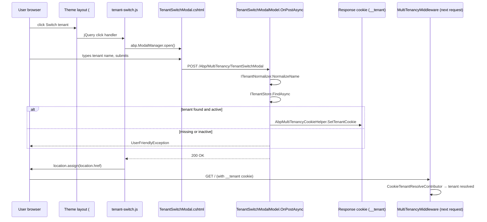

`framework/src/Volo.Abp.AspNetCore.Mvc.UI.MultiTenancy/` is the *presentation*
layer of ABP Framework's built-in multi-tenancy. It does not introduce a new
runtime contract — `ICurrentTenant`, `ITenantStore`, and the resolver chain are
already in place from the lower layers. What it adds is the user-visible
machinery: a Razor Pages-based switch modal, a Web API controller exposing
tenant lookups to the client, a small JavaScript bundle that opens the modal,
and a localization resource for the strings. The module class
`framework/src/Volo.Abp.AspNetCore.Mvc.UI.MultiTenancy/Volo/Abp/AspNetCore/Mvc/UI/MultiTenancy/AbpAspNetCoreMvcUiMultiTenancyModule.cs`
ties everything together.

## `AbpAspNetCoreMvcUiMultiTenancyModule`

The module depends on `AbpAspNetCoreMvcUiThemeSharedModule` (for theming
primitives such as the bootstrap modal tag helpers) and
`AbpAspNetCoreMultiTenancyModule` (for the underlying runtime). Its
`PreConfigureServices` registers the embedded assembly as an MVC application
part and adds the localization resource to the data-annotations chain:

```csharp
public override void PreConfigureServices(ServiceConfigurationContext context)
{
    PreConfigure<AbpMvcDataAnnotationsLocalizationOptions>(options =>
    {
        options.AddAssemblyResource(
            typeof(AbpUiMultiTenancyResource),
            typeof(AbpAspNetCoreMvcUiMultiTenancyModule).Assembly);
    });

    PreConfigure<IMvcBuilder>(mvcBuilder =>
    {
        mvcBuilder.AddApplicationPartIfNotExists(typeof(AbpAspNetCoreMvcUiMultiTenancyModule).Assembly);
    });
}
```

`AddApplicationPartIfNotExists` is what makes `Pages/Abp/MultiTenancy/TenantSwitchModal.cshtml`
reachable from the host application even though the file lives inside the
embedded assembly. The localization resource `AbpUiMultiTenancyResource`
(declared in
`framework/src/Volo.Abp.AspNetCore.Mvc.UI.MultiTenancy/Volo/Abp/AspNetCore/Mvc/UI/MultiTenancy/Localization/AbpUiMultiTenancyResource.cs`
with the resource-name `"AbpUiMultiTenancy"`) lets Razor and validation pick up
translated strings from `Localization/en.json`, `tr.json`, etc.

`ConfigureServices` does three things — embeds the virtual file system, adds the
localization JSON, and bundles the tenant-switch JavaScript into the global
script bundle:

```csharp
public override void ConfigureServices(ServiceConfigurationContext context)
{
    Configure<AbpVirtualFileSystemOptions>(options =>
    {
        options.FileSets.AddEmbedded<AbpAspNetCoreMvcUiMultiTenancyModule>();
    });

    Configure<AbpLocalizationOptions>(options =>
    {
        options.Resources
            .Add<AbpUiMultiTenancyResource>("en")
            .AddVirtualJson("/Volo/Abp/AspNetCore/Mvc/UI/MultiTenancy/Localization");
    });

    Configure<AbpBundlingOptions>(options =>
    {
        options.ScriptBundles
            .Get(StandardBundles.Scripts.Global)
            .AddFiles("/Pages/Abp/MultiTenancy/tenant-switch.js");
    });
}
```

Because the script is appended to `StandardBundles.Scripts.Global` (declared in
`framework/src/Volo.Abp.AspNetCore.Mvc.UI.Theme.Shared/`), every page in a
themed application that renders the global bundle automatically loads
`tenant-switch.js`.

## The `TenantSwitchModal` Razor page

The visible UI is a Razor page at
`framework/src/Volo.Abp.AspNetCore.Mvc.UI.MultiTenancy/Pages/Abp/MultiTenancy/TenantSwitchModal.cshtml`:

```cshtml
@page
@model TenantSwitchModalModel
@inject IHtmlLocalizer<AbpUiMultiTenancyResource> L
@{ Layout = null; }
<abp-dynamic-form abp-model="@Model.Input" asp-page="/Abp/MultiTenancy/TenantSwitchModal">
    <abp-modal>
        <abp-modal-header title="@L["SwitchTenant"].Value"></abp-modal-header>
        <abp-modal-body>
            <abp-form-content />
        </abp-modal-body>
        <abp-modal-footer buttons="@(AbpModalButtons.Cancel|AbpModalButtons.Save)"></abp-modal-footer>
    </abp-modal>
</abp-dynamic-form>
```

The page uses the framework's bootstrap modal tag helpers (`<abp-modal>`,
`<abp-modal-header>`, etc.) so theme overrides — the Lepton or Basic theme —
restyle it without any per-theme code in this package. The form is generated
with `<abp-dynamic-form>`, which inspects the bound model `TenantInfoModel`,
finds the `[InputInfoText("SwitchTenantHint")]` attribute on `Name`, and
renders a labelled input plus the localized hint string.

The page model lives at
`framework/src/Volo.Abp.AspNetCore.Mvc.UI.MultiTenancy/Pages/Abp/MultiTenancy/TenantSwitchModal.cshtml.cs`:

```csharp
public class TenantSwitchModalModel : AbpPageModel
{
    [BindProperty]
    public TenantInfoModel Input { get; set; } = default!;

    protected ITenantStore TenantStore { get; }
    protected ITenantNormalizer TenantNormalizer { get; }
    protected AbpAspNetCoreMultiTenancyOptions Options { get; }

    public TenantSwitchModalModel(
        ITenantStore tenantStore,
        ITenantNormalizer tenantNormalizer,
        IOptions<AbpAspNetCoreMultiTenancyOptions> options)
    {
        TenantStore = tenantStore;
        TenantNormalizer = tenantNormalizer;
        Options = options.Value;
        LocalizationResourceType = typeof(AbpUiMultiTenancyResource);
    }

    public virtual async Task OnGetAsync()
    {
        Input = new TenantInfoModel();
        if (CurrentTenant.IsAvailable)
        {
            var tenant = await TenantStore.FindAsync(CurrentTenant.GetId());
            Input.Name = tenant?.Name;
        }
    }

    public virtual async Task OnPostAsync()
    {
        Guid? tenantId = null;
        if (!Input.Name.IsNullOrEmpty())
        {
            var tenant = await TenantStore.FindAsync(TenantNormalizer.NormalizeName(Input.Name!)!);
            if (tenant == null)
                throw new UserFriendlyException(L["GivenTenantIsNotExist", Input.Name!]);
            if (!tenant.IsActive)
                throw new UserFriendlyException(L["GivenTenantIsNotAvailable", Input.Name!]);
            tenantId = tenant.Id;
        }
        AbpMultiTenancyCookieHelper.SetTenantCookie(HttpContext, tenantId, Options.TenantKey);
    }

    public class TenantInfoModel
    {
        [InputInfoText("SwitchTenantHint")]
        public string? Name { get; set; }
    }
}
```

Three behaviors are worth highlighting:

1. `OnGetAsync` pre-fills the form with the currently resolved tenant name by
   calling `CurrentTenant.GetId()` (from
   `framework/src/Volo.Abp.MultiTenancy.Abstractions/Volo/Abp/MultiTenancy/CurrentTenantExtensions.cs`)
   and looking the tenant up in the store. Host visitors see an empty field;
   tenant visitors see their tenant name pre-filled.
2. `OnPostAsync` normalizes the input through `ITenantNormalizer` before
   looking the tenant up — the same normalization used by
   `TenantConfigurationProvider`, so the lookups stay consistent.
3. The post writes (or deletes) the tenant cookie via
   `AbpMultiTenancyCookieHelper.SetTenantCookie(HttpContext, tenantId,
   Options.TenantKey)` from
   `framework/src/Volo.Abp.AspNetCore.MultiTenancy/Volo/Abp/AspNetCore/MultiTenancy/AbpMultiTenancyCookieHelper.cs`.
   Submitting an empty name deletes the cookie, which sends the next request
   to the host side.

The localized strings rendered by the page — `SwitchTenant`,
`SwitchTenantHint`, `GivenTenantIsNotExist`, `GivenTenantIsNotAvailable`,
`Tenant`, `Switch`, `Name`, `NotSelected` — come from
`framework/src/Volo.Abp.AspNetCore.Mvc.UI.MultiTenancy/Volo/Abp/AspNetCore/Mvc/UI/MultiTenancy/Localization/en.json`
and its sibling JSON files for each culture.

## The tenant-switch link (the trigger)

There is no view component shipped from this assembly; instead, themes render a
plain anchor with `id="AbpTenantSwitchLink"` somewhere in the layout (typically
the toolbar). The corresponding script
`framework/src/Volo.Abp.AspNetCore.Mvc.UI.MultiTenancy/Pages/Abp/MultiTenancy/tenant-switch.js`
wires that anchor up to the modal:

```javascript
(function($) {
    var tenantSwitchModal = new abp.ModalManager(abp.appPath + 'Abp/MultiTenancy/TenantSwitchModal');

    $(function() {
        $('#AbpTenantSwitchLink').click(function(e) {
            e.preventDefault();
            tenantSwitchModal.open();
        });

        tenantSwitchModal.onResult(function() {
            location.assign(location.href);
        });
    });
})(jQuery);
```

The script depends on three globals from the ABP JavaScript SDK:
`abp.ModalManager`, `abp.appPath`, and `jQuery`. On modal success it reloads
the current URL with `location.assign(location.href)` so the next request
carries the freshly written `__tenant` cookie and goes through
`MultiTenancyMiddleware` again — making the new tenant the ambient one. The
script is added to the global bundle in
`AbpAspNetCoreMvcUiMultiTenancyModule.ConfigureServices`, so the host does not
need any extra `<script>` tags.

<Note>
The trigger element id `AbpTenantSwitchLink` is part of the contract between
themes and this assembly. Each ABP theme renders the link in its own toolbar
markup (`framework/src/Volo.Abp.AspNetCore.Mvc.UI.Theme.Basic/` for the basic
theme, `framework/src/Volo.Abp.AspNetCore.Mvc.UI.Theme.LeptonXLite/` for
LeptonXLite, and so on). Use that id in your own custom theme if you want the
modal to open without extra JS.
</Note>

## `AbpTenantController` — the HTTP API

For SPAs and other non-MVC clients that need to look up a tenant by name or id
(typically to render the same kind of switcher in JavaScript), this assembly
exposes a controller at
`framework/src/Volo.Abp.AspNetCore.Mvc.UI.MultiTenancy/Pages/Abp/MultiTenancy/AbpTenantController.cs`:

```csharp
[Area("abp")]
[RemoteService(Name = "abp")]
[Route("api/abp/multi-tenancy")]
public class AbpTenantController : AbpControllerBase, IAbpTenantAppService
{
    [HttpGet, Route("tenants/by-name/{name}")]
    public virtual async Task<FindTenantResultDto> FindTenantByNameAsync(string name)
        => await _abpTenantAppService.FindTenantByNameAsync(name);

    [HttpGet, Route("tenants/by-id/{id}")]
    public virtual async Task<FindTenantResultDto> FindTenantByIdAsync(Guid id)
        => await _abpTenantAppService.FindTenantByIdAsync(id);
}
```

The controller delegates to `IAbpTenantAppService`, whose implementation is
`framework/src/Volo.Abp.AspNetCore.Mvc.UI.MultiTenancy/Pages/Abp/MultiTenancy/AbpTenantAppService.cs`:

```csharp
public class AbpTenantAppService : ApplicationService, IAbpTenantAppService
{
    protected ITenantStore TenantStore { get; }
    protected ITenantNormalizer TenantNormalizer { get; }

    public virtual async Task<FindTenantResultDto> FindTenantByNameAsync(string name)
    {
        var tenant = await TenantStore.FindAsync(TenantNormalizer.NormalizeName(name)!);
        if (tenant == null) return new FindTenantResultDto { Success = false };
        return new FindTenantResultDto
        {
            Success = true,
            TenantId = tenant.Id,
            Name = tenant.Name,
            NormalizedName = tenant.NormalizedName,
            IsActive = tenant.IsActive
        };
    }
    // ...by id is symmetric
}
```

The `IAbpTenantAppService` and `FindTenantResultDto` contracts live in the
ASP.NET Core MVC application-contracts package (`Volo.Abp.AspNetCore.Mvc`
namespace `Volo.Abp.AspNetCore.Mvc.MultiTenancy`). The `Success = false` path
deliberately omits the id — a "tenant not found" response should not leak any
internal state.

Routes exposed:

| Method | Path | Behavior |
|--------|------|----------|
| GET | `/api/abp/multi-tenancy/tenants/by-name/{name}` | Normalizes name, looks up tenant. |
| GET | `/api/abp/multi-tenancy/tenants/by-id/{id}` | Looks up tenant by `Guid`. |

The `[Area("abp")]` attribute groups the controller under the framework's
internal area so consumers can route it through `/Abp/...` if they prefer that
URL style. The `[RemoteService(Name = "abp")]` attribute tags the endpoints so
the ABP HTTP-API client generator (and the OpenAPI document) groups them under
the `abp` API name.

## Request lifecycle for a tenant switch



## Localization resources

The English bundle in
`framework/src/Volo.Abp.AspNetCore.Mvc.UI.MultiTenancy/Volo/Abp/AspNetCore/Mvc/UI/MultiTenancy/Localization/en.json`
defines the keys consumed by both the Razor page and the page model exceptions:

```json
{
  "culture": "en",
  "texts": {
    "GivenTenantIsNotExist": "Given tenant doesn't exist: {0}",
    "GivenTenantIsNotAvailable": "Given tenant isn't available: {0}",
    "Tenant": "Tenant",
    "Switch": "switch",
    "Name": "Name",
    "SwitchTenantHint": "Leave the name field blank to switch to the host side.",
    "SwitchTenant": "Switch tenant",
    "NotSelected": "Not selected"
  }
}
```

Sibling files cover Arabic (`ar.json`), Spanish (`es.json`), Turkish
(`tr.json`), simplified Chinese (`zh-Hans.json`), and many others. To add a
language, drop a new JSON file into the same directory and rebuild — the
virtual-file-system registration in `ConfigureServices` will pick it up
automatically.

## Customization scenarios

<AccordionGroup>
  <Accordion title="Replace the modal with a custom Razor page">
    Put your own `TenantSwitchModal.cshtml` at `Pages/Abp/MultiTenancy/`. ABP's
    virtual file system overrides the embedded version because file-system entries
    win over assembly entries. Keep the route — the JavaScript bundle in
    `framework/src/Volo.Abp.AspNetCore.Mvc.UI.MultiTenancy/Pages/Abp/MultiTenancy/tenant-switch.js`
    calls into `Abp/MultiTenancy/TenantSwitchModal`.
  </Accordion>
  <Accordion title="Customize the cookie behavior">
    The cookie is written via `AbpMultiTenancyCookieHelper.SetTenantCookie`
    in `framework/src/Volo.Abp.AspNetCore.MultiTenancy/Volo/Abp/AspNetCore/MultiTenancy/AbpMultiTenancyCookieHelper.cs`.
    Replace `IAbpTenantAppService` or subclass `TenantSwitchModalModel` to set
    additional `CookieOptions` (Secure, SameSite=Strict) before delegating.
  </Accordion>
  <Accordion title="Change the trigger element">
    Override the layout markup to use a different id, then add a small inline
    script that calls `new abp.ModalManager(abp.appPath +
    'Abp/MultiTenancy/TenantSwitchModal').open();`. Removing
    `tenant-switch.js` from the bundle is optional — the script is idempotent.
  </Accordion>
  <Accordion title="Localize for a new culture">
    Add `Localization/xx.json` next to the existing files inside
    `framework/src/Volo.Abp.AspNetCore.Mvc.UI.MultiTenancy/Volo/Abp/AspNetCore/Mvc/UI/MultiTenancy/Localization/`.
    Because `AbpLocalizationOptions.Resources.Add<AbpUiMultiTenancyResource>("en").AddVirtualJson(...)`
    walks the directory, no code changes are required.
  </Accordion>
</AccordionGroup>

## What this package *does not* provide

This assembly is intentionally narrow. It does **not** ship a tenant CRUD UI, a
listing page, an EF Core context, or a permission system. Those concerns live in
the *Tenant Management* module. The MVC UI package only contains what is needed
to *switch* between tenants — the management UI is wired in by the module that
follows.

<Card title="Next: Tenant Management Module" icon="arrow-right" href="/tenancy/tenant-management-module">
  Quick map of `modules/tenant-management/src/` — domain aggregate, EF Core /
  MongoDB persistence, application contracts, HTTP API, and Web / Blazor UIs.
</Card>
