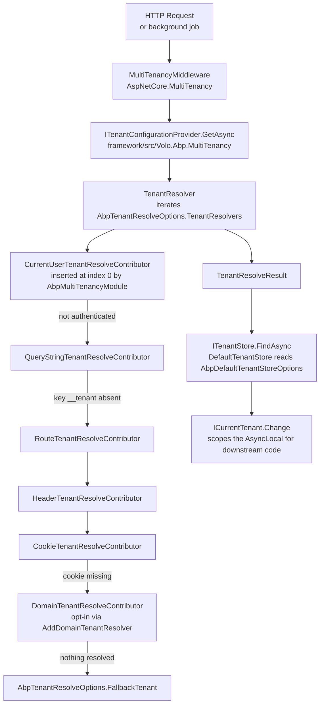

The ABP Framework ships a layered multi-tenancy stack that turns a single application
deployment into a host plus an arbitrary number of isolated tenants. The runtime is
split across four assemblies under `framework/src/`:
`Volo.Abp.MultiTenancy.Abstractions/` (contracts, options, DTO-like records),
`Volo.Abp.MultiTenancy/` (resolver pipeline, current-tenant scope, connection-string
resolution), `Volo.Abp.AspNetCore.MultiTenancy/` (HTTP-aware resolvers and the
`MultiTenancyMiddleware`), and `Volo.Abp.AspNetCore.Mvc.UI.MultiTenancy/` (the
`TenantSwitchModal` Razor page and supporting controller). Each layer adds a module
class (`AbpMultiTenancyAbstractionsModule`, `AbpMultiTenancyModule`,
`AbpAspNetCoreMultiTenancyModule`, `AbpAspNetCoreMvcUiMultiTenancyModule`) that
contributes its services through `ConfigureServices`.

## What multi-tenancy means in ABP Framework

For ABP Framework, a *tenant* is a row in an `ITenantStore` implementation and a
scoped value held by `ICurrentTenant` for the duration of a logical operation. The
core contract `framework/src/Volo.Abp.MultiTenancy.Abstractions/Volo/Abp/MultiTenancy/ICurrentTenant.cs`
exposes only `Id`, `Name`, `IsAvailable`, and `Change(...)`, which keeps tenant
identity orthogonal to user identity, authorization, and persistence. Domain objects
opt into per-tenant isolation by implementing
`framework/src/Volo.Abp.MultiTenancy.Abstractions/Volo/Abp/MultiTenancy/IMultiTenant.cs`,
which carries the nullable `TenantId` consumed by `Volo.Abp.Data` filters and EF Core
query filters.

<Info>
Multi-tenancy is opt-in. `AbpMultiTenancyOptions.IsEnabled` in
`framework/src/Volo.Abp.MultiTenancy.Abstractions/Volo/Abp/MultiTenancy/AbpMultiTenancyOptions.cs`
defaults to `false`; modules that branch on the flag (data filtering, settings,
authorization) only activate tenant-scoped behavior when it is set to `true`.
</Info>

The framework distinguishes two **sides** with the
`MultiTenancySides` flags enum in
`framework/src/Volo.Abp.MultiTenancy.Abstractions/Volo/Abp/MultiTenancy/MultiTenancySides.cs`:
`Tenant = 1`, `Host = 2`, `Both = Tenant | Host`. Most APIs that need to be
host-only or tenant-only declare a `MultiTenancySide` and let
`CurrentTenantExtensions.GetMultiTenancySide(...)` (defined in
`framework/src/Volo.Abp.MultiTenancy.Abstractions/Volo/Abp/MultiTenancy/CurrentTenantExtensions.cs`)
classify the current call. When `ICurrentTenant.Id` is `null`, the side is `Host`;
when it has a value, the side is `Tenant`.

## Where the tenant comes from

The tenant attached to an operation comes from a *resolver chain*. The contract
`framework/src/Volo.Abp.MultiTenancy.Abstractions/Volo/Abp/MultiTenancy/ITenantResolver.cs`
returns a `TenantResolveResult` (see
`framework/src/Volo.Abp.MultiTenancy.Abstractions/Volo/Abp/MultiTenancy/TenantResolveResult.cs`)
containing the resolved `TenantIdOrName` plus the list of resolvers that were
applied. The default implementation
`framework/src/Volo.Abp.MultiTenancy/Volo/Abp/MultiTenancy/TenantResolver.cs` loops
over `AbpTenantResolveOptions.TenantResolvers` (see
`framework/src/Volo.Abp.MultiTenancy.Abstractions/Volo/Abp/MultiTenancy/AbpTenantResolveOptions.cs`)
and stops as soon as a contributor sets `context.TenantIdOrName` or sets
`context.Handled = true` on the shared
`framework/src/Volo.Abp.MultiTenancy.Abstractions/Volo/Abp/MultiTenancy/TenantResolveContext.cs`.



Every contributor in the chain is an `ITenantResolveContributor`
(`framework/src/Volo.Abp.MultiTenancy.Abstractions/Volo/Abp/MultiTenancy/ITenantResolveContributor.cs`).
The base class lives at
`framework/src/Volo.Abp.MultiTenancy/Volo/Abp/MultiTenancy/TenantResolveContributorBase.cs`,
and HTTP-aware contributors extend
`framework/src/Volo.Abp.AspNetCore.MultiTenancy/Volo/Abp/AspNetCore/MultiTenancy/HttpTenantResolveContributorBase.cs`,
which extracts the `HttpContext` from the resolve context before delegating to
`GetTenantIdOrNameFromHttpContextOrNullAsync`.

## How the resolved tenant becomes ambient state

Once the resolver returns a non-null `TenantIdOrName`,
`framework/src/Volo.Abp.MultiTenancy/Volo/Abp/MultiTenancy/TenantConfigurationProvider.cs`
turns it into a `TenantConfiguration` by parsing it as a `Guid` (calling
`ITenantStore.FindAsync(Guid)`) or normalizing it through `ITenantNormalizer` and
calling `ITenantStore.FindAsync(string normalizedName)`. The default normalizer
`UpperInvariantTenantNormalizer` lives at
`framework/src/Volo.Abp.MultiTenancy.Abstractions/Volo/Abp/MultiTenancy/UpperInvariantTenantNormalizer.cs`
and uppercases the input under the invariant culture. If the tenant is missing or
inactive, the provider throws a `BusinessException` with codes
`Volo.AbpIo.MultiTenancy:010001` (not found) or `010002` (not active) using
strings from `AbpMultiTenancyResource`.

After the lookup, `MultiTenancyMiddleware`
(`framework/src/Volo.Abp.AspNetCore.MultiTenancy/Volo/Abp/AspNetCore/MultiTenancy/MultiTenancyMiddleware.cs`)
calls `ICurrentTenant.Change(tenant.Id, tenant.Name)` and runs the rest of the
ASP.NET Core pipeline inside that `using` block. The implementation
`framework/src/Volo.Abp.MultiTenancy/Volo/Abp/MultiTenancy/CurrentTenant.cs` writes
the new `BasicTenantInfo` to an `AsyncLocal<BasicTenantInfo?>` held by
`AsyncLocalCurrentTenantAccessor`
(`framework/src/Volo.Abp.MultiTenancy/Volo/Abp/MultiTenancy/AsyncLocalCurrentTenantAccessor.cs`),
and the returned `IDisposable` restores the parent scope. This is how `using
CurrentTenant.Change(...)` blocks compose inside repositories, application
services, and background jobs.

## Persistence and connection-string isolation

Persistence-level isolation comes from two ABP Framework pieces. First,
`MultiTenantConnectionStringResolver` in
`framework/src/Volo.Abp.MultiTenancy/Volo/Abp/MultiTenancy/MultiTenantConnectionStringResolver.cs`
replaces the default `Volo.Abp.Data.DefaultConnectionStringResolver` and consults
`ICurrentTenant.Id` plus the tenant's `ConnectionStrings` collection on
`TenantConfiguration`. Second, `AbpMultiTenancyOptions.DatabaseStyle` (values from
`framework/src/Volo.Abp.MultiTenancy.Abstractions/Volo/Abp/MultiTenancy/MultiTenancyDatabaseStyle.cs`)
declares whether the deployment is `Shared`, `PerTenant`, or `Hybrid`. EF Core and
MongoDB integrations read this flag to decide whether to apply tenant-id filters or
swap the connection.

<CardGroup cols={2}>
  <Card title="Abstractions" icon="cube" href="/tenancy/abstractions">
    Contracts in `framework/src/Volo.Abp.MultiTenancy.Abstractions/` — `ICurrentTenant`,
    `ITenantStore`, `TenantConfiguration`, `IMultiTenant`, `MultiTenancySides`.
  </Card>
  <Card title="Core resolver chain" icon="link" href="/tenancy/multi-tenancy-core">
    `framework/src/Volo.Abp.MultiTenancy/` — `TenantResolver`, `CurrentTenant`,
    `CurrentUserTenantResolveContributor`, `DefaultTenantStore`.
  </Card>
  <Card title="ASP.NET Core integration" icon="globe" href="/tenancy/aspnetcore-multi-tenancy">
    `framework/src/Volo.Abp.AspNetCore.MultiTenancy/` — `MultiTenancyMiddleware`,
    domain/query/route/header/cookie contributors.
  </Card>
  <Card title="MVC UI integration" icon="window" href="/tenancy/mvc-ui-multi-tenancy">
    `framework/src/Volo.Abp.AspNetCore.Mvc.UI.MultiTenancy/` — `TenantSwitchModal`
    Razor page, `AbpTenantController`, tenant-switch JavaScript bundle.
  </Card>
</CardGroup>

## Background jobs and non-HTTP entry points

Outside of an HTTP request, no `MultiTenancyMiddleware` runs. Hosted services,
background workers, and event handlers must establish the tenant themselves with
`using (CurrentTenant.Change(tenantId)) { ... }`. The `Change` overload in
`framework/src/Volo.Abp.MultiTenancy/Volo/Abp/MultiTenancy/CurrentTenant.cs`
pushes a new scope onto the `AsyncLocal`, so any continuation observes the same
tenant until the `IDisposable` is disposed. Distributed event consumers in
`AbpEventBus` deserialize the tenant id from the envelope and apply the same
pattern.

For background work that fetches the tenant from a queue payload, use
`ITenantConfigurationProvider.GetAsync(saveResolveResult: false)` and feed the
result into `CurrentTenant.Change`. The contract is in
`framework/src/Volo.Abp.MultiTenancy.Abstractions/Volo/Abp/MultiTenancy/ITenantConfigurationProvider.cs`,
and the implementation reuses the same resolver chain — handy when a custom
`ActionTenantResolveContributor`
(`framework/src/Volo.Abp.MultiTenancy/Volo/Abp/MultiTenancy/ActionTenantResolveContributor.cs`)
is registered to read from the job payload.

## Tenant management module

The runtime types above only need an `ITenantStore`. ABP Framework's *tenant
management* module (under `modules/tenant-management/src/`) provides a CRUD
implementation backed by `Volo.Abp.Data` entities, application services, an
HttpApi, and pre-built Web/Blazor UIs. The store implementation replaces
`DefaultTenantStore` once the module is referenced.

<Card title="Tenant Management Module" icon="building" href="/tenancy/tenant-management-module">
  Quick map of the packages under `modules/tenant-management/src/` — domain, EF
  Core, MongoDB, application, HTTP API, and Web/Blazor UIs.
</Card>

## Cross-cutting concerns

A few extras worth knowing about while reading the deep-dive pages:

- **`IgnoreMultiTenancyAttribute`**
  (`framework/src/Volo.Abp.MultiTenancy.Abstractions/Volo/Abp/MultiTenancy/IgnoreMultiTenancyAttribute.cs`)
  marks an entity or DTO so that data-filtering layers skip the tenant filter.
- **`AbpMultiTenancyClaimsIdentityExtensions`**
  (`framework/src/Volo.Abp.MultiTenancy.Abstractions/System/Security/Principal/AbpMultiTenancyClaimsIdentityExtensions.cs`)
  reads and writes the `tenantid` claim used by
  `CurrentUserTenantResolveContributor`.
- **`TenantSettingValueProvider`**
  (`framework/src/Volo.Abp.MultiTenancy/Volo/Abp/MultiTenancy/TenantSettingValueProvider.cs`)
  is inserted into `AbpSettingOptions.ValueProviders` after
  `GlobalSettingValueProvider`, so tenants can override global settings without
  touching application code.
- **`MultiTenantUrlProvider`**
  (`framework/src/Volo.Abp.MultiTenancy/Volo/Abp/MultiTenancy/MultiTenantUrlProvider.cs`)
  implements `IMultiTenantUrlProvider` so OpenIddict, the Account module, and
  email templates can produce per-tenant URLs from a templated host such as
  `{0}.myapp.com`.

<Tip>
When debugging which resolver fired, inspect `ITenantResolveResultAccessor.Result`
after the middleware runs. In ASP.NET Core the implementation is
`HttpContextTenantResolveResultAccessor`
(`framework/src/Volo.Abp.AspNetCore.MultiTenancy/Volo/Abp/AspNetCore/MultiTenancy/HttpContextTenantResolveResultAccessor.cs`),
which stashes the result in `HttpContext.Items["__AbpTenantResolveResult"]`.
</Tip>

## Anatomy of a tenant identifier

Across the framework, a "tenant" can be referenced by three different
shapes, and the resolver chain translates between them:

- **`Guid` id** — the canonical primary key. `BasicTenantInfo.TenantId` in
  `framework/src/Volo.Abp.MultiTenancy.Abstractions/Volo/Abp/MultiTenancy/BasicTenantInfo.cs`
  is a `Guid?`, and `ICurrentTenant.Id` flows the same nullable Guid.
- **Normalized name** — uppercased text stored on
  `TenantConfiguration.NormalizedName`. `UpperInvariantTenantNormalizer` in
  `framework/src/Volo.Abp.MultiTenancy.Abstractions/Volo/Abp/MultiTenancy/UpperInvariantTenantNormalizer.cs`
  is what turns the raw user input into this form.
- **Raw `TenantIdOrName` string** — the resolver's "I don't yet know which shape
  this is" string. `TenantConfigurationProvider.FindTenantAsync` in
  `framework/src/Volo.Abp.MultiTenancy/Volo/Abp/MultiTenancy/TenantConfigurationProvider.cs`
  tries `Guid.TryParse(...)` first and only falls back to the normalizer +
  name lookup when the string is not a Guid.

That three-shape contract is why HTTP-aware contributors such as
`QueryStringTenantResolveContributor`
(`framework/src/Volo.Abp.AspNetCore.MultiTenancy/Volo/Abp/AspNetCore/MultiTenancy/QueryStringTenantResolveContributor.cs`)
can accept either `?__tenant=<guid>` or `?__tenant=<name>` without the
contributor itself caring which one was sent.

## Sides, features, settings, and permissions

The two-sided nature (host vs. tenant) leaks into every cross-cutting subsystem
in ABP Framework. Each of them keys off the same `ICurrentTenant.Id` value:

- **Permissions.** The permission definition API in
  `framework/src/Volo.Abp.PermissionManagement.Domain/` accepts a
  `MultiTenancySides` argument when adding a permission group. Host-only
  permissions never appear in tenant menus, and tenant-only permissions never
  appear when the host operator is logged in.
- **Features.** `IFeatureDefinitionContext` in
  `framework/src/Volo.Abp.Features/` consumes the same enum; features are
  inherited from the tenant's edition (the `EditionId` on `TenantConfiguration`)
  only on the tenant side.
- **Settings.** `TenantSettingValueProvider` in
  `framework/src/Volo.Abp.MultiTenancy/Volo/Abp/MultiTenancy/TenantSettingValueProvider.cs`
  is inserted into `AbpSettingOptions.ValueProviders` *after* the global value
  provider. Settings resolved with `ICurrentTenant.IsAvailable == true` first
  consult the tenant's overrides; host calls fall through to the global value.
- **Localization defaults.** `MultiTenancyMiddleware` in
  `framework/src/Volo.Abp.AspNetCore.MultiTenancy/Volo/Abp/AspNetCore/MultiTenancy/MultiTenancyMiddleware.cs`
  uses the same setting provider to look up
  `LocalizationSettingNames.DefaultLanguage` — so a tenant can pick its own
  default language without code changes.

## Reading the resolver result from your own code

After `MultiTenancyMiddleware` runs, the resolve result is available through
the `ITenantResolveResultAccessor` declared in
`framework/src/Volo.Abp.MultiTenancy.Abstractions/Volo/Abp/MultiTenancy/ITenantResolveResultAccessor.cs`.
Inject it anywhere — controllers, application services, page models — and read
`Result.TenantIdOrName` and `Result.AppliedResolvers`:

```csharp
public class HomeController : AbpControllerBase
{
    private readonly ITenantResolveResultAccessor _accessor;
    public HomeController(ITenantResolveResultAccessor accessor) => _accessor = accessor;

    public IActionResult Index()
    {
        var result = _accessor.Result;
        ViewBag.ResolvedBy = result?.AppliedResolvers.LastOrDefault() ?? "(none)";
        return View();
    }
}
```

In ASP.NET Core hosts the accessor is replaced by
`HttpContextTenantResolveResultAccessor` (above); in CLI tools and worker
services it remains the `NullTenantResolveResultAccessor` from
`framework/src/Volo.Abp.MultiTenancy/Volo/Abp/MultiTenancy/NullTenantResolveResultAccessor.cs`,
which returns `null` so consumers must null-check.

## Multi-tenant connection-string routing

Persistence-level isolation builds on the same `ICurrentTenant`. The
`MultiTenantConnectionStringResolver` in
`framework/src/Volo.Abp.MultiTenancy/Volo/Abp/MultiTenancy/MultiTenantConnectionStringResolver.cs`
replaces `DefaultConnectionStringResolver` from `Volo.Abp.Data` and runs the
following decision tree on every `ResolveAsync(connectionStringName)` call:

1. If `ICurrentTenant.Id` is null, return the host's connection string.
2. Otherwise, fetch the `TenantConfiguration` via
   `ITenantStore.FindAsync(tenantId)` inside a scoped service provider.
3. If the tenant has no `ConnectionStrings`, fall back to the host's value.
4. For the default request, prefer the tenant's `Default` entry over the
   global default; for a named request such as `"Identity"`, look in the
   tenant entries, then in any `Databases.GetMappedDatabaseOrNull(name)`
   whose `IsUsedByTenants == true`, and finally back at the host.

The same resolver is what enables `MultiTenancyDatabaseStyle.Hybrid`: most
tenants live in the shared database, but operators can attach a per-tenant
connection string for the ones that need isolation.

## Where to start reading

If you already know what multi-tenancy is and just want to wire it up, start
with the [ASP.NET Core](/tenancy/aspnetcore-multi-tenancy) page — it has the
`UseMultiTenancy()` pipeline order and the contributor list. If you are
implementing a custom store or contributor, start with
[Abstractions](/tenancy/abstractions) for the contracts and
[Core Runtime](/tenancy/multi-tenancy-core) for the registration patterns used
by `AbpMultiTenancyModule`. The
[Management Module](/tenancy/tenant-management-module) page is the right
landing point if you need a database-backed `ITenantStore` and the admin UIs
that come with it.
