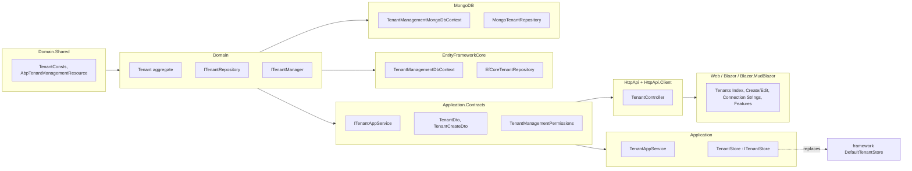

The runtime stack documented on the other pages of this section answers the
question *"what tenant is the current call running for?"*. The
*Tenant Management* module under `modules/tenant-management/src/` answers a
different question: *"how does an operator create, update, and disable
tenants in the first place?"*. It is a full vertical slice — domain aggregate,
repositories, EF Core and MongoDB integrations, application services, HTTP
API, and Web/Blazor UIs — that plugs an `ITenantStore` implementation into the
ABP Framework runtime and adds the corresponding admin screens.

This page is a *map* of the packages and what each one contributes. The
deep-dive pages live in the dedicated *module-tenant-management* group.

## The package layout

`modules/tenant-management/src/` contains seventeen projects. They follow ABP
Framework's standard Domain-Driven Design layering with one project per layer
plus separate UI shells per front-end stack:

```text
modules/tenant-management/src/
├── Volo.Abp.TenantManagement.Domain.Shared/        # constants, ETOs, localization keys
├── Volo.Abp.TenantManagement.Domain/                # Tenant aggregate, ITenantRepository, ITenantManager
├── Volo.Abp.TenantManagement.Application.Contracts/ # DTOs, ITenantAppService, permissions
├── Volo.Abp.TenantManagement.Application/           # TenantAppService, ITenantStore implementation
├── Volo.Abp.TenantManagement.EntityFrameworkCore/   # EF Core DbContext + EfCoreTenantRepository
├── Volo.Abp.TenantManagement.MongoDB/               # MongoDB context + MongoTenantRepository
├── Volo.Abp.TenantManagement.HttpApi/               # TenantController + HTTP API module
├── Volo.Abp.TenantManagement.HttpApi.Client/        # generated/static client proxies
├── Volo.Abp.TenantManagement.Web/                   # MVC Razor Pages (admin UI)
├── Volo.Abp.TenantManagement.Blazor/                # shared Blazor pages
├── Volo.Abp.TenantManagement.Blazor.Server/         # Blazor Server shell
├── Volo.Abp.TenantManagement.Blazor.WebAssembly/    # Blazor WASM shell
├── Volo.Abp.TenantManagement.Blazor.MudBlazor/      # MudBlazor flavour of the pages
├── Volo.Abp.TenantManagement.Blazor.MudBlazor.Server/
├── Volo.Abp.TenantManagement.Blazor.MudBlazor.WebAssembly/
└── Volo.Abp.TenantManagement.Installer/             # `abp install` metadata
```

Each project ships an `Abp...Module` class that depends on the appropriate
lower-layer modules. The dependency chain mirrors the directory order above —
Web depends on HttpApi.Client (or HttpApi directly), HttpApi depends on
Application.Contracts, Application depends on Domain, and Domain depends on
Domain.Shared.

## `Volo.Abp.TenantManagement.Domain.Shared`

The lowest layer holds constants and value types that need to be shared with
every layer above. Key files under
`modules/tenant-management/src/Volo.Abp.TenantManagement.Domain.Shared/Volo/Abp/TenantManagement/`:

- `AbpTenantManagementDomainSharedModule.cs` — the module class registering
  the localization resource `AbpTenantManagementResource`.
- `Localization/AbpTenantManagementResource.cs` — the typed localization
  resource consumed by every UI and API exception.
- `TenantConsts.cs` — string length limits used by validators and EF Core
  configuration (for example `MaxNameLength`).
- `TenantConnectionStringConsts.cs` — limits for the per-tenant connection
  string entries.
- `TenantEto.cs` — the distributed-event payload published when a tenant is
  created/updated/deleted, distinct from `TenantCreatedEto` in the framework
  abstractions.
- `Volo/Abp/ObjectExtending/TenantManagementModuleExtensionConfiguration.cs`
  and `TenantManagementModuleExtensionConsts.cs` — `ObjectExtensionManager`
  configuration entry points that let host applications add extra properties to
  the `Tenant` entity.

## `Volo.Abp.TenantManagement.Domain`

The domain layer defines the aggregate. Inside
`modules/tenant-management/src/Volo.Abp.TenantManagement.Domain/Volo/Abp/TenantManagement/`:

- `Tenant.cs` — the `Tenant` aggregate root, which extends
  `AbpFullAuditedAggregateRoot<Guid>` and carries `Name`, `NormalizedName`, a
  collection of `TenantConnectionString` value objects, and an optional
  `EditionId` (when the Feature Management module is in play).
- `TenantConnectionString.cs` — the owned entity that maps a connection-string
  name to its value.
- `ITenantRepository.cs` — the repository contract with paged/filtered
  queries such as `GetListAsync(filter, sorting, maxResultCount, skipCount,
  includeDetails)` and `FindByNameAsync`.
- `ITenantManager.cs` — the *domain service* that orchestrates creation and
  rename operations (uniqueness checks, event publication).
- `ITenantValidator.cs` + `AbpTenantValidator.cs` — the validation hook that
  enforces name/normalized-name constraints.
- `TenantConfigurationCacheItemInvalidator.cs` — the distributed-event handler
  that invalidates the framework-level tenant-configuration cache when the
  module persists changes.
- `AbpTenantManagementDomainModule.cs` — wires the domain services and
  declares the dependency on `AbpDomainModule`, `AbpEventBusModule`, and
  `AbpTenantManagementDomainSharedModule`.
- `AbpTenantManagementDbProperties.cs` — exposes `DbTablePrefix` and
  `DbSchema` constants consumed by both the EF Core and MongoDB integrations.

## `Volo.Abp.TenantManagement.Application.Contracts`

The contracts package is what consumers reference to call the module without
pulling in the implementation. Files under
`modules/tenant-management/src/Volo.Abp.TenantManagement.Application.Contracts/Volo/Abp/TenantManagement/`:

- `ITenantAppService.cs` — the application service interface with
  `GetAsync(id)`, `GetListAsync(GetTenantsInput input)`, `CreateAsync`,
  `UpdateAsync`, `DeleteAsync`, and the connection-string sub-API.
- `TenantDto.cs`, `TenantCreateDto.cs`, `TenantUpdateDto.cs`,
  `TenantCreateOrUpdateDtoBase.cs`, `GetTenantsInput.cs` — the data-transfer
  shapes used over the wire.
- `TenantManagementPermissions.cs` — the static permission name constants
  used in `[Authorize]` attributes and JS permission checks.
- `AbpTenantManagementPermissionDefinitionProvider.cs` — registers
  *TenantManagement* permissions (Default, Create, Update, Delete,
  ManageConnectionStrings, ManageFeatures) with `IPermissionDefinitionContext`.
- `TenantManagementRemoteServiceConsts.cs` — the `ModuleName` and
  `RemoteServiceName` strings used by the HTTP API client generator.
- `AbpTenantManagementApplicationContractsModule.cs` — declares the module
  metadata and its dependency on `AbpDddApplicationContractsModule`.

## `Volo.Abp.TenantManagement.Application`

The application layer implements the contracts and — crucially — registers an
`ITenantStore` over the repository. Key files under
`modules/tenant-management/src/Volo.Abp.TenantManagement.Application/Volo/Abp/TenantManagement/`:

- `TenantAppService.cs` — the application-service implementation, decorated
  with the permission attributes from
  `TenantManagementPermissions`.
- `TenantStore.cs` — the `ITenantStore` adapter that maps `Tenant`
  aggregates onto `TenantConfiguration` records consumed by the runtime. This
  replaces `DefaultTenantStore` once both modules are referenced.
- `TenantApplicationAutoMapperProfile.cs` (or the Mapperly variant) — the
  `Tenant` ↔ `TenantDto` mapping rules.
- `AbpTenantManagementApplicationModule.cs` — wires the application services
  and depends on the EF Core and/or MongoDB integration modules indirectly
  through `AbpTenantManagementDomainModule`.

## `Volo.Abp.TenantManagement.EntityFrameworkCore`

The EF Core integration ships a self-contained `DbContext` plus the
repository implementation. Under
`modules/tenant-management/src/Volo.Abp.TenantManagement.EntityFrameworkCore/Volo/Abp/TenantManagement/EntityFrameworkCore/`:

- `ITenantManagementDbContext.cs` and `TenantManagementDbContext.cs` — the
  context interface and implementation, with a `DbSet<Tenant>`.
- `AbpTenantManagementDbContextModelCreatingExtensions.cs` — the
  `modelBuilder.ConfigureTenantManagement()` extension that hosts call from
  their own `OnModelCreating` to register the `Tenant` entity into a shared
  `DbContext`.
- `EfCoreTenantRepository.cs` — implements `ITenantRepository` against EF Core,
  including the `IncludeDetails` pattern that eager-loads
  `TenantConnectionString` rows.
- `TenantManagementEfCoreQueryableExtensions.cs` — the `IncludeDetails(bool)`
  extension method.
- `AbpTenantManagementEntityFrameworkCoreModule.cs` — registers the
  repositories and depends on `AbpEntityFrameworkCoreModule` and
  `AbpTenantManagementDomainModule`.

## `Volo.Abp.TenantManagement.MongoDB`

The MongoDB integration mirrors EF Core. Under
`modules/tenant-management/src/Volo.Abp.TenantManagement.MongoDB/Volo/Abp/TenantManagement/MongoDb/`:

- `ITenantManagementMongoDbContext.cs` and
  `TenantManagementMongoDbContext.cs` — the typed context with
  `Collection<Tenant>`.
- `AbpTenantManagementMongoDbContextExtensions.cs` — the
  `mongoModelBuilder.ConfigureTenantManagement()` extension for host
  applications using the merged-context pattern.
- `MongoTenantRepository.cs` — the repository implementation.
- `AbpTenantManagementMongoDbModule.cs` — the integration module.

Choosing between the two is a host concern: reference exactly one of the two
integration packages and the application module picks it up through the
`ITenantRepository` registration.

## `Volo.Abp.TenantManagement.HttpApi`

The HTTP API layer surfaces the application service as a REST controller. Under
`modules/tenant-management/src/Volo.Abp.TenantManagement.HttpApi/Volo/Abp/TenantManagement/`:

- `TenantController.cs` — the `[Route("api/multi-tenancy/tenants")]`
  controller that implements `ITenantAppService` and delegates to its DI-injected
  application-service instance.
- `AbpTenantManagementHttpApiModule.cs` — the HTTP API module, depending on
  `AbpAspNetCoreMvcModule` and `AbpTenantManagementApplicationContractsModule`.

The companion package
`Volo.Abp.TenantManagement.HttpApi.Client` (folder
`modules/tenant-management/src/Volo.Abp.TenantManagement.HttpApi.Client/`)
contains either the dynamic proxy module (`AbpTenantManagementHttpApiClientModule`)
or the static `ClientProxies/` generated by `abp generate-proxy`. Pick the
matching style for your host.

## Web and Blazor UIs

The MVC Razor Pages UI lives under
`modules/tenant-management/src/Volo.Abp.TenantManagement.Web/`:

- `AbpTenantManagementWebModule.cs` — the module wiring view registrations,
  permission-name conventions, and navigation menus.
- `Navigation/` — the menu contributor adding the *Tenant Management* link to
  the admin menu under `AbpTenantManagementMenuContributor`.
- `Pages/` — the Index, Create/Edit modal, Connection-Strings modal, and
  Features modal Razor pages.
- `AbpTenantManagementWebMapperlyMappers.cs` — Mapperly mappings used by the
  Razor view models.

For Blazor, four projects work in concert:

- `Volo.Abp.TenantManagement.Blazor/` — shared Razor components (the
  `Tenants.razor` page, modals, and menu contributor).
- `Volo.Abp.TenantManagement.Blazor.Server/` and
  `Volo.Abp.TenantManagement.Blazor.WebAssembly/` — the host-specific
  modules that pick the correct HTTP-API-client style.
- `Volo.Abp.TenantManagement.Blazor.MudBlazor/`,
  `...MudBlazor.Server/`, and `...MudBlazor.WebAssembly/` — the MudBlazor
  flavor of the same UI.

The Blazor pages reuse the application contracts directly, so changes to
`ITenantAppService` automatically surface in both UIs without redefining
types.

## `Volo.Abp.TenantManagement.Installer`

The Installer project under
`modules/tenant-management/src/Volo.Abp.TenantManagement.Installer/`
contains the metadata read by the ABP CLI's `abp install` and
`abp add-module` commands. `AngularInstallationInfo.json` declares the Angular
UI assets that ship as an NPM package, and `InstallationNotes.md` lists the
post-install steps an operator needs to run (database migration, permission
seeding).

## How the module replaces `DefaultTenantStore`

The runtime contract `ITenantStore` is registered by
`framework/src/Volo.Abp.MultiTenancy/Volo/Abp/MultiTenancy/ConfigurationStore/DefaultTenantStore.cs`
with `[Dependency(TryRegister = true)]`. The `TenantStore` implementation in
`modules/tenant-management/src/Volo.Abp.TenantManagement.Application/` is
registered without that flag, so adding the tenant-management module
*automatically* wins the registration race — no extra configuration is required.
The application-layer `TenantStore` reads `ITenantRepository`, projects each
`Tenant` aggregate to a `TenantConfiguration`, and caches the results through
`IDistributedCache<TenantConfigurationCacheItem>` so the resolver chain stays
fast.

When an operator updates a tenant's connection string via the admin UI, the
domain layer publishes a `TenantConnectionStringUpdatedEto` (defined in
`framework/src/Volo.Abp.MultiTenancy.Abstractions/Volo/Abp/MultiTenancy/TenantConnectionStringUpdatedEto.cs`),
and the in-process handler `TenantConfigurationCacheItemInvalidator` evicts the
affected cache entries.

## Quick reference diagram



## Where to go next

The detailed pages for each project — Domain aggregate, EF Core mapping,
application service, HTTP API surface, and the two UI variants — live in the
*module-tenant-management* group. They cover:

<CardGroup cols={2}>
  <Card title="Domain aggregate and validators" icon="cube">
    `Tenant`, `TenantConnectionString`, `ITenantManager`, `AbpTenantValidator`,
    cache-item invalidation events in
    `modules/tenant-management/src/Volo.Abp.TenantManagement.Domain/`.
  </Card>
  <Card title="EF Core and MongoDB stores" icon="database">
    `TenantManagementDbContext`, `EfCoreTenantRepository`, the MongoDB
    equivalents, and the model-builder extensions hosts call from their merged
    contexts.
  </Card>
  <Card title="Application service and contracts" icon="gears">
    `TenantAppService`, `TenantStore` (the `ITenantStore` adapter), DTOs,
    `AbpTenantManagementPermissionDefinitionProvider`, and the consumed
    `ITenantAppService` shape.
  </Card>
  <Card title="HTTP API and Web/Blazor UIs" icon="window">
    `TenantController`, the static and dynamic client proxies, the MVC Razor
    Pages, and the Blazor / Blazor.MudBlazor pages and modals.
  </Card>
</CardGroup>

<Tip>
If you only need *runtime* multi-tenancy — say, for a single-tenant deployment
or a system whose tenants are provisioned out-of-band by another service — you
can skip this module entirely and ship your own `ITenantStore` implementation
backed by a configuration file, a remote API call, or an external identity
provider's tenant directory. The framework's `[Dependency(TryRegister =
true)]` on `DefaultTenantStore` means your implementation wins the
registration race without any extra ceremony.
</Tip>
