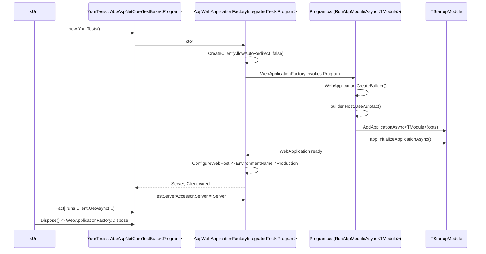

The `Volo.Abp.AspNetCore.TestBase` package gives the ABP Framework a way to run integration tests against a real ASP.NET Core pipeline — controllers, middleware, model binders, MVC filters, authentication, the works — without binding to a network port. It does this by layering on top of `Microsoft.AspNetCore.Mvc.Testing.WebApplicationFactory<TProgram>`, plugging in ABP's module pipeline, and exposing the resulting `TestServer` and `HttpClient` to test code.

This page walks every public type the package exposes, the boot flow they participate in, and the patterns the framework's own test runners use. All paths are relative to `/home/daytona/repos/abpframework/abp/framework/src/Volo.Abp.AspNetCore.TestBase/`.

## Package shape

The csproj at `framework/src/Volo.Abp.AspNetCore.TestBase/Volo.Abp.AspNetCore.TestBase.csproj` uses `Microsoft.NET.Sdk.Web`, targets `net10.0` only (it is HTTP-pipeline specific), and references `Volo.Abp.AspNetCore`, `Volo.Abp.Http.Client`, `Volo.Abp.TestBase`, and `Volo.Abp.Autofac` plus the runtime packages `Microsoft.AspNetCore.TestHost` and `Microsoft.AspNetCore.Mvc.Testing`. It sets `NoDefaultLaunchSettingsFile=true` and `IsPackable=true` so it can be redistributed as a NuGet package consumed by application test projects.

The exported types are:

| Type | File | Role |
|---|---|---|
| `AbpAspNetCoreTestBaseModule` | `Volo/Abp/AspNetCore/TestBase/AbpAspNetCoreTestBaseModule.cs` | Test-side module wiring `AbpHttpClientModule`, `AbpAspNetCoreModule`, `AbpTestBaseModule`, `AbpAutofacModule`. |
| `AbpWebApplicationFactoryIntegratedTest<TProgram>` | `Volo/Abp/AspNetCore/TestBase/AbpWebApplicationFactoryIntegratedTest.cs` | Recommended base; subclass of `WebApplicationFactory<TProgram>`. |
| `AbpAspNetCoreIntegratedTestBase<TStartupModule>` | `Volo/Abp/AspNetCore/TestBase/AbpAspNetCoreIntegratedTestBase.cs` | Legacy `Host.CreateDefaultBuilder` host. Marked `[Obsolete]`. |
| `AbpAspNetCoreAsyncIntegratedTestBase<TModule>` | `Volo/Abp/AspNetCore/TestBase/AbpAspNetCoreAsyncIntegratedTestBase.cs` | Legacy async sibling. Marked `[Obsolete]`. |
| `ITestServerAccessor` / `TestServerAccessor` | `Volo/Abp/AspNetCore/TestBase/` | Singleton holder of the active `TestServer`. |
| `AspNetCoreTestProxyHttpClientFactory` | `Volo/Abp/AspNetCore/TestBase/DynamicProxying/AspNetCoreTestProxyHttpClientFactory.cs` | Replaces `IProxyHttpClientFactory` so ABP HTTP-client dynamic proxies hit `TestServer`. |
| `AbpNoopHostLifetime` / `TestNoopHostLifetime` | `Volo/Abp/AspNetCore/TestBase/` | Host-lifetimes that do nothing on start/stop — required for in-process hosting. |
| `TestStartup<TStartupModule>` | `Volo/Abp/AspNetCore/TestBase/TestStartup.cs` | Internal startup that hands the type to `AddApplicationAsync` and runs `InitializeApplicationAsync`. |
| `AbpWebHostBuilderExtensions.UseAbpTestServer` | `Volo/Abp/AspNetCore/TestBase/WebHostBuilderExtensions.cs` | `IWebHostBuilder` extension; swaps in `AbpNoopHostLifetime` and `TestServer`. |
| `WebApplicationBuilderExtensions.RunAbpModuleAsync` | `Volo/Abp/AspNetCore/TestBase/WebApplicationBuilderExtensions.cs` | One-line `Program.cs` for test projects. |
| `GetWebProjectContentRootPathHelper` | `Volo/Abp/AspNetCore/TestBase/WebProjectPatchHelper.cs` | Walks parent directories to find a sibling web project content root. |

## The boot flow

When xUnit instantiates a class deriving from `AbpWebApplicationFactoryIntegratedTest<TProgram>`, the inherited `WebApplicationFactory<TProgram>` does its usual work: locate the `Program` type in the entry assembly, replay its host construction with overrides, and surface `TestServer` as `Server` and an `HttpClient` as `Client`. ABP plugs in at two points — `CreateHost` to add `AddAppSettingsSecretsJson` and `ConfigureServices(ConfigureServices)`, and the constructor which captures `Client` and stamps `ITestServerAccessor.Server`.



The pivot is that the *test runner project's* own `Program.cs` is what `WebApplicationFactory<TProgram>` re-runs. The framework standardises that `Program.cs` to a single statement — `await builder.RunAbpModuleAsync<TStartupModule>()` — using the extension defined in `framework/src/Volo.Abp.AspNetCore.TestBase/Volo/Abp/AspNetCore/TestBase/WebApplicationBuilderExtensions.cs`. The visible example is at `framework/test/Volo.Abp.AspNetCore.Mvc.UI.Tests/Volo/Abp/AspNetCore/Mvc/UI/Program.cs`:

```csharp
var builder = WebApplication.CreateBuilder();
await builder.RunAbpModuleAsync<AbpAspNetCoreMvcUiTestModule>();

public partial class Program
{
}
```

The `public partial class Program` line is required so `WebApplicationFactory<Program>` can find a public root type when the file uses top-level statements.

## `AbpWebApplicationFactoryIntegratedTest<TProgram>`

This is the recommended base. Its declaration in `framework/src/Volo.Abp.AspNetCore.TestBase/Volo/Abp/AspNetCore/TestBase/AbpWebApplicationFactoryIntegratedTest.cs`:

```csharp
public abstract class AbpWebApplicationFactoryIntegratedTest<TProgram>
    : WebApplicationFactory<TProgram>
    where TProgram : class
{
    protected HttpClient Client { get; set; }
    protected IServiceProvider ServiceProvider => Services;

    protected AbpWebApplicationFactoryIntegratedTest()
    {
        Client = CreateClient(new WebApplicationFactoryClientOptions
        {
            AllowAutoRedirect = false
        });
        ServiceProvider.GetRequiredService<ITestServerAccessor>().Server = Server;
    }
}
```

Three things to notice. First, `Client` is created with `AllowAutoRedirect = false`. This is deliberate — many ABP middlewares (multi-tenancy, OpenIddict, auth challenges) return redirects that you want to assert on directly. Second, `ServiceProvider` is a thin proxy over `WebApplicationFactory.Services`, so resolving anything goes through the *application* container, not the test class container. Third, the constructor reaches into the running container to set `ITestServerAccessor.Server`. That accessor is used by ABP's dynamic-HTTP-proxy infrastructure to route remote-service calls back through the in-process `TestServer`.

### Overridable hooks

The class overrides two `WebApplicationFactory<TProgram>` extension points and exposes a third virtual:

```csharp
protected override IHost CreateHost(IHostBuilder builder)
{
    builder
        .AddAppSettingsSecretsJson()
        .ConfigureServices(ConfigureServices);
    return base.CreateHost(builder);
}

protected override void ConfigureWebHost(IWebHostBuilder builder)
{
    builder.ConfigureAppConfiguration((hostingContext, config) =>
    {
        hostingContext.HostingEnvironment.EnvironmentName = "Production";
    });
    base.ConfigureWebHost(builder);
}

protected virtual void ConfigureServices(IServiceCollection services) { }
```

`AddAppSettingsSecretsJson` is an ABP-side helper that loads `appsettings.secrets.json` if present — useful when integration tests need real (non-checked-in) credentials. `EnvironmentName="Production"` forces production-shaped middleware ordering, so the test runs the same pipeline a deployed app would. The empty virtual `ConfigureServices(IServiceCollection)` is the override point for test-specific descriptors — replace `IClock`, register a captured-log sink, mock an outbound service, and so on.

### Service resolution helpers

The class also inherits the four resolution helpers seen on `AbpTestBaseWithServiceProvider` — but reimplements them locally because it does not actually inherit from that class (it has to inherit from `WebApplicationFactory<TProgram>`):

```csharp
protected virtual T? GetService<T>() => Services.GetService<T>();
protected virtual T GetRequiredService<T>() where T : notnull => Services.GetRequiredService<T>();
protected virtual T? GetKeyedServices<T>(object? serviceKey) => ServiceProvider.GetKeyedService<T>(serviceKey);
protected virtual T GetRequiredKeyedService<T>(object? serviceKey) where T : notnull => ServiceProvider.GetRequiredKeyedService<T>(serviceKey);
```

### URL helpers for controllers

Inside the `#region GetUrl` block of `framework/src/Volo.Abp.AspNetCore.TestBase/Volo/Abp/AspNetCore/TestBase/AbpWebApplicationFactoryIntegratedTest.cs` the class exposes three convenience builders:

```csharp
protected virtual string GetUrl<TController>();
protected virtual string GetUrl<TController>(string actionName);
protected virtual string GetUrl<TController>(string actionName, object queryStringParamsAsAnonymousObject);
```

The first strips conventional suffixes (`Controller`, `AppService`, `ApplicationService`, `IntService`, `IntegrationService`, `Service`) from the type name and prepends `/`. The third uses `RouteValueDictionary` to flatten an anonymous object into a query string. The pattern in test code is:

```csharp
var url = GetUrl<PeopleController>(nameof(PeopleController.Get), new { id = personId });
var response = await Client.GetAsync(url);
```

## Convention subclass: `AbpAspNetCoreTestBase<TProgram>`

The framework does not use `AbpWebApplicationFactoryIntegratedTest<TProgram>` directly in tests — it wraps it in a tiny subclass at `framework/test/Volo.Abp.AspNetCore.Tests/Volo/Abp/AspNetCore/AbpAspNetCoreTestBase.cs`:

```csharp
public class AbpAspNetCoreTestBase : AbpAspNetCoreTestBase<Program> { }

public abstract class AbpAspNetCoreTestBase<TProgram>
    : AbpWebApplicationFactoryIntegratedTest<TProgram>
    where TProgram : class
{
    protected virtual async Task<T> GetResponseAsObjectAsync<T>(
        string url, HttpStatusCode expectedStatusCode = HttpStatusCode.OK);

    protected virtual async Task<string> GetResponseAsStringAsync(
        string url, HttpStatusCode expectedStatusCode = HttpStatusCode.OK);

    protected virtual async Task<HttpResponseMessage> GetResponseAsync(
        string url, HttpStatusCode expectedStatusCode = HttpStatusCode.OK,
        bool xmlHttpRequest = false);
}
```

The three helpers cover the 90 % case for HTTP integration tests: deserialise JSON, read the body as a string, or get the raw `HttpResponseMessage` while asserting the status code. They use Shouldly (`response.StatusCode.ShouldBe(expectedStatusCode)`) and set `Accept-Language` to the current UI culture. Every per-domain test base in the framework — `AspNetCoreMultiTenancyTestBase`, `AspNetCoreMvcTestBase`, `AbpAspNetCoreMvcUiTestBase`, `AbpSerilogTestBase`, etc. — derives from `AbpAspNetCoreTestBase<Program>` rather than from the raw factory base.

## `ITestServerAccessor` and `TestServerAccessor`

`ITestServerAccessor` at `framework/src/Volo.Abp.AspNetCore.TestBase/Volo/Abp/AspNetCore/TestBase/ITestServerAccessor.cs` (one property, `TestServer Server`) and its implementation `TestServerAccessor` at `framework/src/Volo.Abp.AspNetCore.TestBase/Volo/Abp/AspNetCore/TestBase/TestServerAccessor.cs`:

```csharp
public class TestServerAccessor : ITestServerAccessor, ISingletonDependency
{
    public TestServer Server { get; set; } = default!;
}
```

It is auto-registered because it implements `ISingletonDependency`. The constructor of `AbpWebApplicationFactoryIntegratedTest<TProgram>` populates `Server` after the host starts; from then on, anything inside the container can resolve `ITestServerAccessor` to get a handle on the running test server.

The flagship consumer is `AspNetCoreTestProxyHttpClientFactory` at `framework/src/Volo.Abp.AspNetCore.TestBase/Volo/Abp/AspNetCore/TestBase/DynamicProxying/AspNetCoreTestProxyHttpClientFactory.cs`:

```csharp
[Dependency(ReplaceServices = true)]
public class AspNetCoreTestProxyHttpClientFactory
    : IProxyHttpClientFactory, ITransientDependency
{
    public AspNetCoreTestProxyHttpClientFactory(ITestServerAccessor testServerAccessor) { /* … */ }

    public HttpClient Create() => _testServerAccessor.Server.CreateClient();
    public HttpClient Create(string name) => Create();
}
```

The `[Dependency(ReplaceServices = true)]` attribute replaces the default `IProxyHttpClientFactory` from `Volo.Abp.Http.Client`. The effect is that any dynamic HTTP proxy (a remote `IPeopleAppService` generated by `AbpHttpClientModule`) makes its outbound HTTP call through the in-process `TestServer` instead of opening a socket. This is what lets the framework write tests that exercise dynamic proxies end-to-end without ever touching the network.

## `AbpAspNetCoreTestBaseModule`

At `framework/src/Volo.Abp.AspNetCore.TestBase/Volo/Abp/AspNetCore/TestBase/AbpAspNetCoreTestBaseModule.cs`:

```csharp
[DependsOn(typeof(AbpHttpClientModule))]
[DependsOn(typeof(AbpAspNetCoreModule))]
[DependsOn(typeof(AbpTestBaseModule))]
[DependsOn(typeof(AbpAutofacModule))]
public class AbpAspNetCoreTestBaseModule : AbpModule
{
}
```

The module itself has no `ConfigureServices`; its only job is to pull in those four dependencies. Test projects that need both ABP HTTP-client proxying *and* a test server depend on this module from their own test module.

## `UseAbpTestServer` for legacy hosts

The legacy base classes still rely on `IWebHostBuilder.UseAbpTestServer()` from `framework/src/Volo.Abp.AspNetCore.TestBase/Volo/Abp/AspNetCore/TestBase/WebHostBuilderExtensions.cs`:

```csharp
public static IWebHostBuilder UseAbpTestServer(this IWebHostBuilder builder)
{
    return builder.ConfigureServices(services =>
    {
        services.AddScoped<IHostLifetime, AbpNoopHostLifetime>();
        services.AddScoped<IServer, TestServer>();
    });
}
```

The trick is swapping `IServer` for `Microsoft.AspNetCore.TestHost.TestServer` and replacing `IHostLifetime` with `AbpNoopHostLifetime` (from `framework/src/Volo.Abp.AspNetCore.TestBase/Volo/Abp/AspNetCore/TestBase/AbpNoopHostLifetime.cs`), which returns `Task.CompletedTask` for both `WaitForStartAsync` and `StopAsync` so the host runs without binding to console signals. The `TestNoopHostLifetime` sibling is identical and exists only because the obsolete async base referenced a separately-named symbol.

You will not call `UseAbpTestServer` yourself in new code — `WebApplicationFactory<TProgram>` already substitutes `TestServer` for `IServer`. The extension stays so the obsolete bases keep working.

## Obsolete classes

Two classes in the package carry `[Obsolete("Use AbpWebApplicationFactoryIntegratedTest instead.")]`. They date from before `WebApplicationFactory<TProgram>` was the standard way to test ASP.NET Core.

`AbpAspNetCoreIntegratedTestBase<TStartupModule>` at `framework/src/Volo.Abp.AspNetCore.TestBase/Volo/Abp/AspNetCore/TestBase/AbpAspNetCoreIntegratedTestBase.cs` boots its own `Host.CreateDefaultBuilder().ConfigureWebHostDefaults(...)` chain. It supports both module types and old-style `Startup` classes; when `TStartupModule` is an `IAbpModule`, it routes through the internal `TestStartup<TStartupModule>` at `framework/src/Volo.Abp.AspNetCore.TestBase/Volo/Abp/AspNetCore/TestBase/TestStartup.cs`:

```csharp
internal class TestStartup<TStartupModule>
{
    public void ConfigureServices(IServiceCollection services)
        => AsyncHelper.RunSync(() => services.AddApplicationAsync(typeof(TStartupModule)));

    public void Configure(IApplicationBuilder app)
        => AsyncHelper.RunSync(app.InitializeApplicationAsync);
}
```

`AbpAspNetCoreAsyncIntegratedTestBase<TModule>` at `framework/src/Volo.Abp.AspNetCore.TestBase/Volo/Abp/AspNetCore/TestBase/AbpAspNetCoreAsyncIntegratedTestBase.cs` is the async sibling — it uses `WebApplication.CreateBuilder`, registers `TestNoopHostLifetime` and `TestServer` manually, calls `services.AddApplicationAsync<TModule>(...)`, and starts the app via `WebApplication.StartAsync()`. It also re-implements `GetUrl<TController>` helpers.

New tests should use the `WebApplicationFactory<TProgram>`-based path. The obsolete classes are kept for backwards compatibility — chiefly because a few downstream sample apps still reference them.

## `RunAbpModuleAsync` — the canonical test `Program.cs`

The extension at `framework/src/Volo.Abp.AspNetCore.TestBase/Volo/Abp/AspNetCore/TestBase/WebApplicationBuilderExtensions.cs` is what every test runner's `Program.cs` calls:

```csharp
public async static Task RunAbpModuleAsync<TModule>(
    this WebApplicationBuilder builder,
    Action<AbpApplicationCreationOptions>? optionsAction = null,
    string? applicationName = null)
    where TModule : IAbpModule
{
    applicationName = applicationName ?? typeof(TModule).Assembly.GetName()?.Name;
    if (!applicationName.IsNullOrWhiteSpace())
    {
        builder.Environment.ApplicationName = applicationName;
    }

    builder.Host.UseAutofac();
    await builder.AddApplicationAsync<TModule>(optionsAction);
    var app = builder.Build();
    await app.InitializeApplicationAsync();
    await app.RunAsync();
}
```

It does four things: stamp `ApplicationName` to the module's assembly name (which `WebApplicationFactory<TProgram>` then uses to seed `IMvcBuilder.PartManager.ApplicationParts`), enable Autofac, add the ABP application, initialise modules, and call `RunAsync`. When this code path is being driven by `WebApplicationFactory<TProgram>`, `RunAsync` returns immediately because the `IHostLifetime` is the noop test lifetime. The same `Program.cs` works both as a standalone executable (run from `dotnet run`) and as the entry point `WebApplicationFactory<TProgram>` reuses.

## `GetWebProjectContentRootPathHelper`

A small utility at `framework/src/Volo.Abp.AspNetCore.TestBase/Volo/Abp/AspNetCore/TestBase/WebProjectPatchHelper.cs`. Tests sometimes need the content root of a sibling web project (for example to load `wwwroot` assets that were not copied to the test binary directory). The helper walks parents of `Directory.GetCurrentDirectory()` searching for the named `.csproj`:

```csharp
public static class GetWebProjectContentRootPathHelper
{
    public static string Get(string webProjectName)
    {
        var currentDirectory = new DirectoryInfo(Directory.GetCurrentDirectory());

        while (currentDirectory != null && Directory.GetParent(currentDirectory.FullName) != null)
        {
            currentDirectory = Directory.GetParent(currentDirectory.FullName);
            if (currentDirectory == null) continue;

            var files = currentDirectory.GetFiles(webProjectName, SearchOption.AllDirectories);
            if (files.Length > 0) return files[0].DirectoryName!;
        }

        throw new AbpException($"Web project({webProjectName}) not found!");
    }
}
```

If the project cannot be located the helper throws `AbpException`. The usual call site is a test-only middleware or static-file configuration that needs to map `wwwroot` to a sibling source folder rather than to the test output directory.

## Composing a domain-specific test base

The framework's convention is to write a one-line subclass per HTTP-tested module. Look at `framework/test/Volo.Abp.AspNetCore.MultiTenancy.Tests/Volo/Abp/AspNetCore/MultiTenancy/AspNetCoreMultiTenancyTestBase.cs`:

```csharp
namespace Volo.Abp.AspNetCore.MultiTenancy;

public abstract class AspNetCoreMultiTenancyTestBase : AbpAspNetCoreTestBase<Program> { }
```

Or `framework/test/Volo.Abp.AspNetCore.Mvc.UI.Tests/Volo/Abp/AspNetCore/Mvc/UI/AbpAspNetCoreMvcUiTestBase.cs`:

```csharp
namespace Volo.Abp.AspNetCore.Mvc.UI;

public abstract class AbpAspNetCoreMvcUiTestBase : AbpAspNetCoreTestBase<Program> { }
```

Each test project provides its own `Program.cs` (calling `RunAbpModuleAsync<MyTestModule>`) and its own `MyTestModule` that depends on the framework module under test plus any test-only configuration. The test base then becomes a trivial alias that exists only so concrete `[Fact]` classes have a stable inheritance point — `public class Something_Tests : AbpAspNetCoreMvcUiTestBase`.

## Integrating with controllers and middleware

To verify a controller, write a `[Fact]` that pulls `Client` from the base and asserts on the response:

```csharp
public class People_Tests : AbpAspNetCoreTestBase<Program>
{
    [Fact]
    public async Task Should_Get_Person()
    {
        var person = await GetResponseAsObjectAsync<PersonDto>(
            GetUrl<PeopleController>(nameof(PeopleController.Get), new { id = "abc" }));
        person.ShouldNotBeNull();
    }
}
```

To verify middleware, exercise the request path that triggers it and read the headers from the `HttpResponseMessage`:

```csharp
var response = await GetResponseAsync("/secure-area", HttpStatusCode.Unauthorized);
response.Headers.WwwAuthenticate.ShouldNotBeEmpty();
```

To swap a dependency at the test level, override `ConfigureServices`:

```csharp
protected override void ConfigureServices(IServiceCollection services)
{
    services.Replace(ServiceDescriptor.Singleton<IClock>(_ => new FixedClock(DateTime.UtcNow)));
}
```

`ConfigureServices` here is the virtual on `AbpWebApplicationFactoryIntegratedTest<TProgram>`, called by `CreateHost(builder)` *after* the host's own module pipeline runs. Anything you register here wins over the module-supplied registration.

## Failure modes

`WebApplicationFactory<TProgram>` is sensitive to assembly probing — if the test runner cannot find `Program` in the entry assembly the factory throws on construction. The `applicationName = typeof(TModule).Assembly.GetName()?.Name` line in `RunAbpModuleAsync` exists specifically to fix this for MVC, where `ApplicationName` is also used to seed `ApplicationPart` discovery.

When `Program.cs` uses top-level statements, you must include `public partial class Program {}` so the type is visible to the factory's generic parameter. Tests fail at boot otherwise — see how `framework/test/Volo.Abp.AspNetCore.Mvc.UI.Tests/Volo/Abp/AspNetCore/Mvc/UI/Program.cs` ends with exactly that line.

If `Client.GetAsync` returns a redirect you did not expect, remember `AllowAutoRedirect = false`. You either follow the redirect explicitly with a second `Client.GetAsync(response.Headers.Location)` call, or change the client options in your own constructor by setting `Client = CreateClient(new WebApplicationFactoryClientOptions { AllowAutoRedirect = true })`.

## Where to next

Read [TestBase](/testing/test-base) for the underlying synchronous and asynchronous boot primitives that this package builds on — `AbpIntegratedTest<TStartupModule>` shares `AbpTestBaseWithServiceProvider` with all higher-level bases.

Read [Framework Tests](/testing/framework-tests) for the catalogue of every framework test project, each tagged with the test base it uses. Most ASP.NET Core integrations in the framework derive from `AbpAspNetCoreTestBase<Program>`; the survey shows where the exceptions are.
