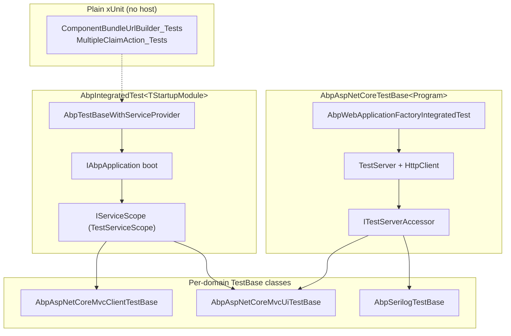
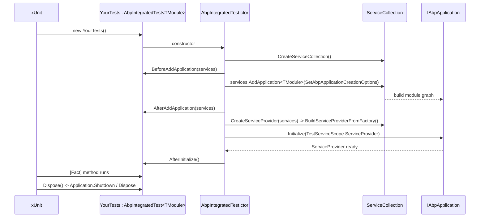

The ABP Framework ships with a testing stack designed around the same modularity, dependency injection, and host-bootstrapping primitives it exposes to applications. Rather than offering a single "test helper", the framework provides two NuGet packages — `Volo.Abp.TestBase` and `Volo.Abp.AspNetCore.TestBase` — and uses them in roughly eighty in-repo test projects under `framework/test/` that exercise nearly every module the framework publishes.

This page is the entry point to that stack. It maps the source files in `/home/daytona/repos/abpframework/abp/framework/src/Volo.Abp.TestBase/` and `/home/daytona/repos/abpframework/abp/framework/src/Volo.Abp.AspNetCore.TestBase/`, explains how they layer, and enumerates the in-repo test projects under `/home/daytona/repos/abpframework/abp/framework/test/` so you can navigate to the closest analogue for whatever you are trying to test.

## The testing pyramid the framework uses

ABP Framework tests follow a three-tier pyramid. At the base are plain xUnit unit tests with no DI container — used when a class can be exercised through its constructor with hand-built dependencies (or NSubstitute mocks). Above that sits `AbpIntegratedTest<TStartupModule>` from `framework/src/Volo.Abp.TestBase/Volo/Abp/Testing/AbpIntegratedTest.cs`, which boots a full `IAbpApplication`, runs the module pipeline, and gives the test class a resolved scope. At the top sit ASP.NET Core integration tests built on `AbpWebApplicationFactoryIntegratedTest<TProgram>` from `framework/src/Volo.Abp.AspNetCore.TestBase/Volo/Abp/AspNetCore/TestBase/AbpWebApplicationFactoryIntegratedTest.cs`, which spin a `TestServer` and an `HttpClient` over a real `WebApplication` host.



Each tier corresponds to actual source: the base of the pyramid is any class in `framework/test/*` that has no base class and just uses `[Fact]`; the middle is rooted in `framework/src/Volo.Abp.TestBase/Volo/Abp/Testing/AbpIntegratedTest.cs`; the top is rooted in `framework/src/Volo.Abp.AspNetCore.TestBase/Volo/Abp/AspNetCore/TestBase/AbpWebApplicationFactoryIntegratedTest.cs`. Domain-specific bases like `AbpAspNetCoreMvcClientTestBase` (see `framework/test/Volo.Abp.AspNetCore.Mvc.Client.Tests/Volo/Abp/AspNetCore/Mvc/Client/AbpAspNetCoreMvcClientTestBase.cs`) inherit from one of these two roots and bind a module type.

## How application-startup flows differ across tiers

Reading the three boots side-by-side highlights how the framework lets you pick exactly the surface area you need. At the bottom — a plain xUnit unit test — no boot occurs. The test class is constructed by xUnit, the unit under test is instantiated by hand, and assertions run. There is no DI, no module pipeline, no host. The only cost is class construction.

At the middle tier — `AbpIntegratedTest<TStartupModule>` — the constructor runs `services.AddApplication<TStartupModule>(SetAbpApplicationCreationOptions)`, builds the provider via `BuildServiceProviderFromFactory`, opens a scope, and calls `application.Initialize(TestServiceScope.ServiceProvider)`. Every module in the graph rooted at `TStartupModule` runs its `PreConfigureServices` → `ConfigureServices` → `OnApplicationInitialization` lifecycle. The cost is whatever the module graph's startup costs — usually milliseconds.

At the top tier — `AbpWebApplicationFactoryIntegratedTest<TProgram>` — the work above happens inside the *application's own* `Program.cs`, which `WebApplicationFactory<TProgram>` re-runs. The factory injects `IServer = TestServer`, swaps `IHostLifetime` so the `RunAsync()` returns immediately, and exposes `Server` and `Client` to the test. The framework's helper `RunAbpModuleAsync` makes this `Program.cs` a single line. The cost is one full `WebApplication.Build()` plus `InitializeApplicationAsync()` — typically tens of milliseconds.

## How a single test boots

When xUnit instantiates a class that derives from `AbpIntegratedTest<TStartupModule>`, the constructor in `framework/src/Volo.Abp.TestBase/Volo/Abp/Testing/AbpIntegratedTest.cs` runs the full ABP module pipeline. A fresh `ServiceCollection` is created, the `BeforeAddApplication` hook fires, `services.AddApplication<TStartupModule>(SetAbpApplicationCreationOptions)` registers the module graph, `AfterAddApplication` fires, an `IServiceProvider` is built via `BuildServiceProviderFromFactory`, and a single `IServiceScope` (`TestServiceScope`) is opened. `application.Initialize(TestServiceScope.ServiceProvider)` then runs every module's `OnApplicationInitialization` callback before `ServiceProvider` is reassigned to `Application.ServiceProvider`. The same lifecycle applies to ASP.NET Core integration tests, but instead of a plain provider the host is a `WebApplication` and a `TestServer` is exposed.



The async variant of this flow lives in `framework/src/Volo.Abp.TestBase/Volo/Abp/Testing/AbpAsyncIntegratedTest.cs` and is described in detail on the [TestBase page](/testing/test-base).

## Three test categories the framework distinguishes

Walking the `framework/test/` tree quickly reveals three distinct categories of test, each living side by side under the same folder convention.

The first category is **unit tests** that bypass the test base entirely. They appear when the unit under test has no DI-resolvable dependencies — for example, `framework/test/Volo.Abp.AspNetCore.Components.Web.Theming.Tests/Volo/Abp/AspNetCore/Components/Web/Theming/Bundling/ComponentBundleUrlBuilder_Tests.cs` instantiates `new ComponentBundleUrlBuilder()` directly and asserts on `await _builder.BuildAsync(...)`. No `AbpModule`, no `IServiceProvider`, no host.

The second category is **integration tests** that boot an `IAbpApplication` but never reach an HTTP pipeline. They derive from `AbpIntegratedTest<TStartupModule>` and resolve services from the container — the canonical example is `framework/test/Volo.Abp.AI.Tests/Volo/Abp/AI/ChatClient_Tests.cs`, which calls `GetRequiredService<IChatClient<WordCounter>>()` and asserts that workspace-keyed resolution picks the right mock. Many in-process tests fall here: caching, event bus, AutoMapper, multi-tenancy abstractions, settings.

The third category is **HTTP integration tests** that exercise the full ASP.NET Core middleware pipeline behind a `TestServer`. They derive from `AbpAspNetCoreTestBase<Program>` and use the inherited `Client` (`HttpClient`) to issue real-shaped HTTP requests. The MVC, Serilog, SignalR, multi-tenancy middleware, OAuth claim handling, and theme-shared runners all sit here.

The three categories cover the entire framework. Anything ABP ships ends up in one of them — and as a downstream consumer of `Volo.Abp.TestBase` and `Volo.Abp.AspNetCore.TestBase`, your tests will too.

## Two test base packages, one test counter

`Volo.Abp.TestBase` is the minimal host-only package. Its csproj at `framework/src/Volo.Abp.TestBase/Volo.Abp.TestBase.csproj` targets `netstandard2.0;netstandard2.1;net8.0;net9.0;net10.0` and depends only on `Volo.Abp.Core`. The whole package is six files: `AbpTestBaseModule`, `AbpTestBaseWithServiceProvider`, `AbpIntegratedTest`, `AbpAsyncIntegratedTest`, `ITestCounter`, and `TestCounter`. There is no opinion about test runner — xUnit, NUnit, or MSTest can all derive from `AbpIntegratedTest<TStartupModule>` because the constructor does the work and `Dispose()` tears down.

`Volo.Abp.AspNetCore.TestBase` builds on top. Its csproj at `framework/src/Volo.Abp.AspNetCore.TestBase/Volo.Abp.AspNetCore.TestBase.csproj` targets `net10.0` only, declares itself an `Microsoft.NET.Sdk.Web` project, and references `Volo.Abp.AspNetCore`, `Volo.Abp.Http.Client`, `Volo.Abp.TestBase`, and `Volo.Abp.Autofac` along with `Microsoft.AspNetCore.TestHost` and `Microsoft.AspNetCore.Mvc.Testing`. Its module `AbpAspNetCoreTestBaseModule` at `framework/src/Volo.Abp.AspNetCore.TestBase/Volo/Abp/AspNetCore/TestBase/AbpAspNetCoreTestBaseModule.cs` depends on `AbpHttpClientModule`, `AbpAspNetCoreModule`, `AbpTestBaseModule`, and `AbpAutofacModule`. Both packages share a single counter primitive — `ITestCounter` and its singleton implementation `TestCounter` in `framework/src/Volo.Abp.TestBase/Volo/Abp/Testing/Utils/TestCounter.cs` — for asserting how many times a hook or interceptor fired across a test.

## Test runner project layout

A typical runner project has roughly this layout, lifted from `framework/test/Volo.Abp.AI.Tests/`:

```
Volo.Abp.AI.Tests/
├── Volo.Abp.AI.Tests.csproj      # references source + AbpTestBase + common.test.props
├── Volo.Abp.AI.Tests.abppkg      # ABP build metadata
└── Volo/Abp/AI/
    ├── AbpAITestModule.cs        # the TStartupModule
    ├── ChatClient_Tests.cs       # [Fact] methods, derives from AbpIntegratedTest<AbpAITestModule>
    ├── ChatClientAccessor_Tests.cs
    ├── KernelAccessor_Tests.cs
    ├── Mocks/                    # NSubstitute or hand-rolled mocks
    └── Workspaces/               # workspace markers used by Workspace<T> services
```

HTTP runners add a `Program.cs` at the project root and an `Abp<Module>TestBase.cs` next to the module file. The csproj imports `..\..\..\common.test.props` to inherit `xunit`, `Shouldly`, `NSubstitute`, and the test SDK without restating them.

## Versioning and target frameworks

`Volo.Abp.TestBase` multi-targets `netstandard2.0`, `netstandard2.1`, `net8.0`, `net9.0`, and `net10.0` — visible in `framework/src/Volo.Abp.TestBase/Volo.Abp.TestBase.csproj`. This is deliberate: applications still on .NET Standard need a way to write integrated tests, and the package's surface is small enough that the multi-target overhead is negligible.

`Volo.Abp.AspNetCore.TestBase` targets only `net10.0`. ASP.NET Core's modern hosting model (`WebApplication`, `WebApplicationBuilder`, the testing-friendly `IServer = TestServer` swap) is a moving target across versions, and the framework pins to the latest LTS to avoid maintaining multiple host-builder code paths. If your application is on .NET 8 or .NET 9, you will reference a matching older minor of the ABP packages — the test-base package matches the rest of the framework.

## The `framework/test/` tree at a glance

The in-repo test tree contains both libraries that *support* tests (no `.Tests` suffix) and runner projects (with `.Tests` suffix). The supporting libraries `framework/test/AbpTestBase/`, `framework/test/Volo.Abp.TestApp/`, and `framework/test/SimpleConsoleDemo/` are the most reused. Below is the canonical map of the categories you will encounter; the [Framework Tests](/testing/framework-tests) page enumerates every project individually.

| Category | Folder pattern | Purpose |
|---|---|---|
| Test base library | `framework/test/AbpTestBase/` | Shouldly extensions and `ICanLogOnObject` shared across runners. |
| Sample domain | `framework/test/Volo.Abp.TestApp/` | A reusable `Person`, `City`, `District` domain used by data-access tests. |
| Sample console | `framework/test/SimpleConsoleDemo/` | Smallest end-to-end ABP application; sanity-check of module + autofac. |
| Plain xUnit | `framework/test/Volo.Abp.Json.Tests/`, etc. | Pure unit tests; no `AbpIntegratedTest` base. |
| Integrated tests | `framework/test/Volo.Abp.*.Tests/` | Derive from `AbpIntegratedTest<TModule>` with a local `TestModule`. |
| ASP.NET Core tests | `framework/test/Volo.Abp.AspNetCore.*.Tests/` | Derive from `AbpAspNetCoreTestBase<Program>` and host a `TestServer`. |
| Plug-in fixture | `framework/test/Volo.Abp.AspNetCore.Mvc.PlugIn/` | Not a runner — a satellite assembly loaded as a plug-in by MVC tests. |

Every test runner project has a matching `*.abppkg` file (used by the ABP build pipeline) and a `csproj` that imports `..\..\..\common.test.props`, which centralises the package references for `Microsoft.NET.Test.Sdk`, `xunit`, `xunit.extensibility.execution`, `xunit.runner.visualstudio`, `Shouldly`, and `NSubstitute`. You can see the canonical layout in `framework/test/AbpTestBase/AbpTestBase.csproj` — the only project that references `Volo.Abp.TestBase` *as a runner* rather than as a library.

## Counting things — `ITestCounter`

Among the public types in `Volo.Abp.TestBase` is `ITestCounter`, defined at `framework/src/Volo.Abp.TestBase/Volo/Abp/Testing/Utils/ITestCounter.cs` and implemented at `framework/src/Volo.Abp.TestBase/Volo/Abp/Testing/Utils/TestCounter.cs`. It is registered as `ISingletonDependency`, exposes thread-safe `Increment(name)`, `Decrement(name)`, `Add(name, count)`, `GetValue(name)`, and `ResetCount(name)` methods, and is the framework's idiomatic way to assert that an interceptor or event handler ran the expected number of times.

The intended use is: inject `ITestCounter` into a stub handler under test, increment a named bucket on each invocation, and assert `GetValue("HandlerName")` from the test body. Because the counter is a singleton in the root scope, every component sharing the test's `IServiceProvider` sees the same instance. Because it is per-test (the test class is constructed fresh per `[Fact]`), there is no cross-test bleed.

A worked example pattern:

```csharp
public class MyHandler_Tests : AbpIntegratedTest<MyTestModule>
{
    [Fact]
    public async Task Should_Run_Handler_Twice()
    {
        var bus = GetRequiredService<ILocalEventBus>();
        await bus.PublishAsync(new MyEvent());
        await bus.PublishAsync(new MyEvent());

        GetRequiredService<ITestCounter>().GetValue("MyHandler").ShouldBe(2);
    }
}
```

This is more honest than mocking `ILocalEventBus` itself — the actual production bus is used, the actual handler resolution path runs, and only the *count* is asserted. The [TestBase](/testing/test-base) page has more on patterns layered on top of `ITestCounter`.

## Reading the canonical patterns

Three files in the framework are worth opening in a window before you write your first test, because they distil the canonical patterns the rest of the suite reuses.

The first is `framework/test/Volo.Abp.AI.Tests/Volo/Abp/AI/ChatClient_Tests.cs`. It is roughly twenty lines, derives from `AbpIntegratedTest<AbpAITestModule>`, has no constructor, and uses `GetRequiredService<IChatClient<WordCounter>>()` inside a `[Fact]`. It is the smallest meaningful integrated test in the framework and shows the loop you will repeat hundreds of times: derive, resolve, assert.

The second is `framework/test/Volo.Abp.AspNetCore.MultiTenancy.Tests/Volo/Abp/AspNetCore/MultiTenancy/AspNetCoreMultiTenancyTestBase.cs`. It is three lines: `public abstract class AspNetCoreMultiTenancyTestBase : AbpAspNetCoreTestBase<Program> { }`. That is the canonical per-domain test base. Pair it with a `Program.cs` that calls `RunAbpModuleAsync<MultiTenancyTestModule>` and a `MultiTenancyTestModule` that depends on `AbpAspNetCoreMultiTenancyModule`, and you have a complete HTTP integration test runner.

The third is `framework/test/Volo.Abp.AspNetCore.Mvc.UI.Tests/Volo/Abp/AspNetCore/Mvc/UI/Program.cs`:

```csharp
var builder = WebApplication.CreateBuilder();
await builder.RunAbpModuleAsync<AbpAspNetCoreMvcUiTestModule>();

public partial class Program
{
}
```

Two lines plus a `partial Program` declaration. This is *the* shape every HTTP test runner uses. Replace `AbpAspNetCoreMvcUiTestModule` with your own module and you have a working test host.

## Tooling conventions

The framework standardises on **xUnit** as the runner, **Shouldly** for assertions (`response.StatusCode.ShouldBe(HttpStatusCode.OK);` rather than `Assert.Equal`), and **NSubstitute** for test doubles. `Shouldly` is reachable as an extension method everywhere — for example, `framework/test/AbpTestBase/Microsoft/Extensions/DependencyInjection/ServiceCollectionShouldlyExtensions.cs` adds `services.ShouldContainTransient(typeof(IFoo), typeof(Foo))` style helpers that the framework uses to verify `ConfigureServices` registers descriptors at the right `ServiceLifetime`. NSubstitute appears anywhere a port needs to be faked — typical for `IClock`, `ICurrentUser`, or `IHttpContextAccessor`.

Beyond the runner libraries, the framework standardises on **module-per-test-project**. Every `*.Tests` project under `framework/test/` either declares its own `AbpXxxTestModule` (compare `framework/test/Volo.Abp.AI.Tests/Volo/Abp/AI/AbpAITestModule.cs`) or derives a `*TestBase` class from `AbpAspNetCoreTestBase<Program>` and uses the test project's own `Program.cs` as the host root. The first form is for non-HTTP integration tests, the second for tests that need a real ASP.NET Core pipeline.

## Where the source lives

The two test-base packages are self-contained. `Volo.Abp.TestBase` is six files; `Volo.Abp.AspNetCore.TestBase` is twelve. The full picture, with file paths, is:

| Package | File | Public type |
|---|---|---|
| `Volo.Abp.TestBase` | `framework/src/Volo.Abp.TestBase/Volo/Abp/AbpTestBaseModule.cs` | `AbpTestBaseModule` |
| `Volo.Abp.TestBase` | `framework/src/Volo.Abp.TestBase/Volo/Abp/AbpTestBaseWithServiceProvider.cs` | `AbpTestBaseWithServiceProvider` |
| `Volo.Abp.TestBase` | `framework/src/Volo.Abp.TestBase/Volo/Abp/Testing/AbpIntegratedTest.cs` | `AbpIntegratedTest<TStartupModule>` |
| `Volo.Abp.TestBase` | `framework/src/Volo.Abp.TestBase/Volo/Abp/Testing/AbpAsyncIntegratedTest.cs` | `AbpAsyncIntegratedTest<TStartupModule>` |
| `Volo.Abp.TestBase` | `framework/src/Volo.Abp.TestBase/Volo/Abp/Testing/Utils/ITestCounter.cs` | `ITestCounter` |
| `Volo.Abp.TestBase` | `framework/src/Volo.Abp.TestBase/Volo/Abp/Testing/Utils/TestCounter.cs` | `TestCounter` |
| `Volo.Abp.AspNetCore.TestBase` | `framework/src/Volo.Abp.AspNetCore.TestBase/Volo/Abp/AspNetCore/TestBase/AbpAspNetCoreTestBaseModule.cs` | `AbpAspNetCoreTestBaseModule` |
| `Volo.Abp.AspNetCore.TestBase` | `.../AbpWebApplicationFactoryIntegratedTest.cs` | `AbpWebApplicationFactoryIntegratedTest<TProgram>` |
| `Volo.Abp.AspNetCore.TestBase` | `.../AbpAspNetCoreIntegratedTestBase.cs` | `[Obsolete]` legacy host |
| `Volo.Abp.AspNetCore.TestBase` | `.../AbpAspNetCoreAsyncIntegratedTestBase.cs` | `[Obsolete]` async legacy host |
| `Volo.Abp.AspNetCore.TestBase` | `.../TestServerAccessor.cs` and `ITestServerAccessor.cs` | `ITestServerAccessor`, `TestServerAccessor` |
| `Volo.Abp.AspNetCore.TestBase` | `.../DynamicProxying/AspNetCoreTestProxyHttpClientFactory.cs` | Replaces `IProxyHttpClientFactory` |
| `Volo.Abp.AspNetCore.TestBase` | `.../AbpNoopHostLifetime.cs` and `TestNoopHostLifetime.cs` | No-op `IHostLifetime` implementations |
| `Volo.Abp.AspNetCore.TestBase` | `.../TestStartup.cs` | Internal startup for legacy hosts |
| `Volo.Abp.AspNetCore.TestBase` | `.../WebHostBuilderExtensions.cs` | `UseAbpTestServer` extension |
| `Volo.Abp.AspNetCore.TestBase` | `.../WebApplicationBuilderExtensions.cs` | `RunAbpModuleAsync` extension |
| `Volo.Abp.AspNetCore.TestBase` | `.../WebProjectPatchHelper.cs` | `GetWebProjectContentRootPathHelper` |

Detailed walkthroughs of each type are on the [TestBase](/testing/test-base) and [AspNetCore TestBase](/testing/aspnetcore-test-base) pages.

## Choosing a base class

For a unit test of a pure algorithm — no DI, no module activation, no host — write a class with `[Fact]` methods and no base. The framework does this for things like `ComponentBundleUrlBuilder_Tests` in `framework/test/Volo.Abp.AspNetCore.Components.Web.Theming.Tests/Volo/Abp/AspNetCore/Components/Web/Theming/Bundling/ComponentBundleUrlBuilder_Tests.cs`, where the class under test takes no constructor dependencies.

For an integration test that needs ABP DI, an `AbpModule` graph, but no HTTP pipeline, derive from `AbpIntegratedTest<TStartupModule>` (see `framework/src/Volo.Abp.TestBase/Volo/Abp/Testing/AbpIntegratedTest.cs`). The base class gives you `GetRequiredService<T>()`, `GetService<T>()`, `GetRequiredKeyedService<T>(key)`, and `GetKeyedServices<T>(key)` via `AbpTestBaseWithServiceProvider` at `framework/src/Volo.Abp.TestBase/Volo/Abp/AbpTestBaseWithServiceProvider.cs`. The detailed walkthrough is on the [TestBase](/testing/test-base) page.

For an integration test that exercises controllers, middleware, model binding, or anything that requires a `HttpContext`, derive from `AbpWebApplicationFactoryIntegratedTest<TProgram>` (or the convenience subclass `AbpAspNetCoreTestBase<Program>` defined in `framework/test/Volo.Abp.AspNetCore.Tests/Volo/Abp/AspNetCore/AbpAspNetCoreTestBase.cs`). The base gives you `Client` (an `HttpClient` against `TestServer`), `Services`, and a `GetUrl<TController>()` helper. See the [AspNetCore TestBase](/testing/aspnetcore-test-base) page for the contract.

## Why the framework uses xUnit specifically

The framework's `common.test.props` (referenced from every `*.Tests` csproj — see `framework/test/AbpTestBase/AbpTestBase.csproj` for the canonical import) pulls `xunit`, `xunit.extensibility.execution`, `xunit.runner.visualstudio`, and `Microsoft.NET.Test.Sdk`. xUnit was chosen because (a) it constructs a new test class per `[Fact]`, which gives `AbpIntegratedTest<TStartupModule>` a clean DI scope per test without explicit fixture wiring, (b) it exposes `IAsyncLifetime` for the async base, and (c) it has the smallest runner surface that integrates with `dotnet test` and Visual Studio Test Explorer.

`AbpIntegratedTest<TStartupModule>` works with NUnit and MSTest too — the constructor/dispose contract is runner-agnostic — but the framework does not maintain templates for either. If you depend on `Volo.Abp.TestBase` from an NUnit project, you must implement the test-class lifecycle (`[SetUp]` → call base ctor work; `[TearDown]` → call `Dispose()`) yourself.

## Async-lifetime semantics

xUnit's `IAsyncLifetime` interface is:

```csharp
public interface IAsyncLifetime
{
    Task InitializeAsync();
    Task DisposeAsync();
}
```

`AbpAsyncIntegratedTest<TStartupModule>` exposes methods of exactly that signature without declaring the interface itself. Concrete test classes opt in by declaring `IAsyncLifetime` themselves, which lets xUnit call the inherited methods at the right moments. The shape match is deliberate — it keeps the package free of an xUnit reference. The full body of `InitializeAsync` is in `framework/src/Volo.Abp.TestBase/Volo/Abp/Testing/AbpAsyncIntegratedTest.cs` and is dissected on the [TestBase](/testing/test-base) page.

## What you should not assume

The framework's test bases are **per-test instances**, not shared fixtures. The constructor of `AbpIntegratedTest<TStartupModule>` runs once per `[Fact]`, building a fresh `IAbpApplication` each time. There is no `IClassFixture<T>` or `ICollectionFixture<T>` in `Volo.Abp.TestBase`. If you need to share an expensive host (a database fixture, for example) you compose xUnit's own fixture types on top — the framework does not provide a built-in alternative.

The async base `AbpAsyncIntegratedTest<TStartupModule>` in `framework/src/Volo.Abp.TestBase/Volo/Abp/Testing/AbpAsyncIntegratedTest.cs` does **not** run in the constructor — it implements xUnit's `IAsyncLifetime` shape with `InitializeAsync` / `DisposeAsync`. Mixing it with the sync version causes double initialisation; pick one per fixture.

The obsolete `AbpAspNetCoreIntegratedTestBase<TStartupModule>` at `framework/src/Volo.Abp.AspNetCore.TestBase/Volo/Abp/AspNetCore/TestBase/AbpAspNetCoreIntegratedTestBase.cs` and its async sibling carry an `[Obsolete("Use AbpWebApplicationFactoryIntegratedTest instead.")]` attribute. They still exist for backwards compatibility but new code should use `AbpWebApplicationFactoryIntegratedTest<TProgram>`.

## What the test base does *not* give you

`Volo.Abp.TestBase` deliberately stops short of providing fixtures, collections, or runner-specific lifecycle wrappers. There is no `AbpFixture` class you share with `IClassFixture<T>`; there is no `AbpCollection` attribute; there is no built-in `[Trait]`-based categorisation. The package gives you a *boot* primitive and a `Dispose` primitive — *how* you use those is delegated to the runner you choose.

This is intentional. Sharing an `IAbpApplication` across `[Fact]` methods is dangerous: any `[Fact]` that registers an event handler or mutates an in-memory cache leaks into the next one. The framework's own tests construct a fresh application per test, paying the millisecond-cost penalty in exchange for isolation. If you need a heavier shared fixture — a docker container, a fresh schema migration, a warm Redis connection — you should compose that *outside* the test base using xUnit's own `IAsyncLifetime` on a fixture class and inject its handles into your test constructor.

## File-level conventions across `framework/test/`

Test projects in the framework follow a small set of file-level rules. Each `*.Tests` project has at most one `Abp<Module>TestModule.cs` (the entry module pointed at by `AbpIntegratedTest<TStartupModule>`), at most one `Abp<Module>TestBase.cs` (the abstract base concrete `[Fact]` classes derive from), one `Program.cs` for HTTP runners (always one statement plus `public partial class Program {}`), and a tree of `<Subject>_Tests.cs` files where `<Subject>` is the type under test. Test class names always end in `_Tests`. Test method names always start with `Should_` and read as an English sentence, e.g. `Should_Resolve_Keyed_ChatClient_For_Workspace`.

The file path conventions matter to the build system. `framework/test/Volo.Abp.<X>.Tests/Volo/Abp/<X>/` mirrors the source path under `framework/src/Volo.Abp.<X>/Volo/Abp/<X>/`, so a developer who needs the test for `Volo.Abp.MultiTenancy.MultiTenancyMiddleware` knows to look in `framework/test/Volo.Abp.AspNetCore.MultiTenancy.Tests/Volo/Abp/AspNetCore/MultiTenancy/`. The catalogue on the [Framework Tests](/testing/framework-tests) page applies this mapping for every framework module.

## Module composition under test

Test modules in the framework follow the same `[DependsOn]` graph rules as production modules. A typical test module under `framework/test/Volo.Abp.<Module>.Tests/` declares `[DependsOn(typeof(AbpTestBaseModule))]` plus `[DependsOn(typeof(Abp<Module>Module))]`, then in `PreConfigureServices` or `ConfigureServices` overrides any production defaults with mocks. The canonical example sits at `framework/test/Volo.Abp.AI.Tests/Volo/Abp/AI/AbpAITestModule.cs`, where `PreConfigure<AbpAIWorkspaceOptions>` swaps in `MockDefaultChatClient` and `MockChatClient` so the test pipeline never reaches a real LLM endpoint.

Because the test module is just a normal `AbpModule`, anything you can do in a production module — `[DependsOn]`, `PreConfigureServices`, `ConfigureServicesAsync`, `OnApplicationInitialization`, `OnApplicationShutdown` — works in tests. The `AbpIntegratedTest<TStartupModule>` boot at `framework/src/Volo.Abp.TestBase/Volo/Abp/Testing/AbpIntegratedTest.cs` runs the full pipeline, including async hooks when you derive from `AbpAsyncIntegratedTest<TStartupModule>` instead.

## The role of `Volo.Abp.TestApp`

A handful of data-access modules need *a domain* to test against. Rather than each EF Core, MongoDB, Dapper, and memory-DB runner inventing its own entities, the framework consolidates them in `framework/test/Volo.Abp.TestApp/`. That project ships a `Person` aggregate with phones, a `City` and `District` pair, an `EntityWithIntPk`, and corresponding repositories (`IPersonRepository`, `ICityRepository`), DTOs, and `IPeopleAppService` / `IPeopleIntegrationService` application services.

Files under `framework/test/Volo.Abp.TestApp/Volo/Abp/TestApp/` are referenced from `Volo.Abp.EntityFrameworkCore.Tests`, `Volo.Abp.MongoDB.Tests`, `Volo.Abp.Dapper.Tests`, `Volo.Abp.MemoryDb.Tests`, `Volo.Abp.Specifications.Tests`, and `Volo.Abp.Ddd.Tests`. The shared domain lets the framework write *one* set of repository contract checks and verify every backing store delivers the same semantics. The catalogue on the [Framework Tests](/testing/framework-tests) page tags each project that pulls this library in.

## Shouldly conventions

Every assertion in the framework's tests is written through Shouldly's extension methods. The supporting library at `framework/test/AbpTestBase/Microsoft/Extensions/DependencyInjection/ServiceCollectionShouldlyExtensions.cs` extends that vocabulary to `IServiceCollection` itself, adding `ShouldContainTransient(serviceType, implementationType)`, `ShouldContainScoped`, `ShouldContainSingleton`, `ShouldContainTransientImplementationFactory`, `ShouldContain(serviceType, implementationType, ServiceLifetime)`, and `ShouldNotContainService(serviceType)`. These are the helpers that make `ConfigureServices` itself testable — register a module's services into a bare `ServiceCollection`, then assert each descriptor lands at the right lifetime.

The pattern is: build a `new ServiceCollection()`, call `services.AddXxx()` (the production registrar), then `services.ShouldContainTransient(typeof(IFoo), typeof(Foo));`. No `IAbpApplication`, no module pipeline — just a descriptor-level contract check.

## NSubstitute conventions

Test doubles are NSubstitute substitutes, not hand-rolled mocks. The framework reaches for `Substitute.For<IFoo>()` when a port has too many methods to implement manually, then `sub.SomeCall(default).Returns(...)` to stage behaviour. NSubstitute is brought in via `common.test.props` and is available in every `*.Tests` project. The framework uses it most often for `IHttpContextAccessor`, `IClock`, `ICurrentUser`, `IDistributedCache<T>`, and `IObjectMapper`.

## The `*.abppkg` files

Every `*.Tests` folder contains a `*.abppkg` file alongside its csproj. These files are consumed by the ABP build pipeline (the `build/` scripts at the repository root) — they declare package metadata used when the framework publishes coordinated module versions. As a test author you do not edit `*.abppkg` files; they exist so the framework's release tooling knows the test project is *part of* a module package without being publishable.

## Performance benchmarks

The framework also keeps a *throughput* benchmark separate from the unit and integration test suites. It lives at `/home/daytona/repos/abpframework/abp/test/AbpPerfTest/` and contains two side-by-side ASP.NET Core applications — `AbpPerfTest.WithAbp/` (a full ABP app) and `AbpPerfTest.WithoutAbp/` (a vanilla ASP.NET Core app with the same Book resource) — driven by a JMeter test plan in `_jmeter/SimpleTestPlan.jmx`. The runner produces an HTML dashboard plus `statistics.json` under `_results/`, letting the framework spot if a module change causes a hot-path regression. The detailed walkthrough is on the [Framework Tests](/testing/framework-tests) page.

## Common pitfalls

The single most common mistake is overriding `Dispose` without invoking `base.Dispose()`. The `Dispose` on `AbpIntegratedTest<TStartupModule>` calls `Application.Shutdown()`, disposes `TestServiceScope`, disposes `RootServiceProvider` if it implements `IDisposable`, and disposes `Application`. Skipping it leaks the whole module graph and, worse, prevents `OnApplicationShutdown` from running — which often masks resource leaks in the very module under test.

The second is mixing `AbpIntegratedTest<TStartupModule>` and `AbpAsyncIntegratedTest<TStartupModule>` patterns in one class. The sync base runs in the constructor; the async base waits for `InitializeAsync`. Inheriting from both (or implementing `IAsyncLifetime` on a sync base) gives you a half-initialised host that resolves services from the *first* boot's container while reporting state from the second. Pick one base per fixture.

The third is forgetting `public partial class Program {}` after a top-level-statement `Program.cs`. Without it, `WebApplicationFactory<Program>` cannot find a public root type and throws at construction. This trips up every new ASP.NET Core test runner the framework adds — every `Program.cs` under `framework/test/Volo.Abp.AspNetCore.*.Tests/` ends with that line for exactly this reason.

The fourth is using `WebApplicationFactory<TProgram>` defaults (which set `AllowAutoRedirect = true`) and then being surprised when the test cannot observe the `302 Found` an ABP middleware emits. `AbpWebApplicationFactoryIntegratedTest<TProgram>` overrides this in its constructor and sets `AllowAutoRedirect = false` — see the constructor body in `framework/src/Volo.Abp.AspNetCore.TestBase/Volo/Abp/AspNetCore/TestBase/AbpWebApplicationFactoryIntegratedTest.cs`.

## Where to next

If you are writing your first integrated test, go to [TestBase](/testing/test-base) — it documents the constructor flow, the four virtual hooks (`BeforeAddApplication`, `AfterAddApplication`, `SetAbpApplicationCreationOptions`, `AfterInitialize`), and the `AbpTestBaseWithServiceProvider` accessors that all higher bases inherit.

If you are writing an HTTP integration test, read [AspNetCore TestBase](/testing/aspnetcore-test-base) — it covers the `WebApplicationFactory`-based root, `ITestServerAccessor`, the `UseAbpTestServer` extension, the obsolete v1 hosts, and the `WebApplicationBuilder.RunAbpModuleAsync` helper used by every test runner's `Program.cs`.

If you want to find a real-world example for the framework module you are testing — say `AbpAspNetCoreSerilogModule` or `AbpFluentValidationModule` — go to [Framework Tests](/testing/framework-tests). It walks every `*.Tests` directory under `framework/test/`, names the `TestModule` and `TestBase` class each project uses, and points at the standalone `AbpPerfTest` benchmark under `test/AbpPerfTest/` for cost measurements.
