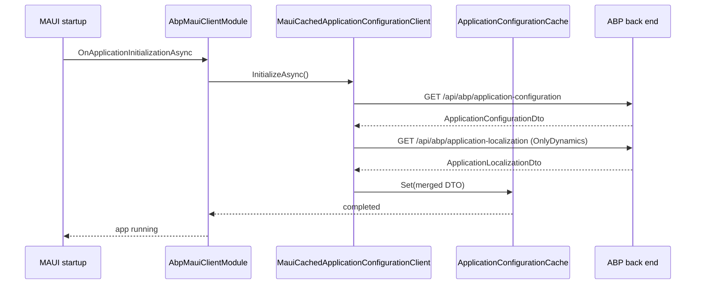

The ABP Framework ships a tiny but important client-side glue package for .NET MAUI applications: `Volo.Abp.Maui.Client`. The whole point of this package is to take the ASP.NET Core MVC Client common module (`AbpAspNetCoreMvcClientCommonModule`) — which is normally wired through ASP.NET Core's request pipeline on a server — and adapt it to a long-lived MAUI process where there is no request, no scope per request, and the same application configuration must be loaded once at startup and then reused. The whole package lives under `framework/src/Volo.Abp.Maui.Client/` and only contains three C# files plus the project file `Volo.Abp.Maui.Client.csproj`.

This page documents what is actually in that package — `AbpMauiClientModule`, `ApplicationConfigurationCache`, and `MauiCachedApplicationConfigurationClient` — and how the MAUI template (`templates/maui/`) plugs them into a host built from `MauiAppBuilder`. There is no MAUI-specific token storage class in the framework today; HTTP authentication is delegated to the static HTTP client proxy infrastructure shared with WPF, console, and Blazor clients.

## Package layout

The package source tree under `framework/src/Volo.Abp.Maui.Client/` is intentionally minimal:

```
framework/src/Volo.Abp.Maui.Client/
├── FodyWeavers.xml
├── FodyWeavers.xsd
├── Volo.Abp.Maui.Client.csproj
└── Volo/Abp/Maui/Client/
    ├── AbpMauiClientModule.cs
    ├── ApplicationConfigurationCache.cs
    └── MauiCachedApplicationConfigurationClient.cs
```

The two files under `Volo/Abp/Maui/Client/` cooperate so that the very first time MAUI starts, the application configuration DTO is fetched once over HTTP from the back end and cached in memory; every subsequent component that asks `ICachedApplicationConfigurationClient` gets the cached copy without an extra HTTP round-trip.

## The AbpMauiClientModule

`framework/src/Volo.Abp.Maui.Client/Volo/Abp/Maui/Client/AbpMauiClientModule.cs` defines the module that you place on the MAUI client's module class. Its only role is to declare a single dependency and run a single initialization step:

```csharp
[DependsOn(typeof(AbpAspNetCoreMvcClientCommonModule))]
public class AbpMauiClientModule : AbpModule
{
    public async Task OnApplicationInitializationAsync(ApplicationInitializationContext context)
    {
        await context.ServiceProvider
            .GetRequiredService<IClientScopeServiceProviderAccessor>().ServiceProvider
            .GetRequiredService<MauiCachedApplicationConfigurationClient>()
            .InitializeAsync();
    }
}
```

Two things to call out from this code in `AbpMauiClientModule.cs`:

<Steps>
  <Step title="Dependency on AbpAspNetCoreMvcClientCommonModule">
    The MAUI client reuses the same DTOs, client proxies, and `IClientScopeServiceProviderAccessor` that the ABP HTTP API client stack uses everywhere else. The dependency lives at `framework/src/Volo.Abp.AspNetCore.Mvc.Client/Volo/Abp/AspNetCore/Mvc/Client/AbpAspNetCoreMvcClientCommonModule.cs` (referenced via project reference in `Volo.Abp.Maui.Client.csproj`).
  </Step>
  <Step title="Eager InitializeAsync call">
    Instead of waiting for the first call to read `ApplicationConfigurationDto`, the module pre-warms the cache during `OnApplicationInitializationAsync`. Inside the call, the resolution goes through `IClientScopeServiceProviderAccessor.ServiceProvider` — that accessor's role is to expose a per-call scope where the HTTP client proxies can resolve their scoped dependencies (auth headers, current tenant, etc.).
  </Step>
</Steps>

## ApplicationConfigurationCache

The cache type sits in `framework/src/Volo.Abp.Maui.Client/Volo/Abp/Maui/Client/ApplicationConfigurationCache.cs` and is registered automatically as `ISingletonDependency`:

```csharp
public class ApplicationConfigurationCache : ISingletonDependency
{
    protected ApplicationConfigurationDto? Configuration { get; set; }
    public event Action? ApplicationConfigurationChanged;

    public virtual ApplicationConfigurationDto? Get() => Configuration;

    public void Set(ApplicationConfigurationDto configuration)
    {
        Configuration = configuration;
        ApplicationConfigurationChanged?.Invoke();
    }
}
```

The cache is dumb on purpose: a single nullable field plus an `ApplicationConfigurationChanged` event. UI code that wants to react to language switches or to a tenant change can subscribe to the event from a singleton view-model. Because the file is so small, you can subclass `ApplicationConfigurationCache` in your own application to layer behavior such as persisting the last good copy to `Microsoft.Maui.Storage.Preferences` between launches.

## MauiCachedApplicationConfigurationClient

The MAUI implementation of `ICachedApplicationConfigurationClient` lives in `framework/src/Volo.Abp.Maui.Client/Volo/Abp/Maui/Client/MauiCachedApplicationConfigurationClient.cs`. It composes four collaborators that the dependency `AbpAspNetCoreMvcClientCommonModule` provides:

| Dependency | Source path | Role |
|---|---|---|
| `AbpApplicationConfigurationClientProxy` | `framework/src/Volo.Abp.AspNetCore.Mvc.Client/.../ClientProxies/AbpApplicationConfigurationClientProxy.cs` | Calls `GET /api/abp/application-configuration` and returns the `ApplicationConfigurationDto`. |
| `AbpApplicationLocalizationClientProxy` | `framework/src/Volo.Abp.AspNetCore.Mvc.Client/.../ClientProxies/AbpApplicationLocalizationClientProxy.cs` | Calls `GET /api/abp/application-localization` to fetch dynamic translation values. |
| `ApplicationConfigurationCache` | `framework/src/Volo.Abp.Maui.Client/.../ApplicationConfigurationCache.cs` | The singleton in-memory holder for the DTO. |
| `ICurrentTenantAccessor` | `framework/src/Volo.Abp.MultiTenancy/.../ICurrentTenantAccessor.cs` | Set after the configuration is loaded so that subsequent calls know which tenant the user signed into. |

The `InitializeAsync` method is the choreography: fetch the configuration without localization resources, then fetch only dynamic localization resources, merge them, write the current tenant onto the accessor, and finally call `Cache.Set(configurationDto)`. The full sequence as written in `MauiCachedApplicationConfigurationClient.cs`:

```csharp
public virtual async Task<ApplicationConfigurationDto> InitializeAsync()
{
    var configurationDto = await ApplicationConfigurationClientProxy.GetAsync(
        new ApplicationConfigurationRequestOptions { IncludeLocalizationResources = false });

    var localizationDto = await ApplicationLocalizationClientProxy.GetAsync(
        new ApplicationLocalizationRequestDto
        {
            CultureName = configurationDto.Localization.CurrentCulture.Name,
            OnlyDynamics = true
        });

    configurationDto.Localization.Resources = localizationDto.Resources;

    CurrentTenantAccessor.Current = new BasicTenantInfo(
        configurationDto.CurrentTenant.Id,
        configurationDto.CurrentTenant.Name);

    Cache.Set(configurationDto);
    return configurationDto;
}
```

The synchronous and asynchronous accessors on the class — `Get()` and `GetAsync()` — return the cached DTO or trigger a fresh `InitializeAsync()` if the cache slot is empty. `Get()` itself routes through `AsyncHelper.RunSync(GetAsync)`, defined in `framework/src/Volo.Abp.Threading/.../AsyncHelper.cs`, so callers in synchronous MAUI event handlers can still get a value.



## The maui template — wiring it together

The MAUI template under `templates/maui/` is what you scaffold with the ABP CLI. The solution file `templates/maui/MyCompanyName.MyProjectName.slnx` only contains one project under `src/MyCompanyName.MyProjectName/MyCompanyName.MyProjectName.csproj`, which is a multi-target MAUI head with Android, iOS, MacCatalyst, Tizen, and Windows platforms (see the `Platforms/` folders alongside the project file).

### MauiProgram.cs

The startup entry point is `templates/maui/src/MyCompanyName.MyProjectName/MauiProgram.cs`. The relevant pieces:

```csharp
public static MauiApp CreateMauiApp()
{
    var builder = MauiApp.CreateBuilder();
    builder
        .UseMauiApp<App>()
        .ConfigureFonts(fonts =>
        {
            fonts.AddFont("OpenSans-Regular.ttf", "OpenSansRegular");
            fonts.AddFont("OpenSans-Semibold.ttf", "OpenSansSemibold");
        })
        .ConfigureContainer(new AbpAutofacServiceProviderFactory(new Autofac.ContainerBuilder()));

    ConfigureConfiguration(builder);

    builder.Services.AddApplication<MyProjectNameModule>(options =>
    {
        options.Services.ReplaceConfiguration(builder.Configuration);
    });

    var app = builder.Build();

    app.Services.GetRequiredService<IAbpApplicationWithExternalServiceProvider>().Initialize(app.Services);

    return app;
}
```

Several things must line up between this file and the framework package:

<Card title="ConfigureContainer with AbpAutofacServiceProviderFactory" icon="box">
  The factory comes from `framework/src/Volo.Abp.Autofac/.../AbpAutofacServiceProviderFactory.cs` and replaces the default `IServiceProvider` with one that supports property injection and the ABP convention-based registrations.
</Card>

<Card title="ReplaceConfiguration" icon="gear">
  `templates/maui/src/MyCompanyName.MyProjectName/MauiProgram.cs` calls `options.Services.ReplaceConfiguration(builder.Configuration)` so the embedded `appsettings.json` (read via `EmbeddedFileProvider` in `ConfigureConfiguration`) is the single `IConfiguration` source for both MAUI and ABP options binding.
</Card>

<Card title="External service provider" icon="plug">
  `Initialize(app.Services)` calls `IAbpApplicationWithExternalServiceProvider.Initialize` from `framework/src/Volo.Abp.Core/Volo/Abp/IAbpApplicationWithExternalServiceProvider.cs`. This is what triggers `AbpMauiClientModule.OnApplicationInitializationAsync` and through it the `InitializeAsync` call on `MauiCachedApplicationConfigurationClient`.
</Card>

### MyProjectNameModule.cs

The application module in `templates/maui/src/MyCompanyName.MyProjectName/MyProjectNameModule.cs` is intentionally short:

```csharp
[DependsOn(typeof(AbpAutofacModule))]
public class MyProjectNameModule : AbpModule
{
}
```

In a real generated project this `[DependsOn]` list grows to include the HTTP API client modules of every back-end module you want to call (Identity, Tenant Management, your own application contracts), plus `AbpMauiClientModule`. The bare template file above is the seed: depend on `AbpAutofacModule` so DI works, then layer in `AbpMauiClientModule` and the HTTP API client modules in your own fork.

### Appsettings.json embedded resource

`templates/maui/src/MyCompanyName.MyProjectName/appsettings.json` is embedded into the assembly. The `ConfigureConfiguration` helper in `MauiProgram.cs` reads it with `EmbeddedFileProvider` against `typeof(App).GetTypeInfo().Assembly` — there is no on-device file system path involved, which keeps the same `appsettings.json` working uniformly across Android, iOS, Mac Catalyst, Tizen, and Windows.

### Platform startup hosts

Each platform under `templates/maui/src/MyCompanyName.MyProjectName/Platforms/` calls into `MauiProgram.CreateMauiApp()`:

- `Platforms/Android/MainApplication.cs` — Android's `Application` subclass with `[Application]` attribute, returning `MauiProgram.CreateMauiApp()` from its `CreateMauiApp()` override.
- `Platforms/iOS/AppDelegate.cs` and `Platforms/iOS/Program.cs` — UIKit entry that delegates to `MauiProgram.CreateMauiApp()`.
- `Platforms/MacCatalyst/AppDelegate.cs` and `Platforms/MacCatalyst/Program.cs` — same idea for Mac Catalyst.
- `Platforms/Tizen/Main.cs` — Tizen entry point.
- `Platforms/Windows/App.xaml.cs` — Windows App SDK host.

All of these end up calling `Initialize(app.Services)` from `MauiProgram.CreateMauiApp()`, which is what kicks `AbpMauiClientModule.OnApplicationInitializationAsync` into running `MauiCachedApplicationConfigurationClient.InitializeAsync()`.

## App shell and views

The visible shell of the template is in `templates/maui/src/MyCompanyName.MyProjectName/App.xaml`, `AppShell.xaml`, and `MainPage.xaml` plus the matching code-behind files. The `App.xaml.cs` constructor wires up `MainPage = new AppShell();` and `MainPage.xaml.cs` resolves `HelloWorldService` from `templates/maui/src/MyCompanyName.MyProjectName/HelloWorldService.cs` to demonstrate that ABP's DI replaced MAUI's default container correctly.

## Notes about authentication tokens

There is no `IAccessTokenStorageService` or `MauiAccessTokenStore` in this code base — token handling for MAUI happens through the static HTTP client proxy stack defined under `framework/src/Volo.Abp.Http.Client/` and the OpenIddict-based clients in the larger ABP Commercial template. If you need persistent token storage between launches, the pattern is to:

<AccordionGroup>
  <Accordion title="Implement IAccessTokenProvider" icon="key">
    `framework/src/Volo.Abp.Http.Client.IdentityModel/.../IAccessTokenProvider.cs` defines the abstraction; supply your own implementation that delegates to `Microsoft.Maui.Authentication.SecureStorage` so tokens survive process restarts.
  </Accordion>
  <Accordion title="Replace via Services.Replace" icon="repeat">
    Register the implementation in `MyProjectNameModule.ConfigureServices` with `context.Services.Replace(ServiceDescriptor.Singleton<IAccessTokenProvider, MauiSecureStorageAccessTokenProvider>())` — this slots into the dynamic client proxies that the cached configuration client already uses.
  </Accordion>
  <Accordion title="Subscribe to ApplicationConfigurationChanged" icon="bell">
    When the user signs out or switches tenants, set the new token in secure storage and call `MauiCachedApplicationConfigurationClient.InitializeAsync()` again so `ApplicationConfigurationCache.Set` raises the event and the UI re-renders.
  </Accordion>
</AccordionGroup>

## Cross references

- The host-side counterparts to the client proxies — `AbpApplicationConfigurationAppService` and `AbpApplicationLocalizationAppService` — live under `framework/src/Volo.Abp.AspNetCore.Mvc/Volo/Abp/AspNetCore/Mvc/ApplicationConfigurations/` and are what the MAUI client ultimately calls over HTTP.
- The DTOs returned to the MAUI client — `ApplicationConfigurationDto` and `ApplicationLocalizationDto` — are defined in `framework/src/Volo.Abp.AspNetCore.Mvc.Contracts/Volo/Abp/AspNetCore/Mvc/ApplicationConfigurations/`.
- The WPF sibling template (also a desktop ABP client) follows a very similar pattern and is documented in [WPF Template](/ui-clients/wpf-template).

## Platform code review

A complete walkthrough of every platform folder under `templates/maui/src/MyCompanyName.MyProjectName/Platforms/` clarifies what stays the same and what differs per OS:

### Android

`Platforms/Android/MainApplication.cs` derives from `MauiApplication`, applies `[Application]` (the Android attribute that nominates it as the application class), and overrides `CreateMauiApp()` to return `MauiProgram.CreateMauiApp()`. `Platforms/Android/MainActivity.cs` is the standard `MauiAppCompatActivity` derivative with `[Activity(...)]` attributes for theme and screen-orientation handling. `Platforms/Android/AndroidManifest.xml` declares the required permissions (typically `INTERNET` for ABP HTTP API calls). `Platforms/Android/Resources/values/colors.xml` holds the Android-native theme colors that the splash screen uses before the WPF-style MAUI shell is loaded.

### iOS

`Platforms/iOS/AppDelegate.cs` is a `MauiUIApplicationDelegate` whose `CreateMauiApp()` calls `MauiProgram.CreateMauiApp()`. `Platforms/iOS/Program.cs` is the standard UIKit `Main` entry. `Platforms/iOS/Info.plist` declares supported orientations and required device capabilities.

### Mac Catalyst

`Platforms/MacCatalyst/AppDelegate.cs` and `Platforms/MacCatalyst/Program.cs` are direct copies of the iOS files because Catalyst reuses UIKit. `Platforms/MacCatalyst/Info.plist` is the macOS-specific manifest.

### Tizen

`Platforms/Tizen/Main.cs` contains a `Main` method that calls into the MAUI bootstrap. `Platforms/Tizen/tizen-manifest.xml` declares the Tizen package metadata. Tizen is rarely targeted for ABP apps, but the template keeps it in to remain compatible with the upstream MAUI template.

### Windows

`Platforms/Windows/App.xaml` plus `Platforms/Windows/App.xaml.cs` plus `Platforms/Windows/Package.appxmanifest` together form the Windows App SDK head. `Platforms/Windows/app.manifest` is the standard Win32 manifest that declares DPI awareness and supported OS versions.

Every one of these files ultimately routes through `MauiProgram.CreateMauiApp()`, which means `AbpMauiClientModule.OnApplicationInitializationAsync` runs once per app launch regardless of platform.

## Resource files

`templates/maui/src/MyCompanyName.MyProjectName/Resources/AppIcon/appicon.svg` and `appiconfg.svg` are the source app-icon SVGs that MAUI compiles into platform-native icon assets at build time. `Resources/Fonts/OpenSans-Regular.ttf` and `OpenSans-Semibold.ttf` are registered in `MauiProgram.ConfigureFonts`. `Resources/Images/dotnet_bot.svg` is the default bot image used by the welcome page. `Resources/Splash/splash.svg` becomes the splash screen for every platform. `Resources/Styles/Colors.xaml` and `Styles.xaml` define the MAUI ResourceDictionary that the shell inherits.

The `Resources/Raw/AboutAssets.txt` file is a holdover from MAUI's template — it documents how to add raw assets but does not contribute to the build output.

## Properties

`templates/maui/src/MyCompanyName.MyProjectName/Properties/launchSettings.json` defines the launch profiles for Visual Studio (Android Emulator, Windows, iOS Simulator). This file does not ship to production builds.

## How to extend a real project

<AccordionGroup>
  <Accordion title="Add HTTP API client modules" icon="link">
    Reference your application's `HttpApi.Client` project and add `[DependsOn(typeof(MyAppHttpApiClientModule), typeof(AbpMauiClientModule))]` on `MyProjectNameModule`. Bind a `RemoteServices` section in `appsettings.json` and ABP's static client proxies start calling the server.
  </Accordion>
  <Accordion title="Plug in OpenIddict authentication" icon="lock">
    Add `Volo.Abp.OpenIddict.Pro.Client.Maui` (commercial) or roll your own integration with `Microsoft.AspNetCore.Authentication.OpenIdConnect` via the platform browser. Persist the access token in `SecureStorage.Default.SetAsync("access_token", token)` and read it in a custom `DelegatingHandler` registered for the HTTP client.
  </Accordion>
  <Accordion title="Replace ApplicationConfigurationCache for persistence" icon="floppy-disk">
    Subclass `ApplicationConfigurationCache` and override `Set` to serialize the DTO to `Preferences.Default`; override the constructor to populate `Configuration` from Preferences on app launch. Register the subclass via `context.Services.Replace(ServiceDescriptor.Singleton<ApplicationConfigurationCache, MyPersistentCache>())`.
  </Accordion>
  <Accordion title="React to ApplicationConfigurationChanged" icon="bell">
    Subscribe to `ApplicationConfigurationCache.ApplicationConfigurationChanged` from a singleton MAUI service that holds your view-models so language changes propagate to the bound UI automatically.
  </Accordion>
</AccordionGroup>

## Trade-offs in eager initialization

The choice to call `InitializeAsync` from `OnApplicationInitializationAsync` (instead of lazily on first access) has trade-offs:

<Card title="Pro: Single configuration snapshot" icon="thumbs-up">
  Every consumer that reads `ICachedApplicationConfigurationClient.Get()` sees the same DTO. There is no race between two callers triggering parallel HTTP requests at app startup.
</Card>

<Card title="Pro: Tenant accessor is set before UI binds" icon="user-check">
  Because `CurrentTenantAccessor.Current = new BasicTenantInfo(...)` runs during initialization, every view-model resolved later sees the correct tenant in `ICurrentTenant`.
</Card>

<Card title="Con: Startup blocks on network" icon="thumbs-down">
  If the backend is unreachable, `InitializeAsync` raises an exception and the app fails to start. Handle this by wrapping the call in a try/catch in your own subclass of `AbpMauiClientModule` and presenting an offline UI.
</Card>

<Card title="Con: No support for offline launch" icon="ban">
  The cache has no persistence; restarting the app re-fetches. Mitigate by overriding `ApplicationConfigurationCache` to persist via `Microsoft.Maui.Storage.Preferences` between launches as described in the extension section.
</Card>
