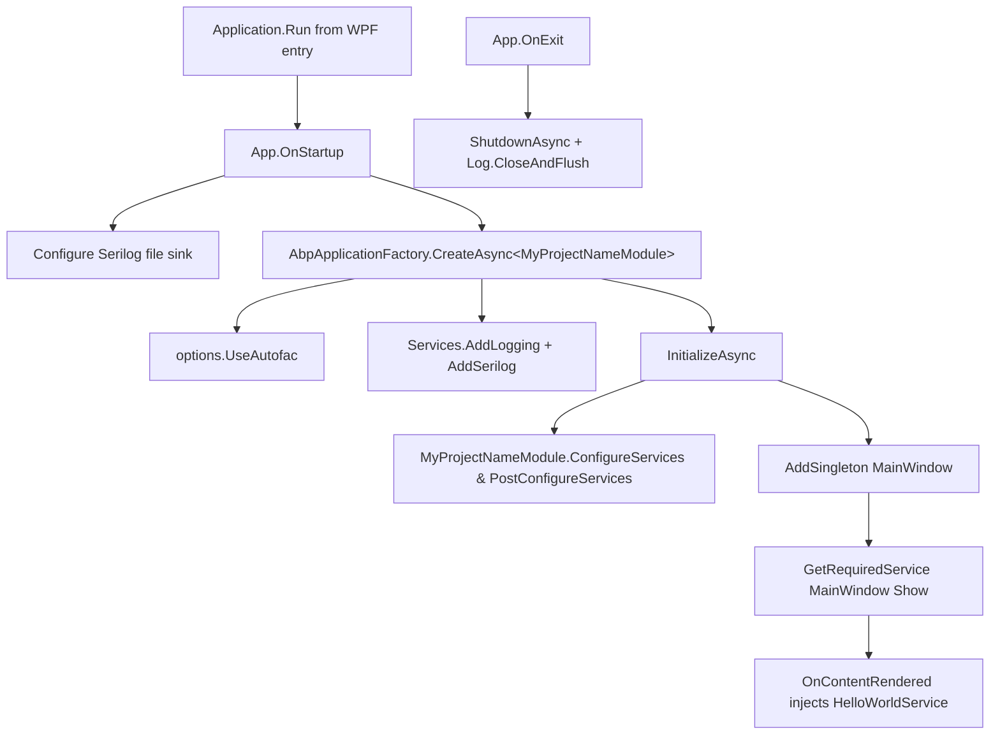

The ABP Framework's WPF template is the smallest of the desktop client templates and demonstrates how to host an ABP application module inside a classic WPF process. The whole template tree lives at `templates/wpf/` and contains one .NET 10 WPF executable that is wired to Autofac, Serilog, and the ABP module system. Unlike Blazor or MVC apps that bootstrap inside `WebApplication`, the WPF host owns the process lifetime and is responsible for calling `IAbpApplicationWithInternalServiceProvider.InitializeAsync` and `ShutdownAsync` from the `Application.OnStartup` and `OnExit` overrides.

This page walks the tree file-by-file using the actual contents of `templates/wpf/`, so that you know which file is responsible for which seam when you generate a project from this template.

## Solution and project layout

The top of the template tree contains a `.slnx` file (the new XML-based solution format) and a shared MSBuild props file referenced by every project:

```
templates/wpf/
├── .gitattributes
├── .gitignore
├── MyCompanyName.MyProjectName.slnx
├── common.props
└── src/
    └── MyCompanyName.MyProjectName/
        ├── App.xaml
        ├── App.xaml.cs
        ├── AssemblyInfo.cs
        ├── HelloWorldService.cs
        ├── MainWindow.xaml
        ├── MainWindow.xaml.cs
        ├── MyCompanyName.MyProjectName.csproj
        ├── MyProjectNameModule.cs
        └── appsettings.json
```

### MyCompanyName.MyProjectName.slnx

`templates/wpf/MyCompanyName.MyProjectName.slnx` is the solution definition in the new XML solution format. It references exactly one project under the `/src/` folder:

```xml
<Solution>
  <Folder Name="/src/">
    <Project Path="src/MyCompanyName.MyProjectName/MyCompanyName.MyProjectName.csproj" />
  </Folder>
</Solution>
```

This intentional minimalism is the WPF template's defining trait: a single executable assembly, no shared contracts project, no test project. When you generate a real application, you will typically extend the solution to add HTTP API client projects (one per ABP back-end module you call) and place this WPF head as the top-most consumer.

## The WPF head project file

`templates/wpf/src/MyCompanyName.MyProjectName/MyCompanyName.MyProjectName.csproj` is what makes this a WPF executable instead of, say, a console app. The interesting properties from the file:

```xml
<PropertyGroup>
    <OutputType>WinExe</OutputType>
    <TargetFramework>net10.0-windows</TargetFramework>
    <Nullable>enable</Nullable>
    <UseWPF>true</UseWPF>
</PropertyGroup>

<ItemGroup>
    <ProjectReference Include="..\..\..\..\framework\src\Volo.Abp.Autofac\Volo.Abp.Autofac.csproj" />
</ItemGroup>

<ItemGroup>
    <PackageReference Include="Microsoft.Extensions.Hosting" Version="10.0.7" />
    <PackageReference Include="Serilog.Extensions.Hosting" Version="9.0.0" />
    <PackageReference Include="Serilog.Extensions.Logging" Version="9.0.2" />
    <PackageReference Include="Serilog.Sinks.Async" Version="2.1.0" />
    <PackageReference Include="Serilog.Sinks.File" Version="7.0.0" />
</ItemGroup>

<ItemGroup>
  <None Remove="appsettings.json" />
  <Content Include="appsettings.json">
    <CopyToOutputDirectory>Always</CopyToOutputDirectory>
  </Content>
</ItemGroup>
```

What the lines mean in practice:

<Steps>
  <Step title="OutputType WinExe and UseWPF true">
    `WinExe` produces a Windows GUI subsystem binary so there is no console window flashing on launch, and `UseWPF` activates WPF's MSBuild flow (XAML markup compilation, BAML embedding, app-icon emission).
  </Step>
  <Step title="net10.0-windows TFM">
    The target framework includes the Windows-specific moniker so WPF types compile. The template is currently pinned to .NET 10 (`net10.0-windows`).
  </Step>
  <Step title="Single project reference">
    Only `framework/src/Volo.Abp.Autofac/Volo.Abp.Autofac.csproj` is referenced. That single reference transitively pulls in `Volo.Abp.Core`, `Volo.Abp.Autofac`, and the full module system because `AbpAutofacModule` depends on the core module.
  </Step>
  <Step title="Serilog hosting packages">
    `Serilog.Extensions.Hosting` lets you adopt Serilog via `Microsoft.Extensions.Hosting` plumbing, while `Serilog.Sinks.File` and `Serilog.Sinks.Async` are the only sinks the bare template uses (writing to `Logs/logs.txt` asynchronously).
  </Step>
  <Step title="appsettings.json as Content">
    The `<None Remove>` followed by `<Content Include>` pattern ensures the JSON file is copied next to the executable instead of being embedded — see `templates/wpf/src/MyCompanyName.MyProjectName/appsettings.json`.
  </Step>
</Steps>

## common.props

`templates/wpf/common.props` lives next to the `.slnx` file and is imported by the `.csproj` via `<Import Project="..\..\common.props" />`. It centralizes shared settings such as `RootNamespace`, `LangVersion`, and any analyzers all projects in the template tree should adopt. Because the template only has one project, this file feels redundant; it is kept so that the generated solution can grow without rewriting MSBuild conventions.

## App.xaml and App.xaml.cs — the ABP host

`templates/wpf/src/MyCompanyName.MyProjectName/App.xaml` is the standard WPF application markup; the interesting code-behind is `App.xaml.cs`. The file does three things: configure Serilog, build an ABP application via `AbpApplicationFactory`, and show the main window.

```csharp
public partial class App : Application
{
    private IAbpApplicationWithInternalServiceProvider? _abpApplication;

    protected override async void OnStartup(StartupEventArgs e)
    {
        Log.Logger = new LoggerConfiguration()
#if DEBUG
            .MinimumLevel.Debug()
#else
            .MinimumLevel.Information()
#endif
            .MinimumLevel.Override("Microsoft", LogEventLevel.Information)
            .Enrich.FromLogContext()
            .WriteTo.Async(c => c.File("Logs/logs.txt"))
            .CreateLogger();

        try
        {
            Log.Information("Starting WPF host.");

            _abpApplication = await AbpApplicationFactory.CreateAsync<MyProjectNameModule>(options =>
            {
                options.UseAutofac();
                options.Services.AddLogging(loggingBuilder => loggingBuilder.AddSerilog(dispose: true));
            });

            await _abpApplication.InitializeAsync();

            _abpApplication.Services.GetRequiredService<MainWindow>()?.Show();
        }
        catch (Exception ex)
        {
            Log.Fatal(ex, "Host terminated unexpectedly!");
        }
    }

    protected override async void OnExit(ExitEventArgs e)
    {
        if (_abpApplication != null)
        {
            await _abpApplication.ShutdownAsync();
        }
        Log.CloseAndFlush();
    }
}
```

The shape comes straight from `framework/src/Volo.Abp.Core/Volo/Abp/AbpApplicationFactory.cs` and `framework/src/Volo.Abp.Autofac/.../AbpApplicationFactoryExtensions.cs` (which provides the `UseAutofac()` helper). The two important contracts:

<Card title="IAbpApplicationWithInternalServiceProvider" icon="server">
  Defined at `framework/src/Volo.Abp.Core/Volo/Abp/IAbpApplicationWithInternalServiceProvider.cs`, this variant manages its own `IServiceProvider` rather than borrowing one from a host — the right choice for WPF where no `IHost` is in charge.
</Card>

<Card title="ShutdownAsync on OnExit" icon="power-off">
  Calling `ShutdownAsync` flushes all background ABP services, runs `OnApplicationShutdown` on every module, and disposes the service provider. Skipping this leaves Serilog writes pending and may leak file handles.
</Card>

## MyProjectNameModule.cs — the ABP module

`templates/wpf/src/MyCompanyName.MyProjectName/MyProjectNameModule.cs` is the application's ABP module:

```csharp
[DependsOn(typeof(AbpAutofacModule))]
public class MyProjectNameModule : AbpModule
{
    public override void ConfigureServices(ServiceConfigurationContext context)
    {
        context.Services.AddSingleton<MainWindow>();
    }
}
```

The dependency on `AbpAutofacModule` (from `framework/src/Volo.Abp.Autofac/.../AbpAutofacModule.cs`) is what makes Autofac the conventional container. The `AddSingleton<MainWindow>` registration is critical for WPF: because a `Window` instance is referenced by the OS HWND and used as a singleton from `App.xaml.cs`, it must be registered as such — registering it transient would create a fresh instance every `GetRequiredService` call and break MVVM bindings.

## MainWindow seam

`templates/wpf/src/MyCompanyName.MyProjectName/MainWindow.xaml` declares a label named `HelloLabel`. The code-behind `MainWindow.xaml.cs` shows the canonical constructor-injection pattern:

```csharp
public partial class MainWindow : Window
{
    private readonly HelloWorldService _helloWorldService;

    public MainWindow(HelloWorldService helloWorldService)
    {
        _helloWorldService = helloWorldService;
        InitializeComponent();
    }

    protected override void OnContentRendered(EventArgs e)
    {
        HelloLabel.Content = _helloWorldService.SayHello();
    }
}
```

Two design notes about this file:

- The `MainWindow` has a constructor parameter, which only works because `App.xaml.cs` resolves it through DI rather than `new MainWindow()`. The autogenerated WPF entry point that calls `new App().Run()` does **not** instantiate `MainWindow` itself — the ABP host does.
- The content is updated in `OnContentRendered` rather than in the constructor, so that any startup-time errors raised by `HelloWorldService` appear after the window is actually rendered and you can see them.

## HelloWorldService

`templates/wpf/src/MyCompanyName.MyProjectName/HelloWorldService.cs` is the canonical "ABP is working" service:

```csharp
public class HelloWorldService : ITransientDependency
{
    public ILogger<HelloWorldService> Logger { get; set; }

    public HelloWorldService()
    {
        Logger = NullLogger<HelloWorldService>.Instance;
    }

    public string SayHello()
    {
        Logger.LogInformation("Call SayHello");
        return "Hello world!";
    }
}
```

Both `ITransientDependency` (from `framework/src/Volo.Abp.Core/Volo/Abp/DependencyInjection/ITransientDependency.cs`) and property-injected `ILogger<HelloWorldService>` are conventions from the ABP core module — no additional `AddTransient` call is needed because the `AbpModule` lifecycle scans for the marker interface automatically.

## AssemblyInfo.cs

`templates/wpf/src/MyCompanyName.MyProjectName/AssemblyInfo.cs` carries the WPF-specific `[ThemeInfo]` attributes that tell the resource loader where to find theme dictionaries. It is otherwise standard generated content.

## appsettings.json

`templates/wpf/src/MyCompanyName.MyProjectName/appsettings.json` is consumed by `AbpApplicationFactory` through the default configuration source that ABP wires up under the hood. There is no explicit `ConfigurationBuilder` call in `App.xaml.cs` — ABP picks up the JSON file from the binary output directory because of the `<Content Include>` rule in the `.csproj`.

## Startup sequence

The diagram below stitches everything together into a single bootstrap flow:



## Folder summary table

| Path under `templates/wpf/` | Purpose |
|---|---|
| `MyCompanyName.MyProjectName.slnx` | Top-level XML solution; references the single WPF project. |
| `common.props` | Shared MSBuild settings imported by the project. |
| `src/MyCompanyName.MyProjectName/MyCompanyName.MyProjectName.csproj` | WPF executable targeting `net10.0-windows` with Serilog, hosting, and the Autofac project reference. |
| `src/MyCompanyName.MyProjectName/App.xaml` & `App.xaml.cs` | WPF application entry; creates and initializes the ABP application via `AbpApplicationFactory`. |
| `src/MyCompanyName.MyProjectName/MainWindow.xaml` & `MainWindow.xaml.cs` | The shell window with DI-injected `HelloWorldService`. |
| `src/MyCompanyName.MyProjectName/MyProjectNameModule.cs` | ABP module class depending on `AbpAutofacModule`; registers `MainWindow` as singleton. |
| `src/MyCompanyName.MyProjectName/HelloWorldService.cs` | Demo transient service to verify DI is working. |
| `src/MyCompanyName.MyProjectName/AssemblyInfo.cs` | WPF theme metadata. |
| `src/MyCompanyName.MyProjectName/appsettings.json` | Configuration source copied next to the binary. |

## Extending the template

A typical real-world extension of this template adds three things: HTTP API client modules for the back-end APIs you talk to, an authentication flow, and an MVVM stack.

<AccordionGroup>
  <Accordion title="Add HTTP API client modules" icon="link">
    Reference your application's `HttpApi.Client` project (which depends on `framework/src/Volo.Abp.Http.Client/.../AbpHttpClientModule.cs`) and add `[DependsOn(typeof(YourAppHttpApiClientModule))]` to `MyProjectNameModule`. Bind a `RemoteServices` section in `appsettings.json` and ABP's dynamic proxies will start calling the server APIs.
  </Accordion>
  <Accordion title="Add authentication via IdentityModel" icon="lock">
    Include `framework/src/Volo.Abp.Http.Client.IdentityModel/.../AbpHttpClientIdentityModelModule.cs` and configure `IdentityClientConfiguration` to point at your OpenIddict authorization server. The dynamic proxies in this module attach `Authorization: Bearer` headers automatically once a token is acquired.
  </Accordion>
  <Accordion title="Adopt MVVM via Microsoft.Extensions.DependencyInjection" icon="diagram-project">
    Because Autofac already replaced the default container, you can register `ICommunityToolkit.Mvvm` view-models with `context.Services.AddTransient<MainViewModel>()` and set `DataContext = serviceProvider.GetRequiredService<MainViewModel>()` from `MainWindow.xaml.cs`.
  </Accordion>
</AccordionGroup>

For the MAUI sibling template (mobile/desktop multi-platform) see [MAUI Client](/ui-clients/maui-client) — the modules and patterns are nearly identical, but the host is `MauiApp` rather than `Application`.

## Logging into Logs/logs.txt

Serilog's `WriteTo.Async(c => c.File("Logs/logs.txt"))` in `App.xaml.cs` writes to a `Logs` folder relative to the working directory. For a WPF app launched from the Start menu, the working directory is the installation folder — which on Windows 11 with WiX-style MSI installers is typically `C:\Program Files\MyCompany\MyProjectName\`. Because regular users do not have write access to `Program Files`, you should change the path to a writable folder for production builds:

```csharp
var logsDir = Path.Combine(
    Environment.GetFolderPath(Environment.SpecialFolder.LocalApplicationData),
    "MyCompany", "MyProjectName", "Logs");
Directory.CreateDirectory(logsDir);

Log.Logger = new LoggerConfiguration()
    ...
    .WriteTo.Async(c => c.File(Path.Combine(logsDir, "logs.txt")))
    .CreateLogger();
```

The bare template uses the relative path because it works out of the box from `dotnet run`, but real production installs need a per-user writable directory.

## Single-instance behavior

The bare template does not enforce single-instance launch. Users can start the application twice and each instance gets its own `IAbpApplicationWithInternalServiceProvider`. For desktop apps this is usually wrong — you want to focus the existing window instead. The fix is to add a named mutex check at the very top of `App.OnStartup`:

```csharp
private static Mutex? _singleInstance;
protected override async void OnStartup(StartupEventArgs e)
{
    bool created;
    _singleInstance = new Mutex(true, "MyCompany.MyProjectName.SingleInstance", out created);
    if (!created)
    {
        Shutdown();
        return;
    }
    // ... continue with the existing OnStartup body
}
```

If the mutex already exists, the second instance shuts down silently. Pair this with a named-pipe message to focus the existing window.

## Auto-update considerations

WPF distributed via MSI / Inno Setup typically wants an auto-update mechanism. ABP does not prescribe one; popular choices are Squirrel.Windows, Velopack, and ClickOnce. None of these need framework-level changes — they wrap the published binaries and handle update orchestration outside the ABP module system.

When your update mechanism replaces `MyCompanyName.MyProjectName.exe` while it is running, Windows will deny the operation. Auto-update tools work around this by extracting the new version to a sibling folder and updating a launcher; nothing about ABP changes that pattern.
